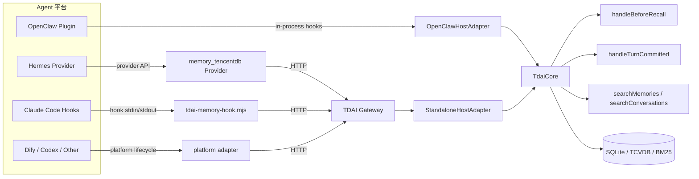
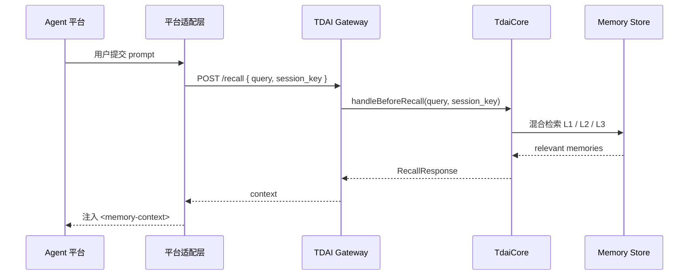
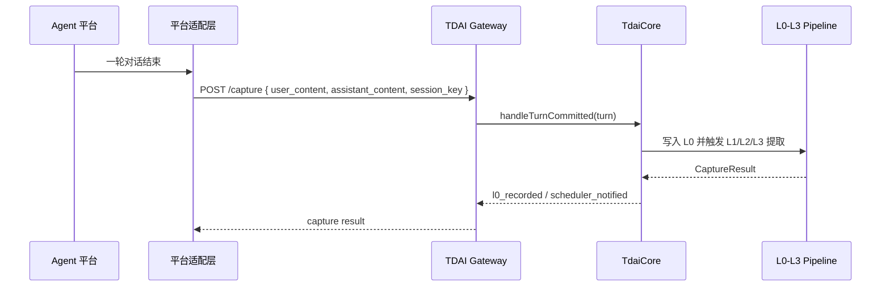

# 跨平台适配指南

本文面向希望把 TencentDB Agent Memory 接入 OpenClaw、Hermes 之外 Agent 平台的开发者。目标是先理解核心边界，再把平台事件翻译成统一的记忆读写 API。

## 核心架构

`TdaiCore` 是宿主无关的记忆引擎入口。各平台不应直接改 L0/L1/L2/L3 记忆流水线，而是通过适配层提供运行时上下文、日志、LLM 调用能力，或通过 HTTP Gateway 调用核心能力。



## 数据流

### 召回



### 捕获



## 现有适配方式对比

| 适配方式 | 接入形态 | 核心调用方式 | 适合场景 |
| :--- | :--- | :--- | :--- |
| OpenClaw | 插件内进程 | `OpenClawHostAdapter -> TdaiCore` | 宿主允许直接加载 TypeScript 插件，并提供 Agent hook 与 LLM runner |
| Hermes | Python Provider + Sidecar | `Provider -> HTTP Gateway -> TdaiCore` | 宿主语言不同，或希望把记忆引擎作为独立服务 |
| Claude Code 示例 | Hook 命令 | `tdai-memory-hook.mjs -> HTTP Gateway -> TdaiCore` | 宿主提供 prompt/stop/session 生命周期事件，但不直接加载本项目代码 |
| 新平台推荐 | 平台适配层 | `GatewayMemoryClient -> HTTP Gateway -> TdaiCore` | Dify、Codex、其他 Agent 框架 |

## Gateway API 映射

| 平台事件 | 推荐 API | 必填字段 | 作用 |
| :--- | :--- | :--- | :--- |
| 用户 prompt 提交前 | `POST /recall` | `query`, `session_key` | 召回长期记忆并注入上下文 |
| 一轮对话完成后 | `POST /capture` | `user_content`, `assistant_content`, `session_key` | 写入 L0，并触发 L1/L2/L3 提取 |
| 主动搜索记忆 | `POST /search/memories` | `query` | 查询结构化 L1 记忆 |
| 主动搜索原始对话 | `POST /search/conversations` | `query` | 查询 L0 对话证据 |
| 会话结束 | `POST /session/end` | `session_key` | 刷新当前 session 的待处理流水线 |

## 统一 HTTP Client

`GatewayMemoryClient` 封装了 Gateway 的鉴权、超时和错误处理。新平台适配层只需要把宿主事件转成这些方法：

```ts
import { GatewayMemoryClient } from "./src/adapters/gateway-client.js";

const memory = new GatewayMemoryClient({
  baseUrl: process.env.TDAI_GATEWAY_URL,
  apiKey: process.env.TDAI_GATEWAY_API_KEY,
});

const recall = await memory.recall(userPrompt, sessionKey);
const injected = recall.context;

await memory.capture({
  user_content: userPrompt,
  assistant_content: assistantAnswer,
  session_key: sessionKey,
});
```

## Claude Code 示例适配

本仓库提供了一个最小可用的 Claude Code hook 示例：

- [`examples/claude-code/tdai-memory-hook.mjs`](../examples/claude-code/tdai-memory-hook.mjs)
- [`examples/claude-code/settings.example.json`](../examples/claude-code/settings.example.json)

Hook 事件与 JSON 输出格式参考 Claude Code 官方文档：[Hooks](https://docs.anthropic.com/en/docs/claude-code/hooks)。

接入步骤：

1. 启动 TDAI Gateway。

```bash
node --import tsx src/gateway/server.ts
```

2. 在目标 Claude Code 项目中复制 hook。

```bash
mkdir -p .claude/hooks
cp /path/to/TencentDB-Agent-Memory/examples/claude-code/tdai-memory-hook.mjs .claude/hooks/
cp /path/to/TencentDB-Agent-Memory/examples/claude-code/settings.example.json .claude/settings.json
```

3. 配置环境变量。

```bash
export TDAI_GATEWAY_URL=http://127.0.0.1:8765
# 如果 Gateway 配置了 TDAI_GATEWAY_API_KEY，也在 hook 环境中设置同名变量。
```

Hook 行为：

- `UserPromptSubmit`：保存当前用户 prompt，调用 `/recall`，并把返回的记忆作为 `<memory-context>` 注入。
- `Stop`：读取上一条用户 prompt 和 assistant 输出，调用 `/capture`。
- `SessionEnd`：调用 `/session/end`，刷新当前 session 的待处理提取任务。

## 新平台适配检查清单

1. 找到平台的“用户输入前”事件，用它触发 `/recall`。
2. 找到平台的“一轮回复完成后”事件，用它触发 `/capture`。
3. 设计稳定的 `session_key`，避免不同项目或用户的记忆混在一起。
4. 如果平台支持工具或命令，暴露 `/search/memories` 和 `/search/conversations`。
5. 如果平台有会话结束事件，调用 `/session/end`，不要直接销毁 Gateway。
6. 适配层失败时应降级为空记忆，避免阻断宿主 Agent 的主流程。
