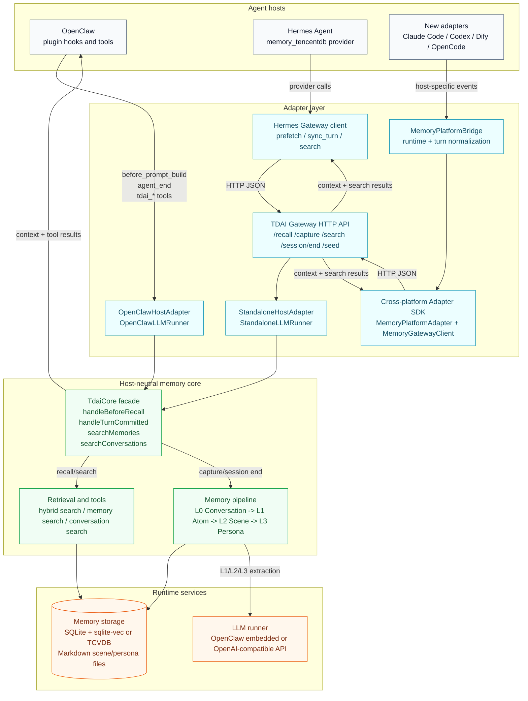

# Cross-Platform Memory Adapter Architecture

## Boundary Summary

- `TdaiCore` is the stable host-neutral boundary. New platforms should not call pipeline internals directly.
- OpenClaw runs in-process through `OpenClawHostAdapter`; Hermes and future hosts should use the Gateway path unless they can safely embed Node and provide a `HostAdapter`.
- The cross-platform adapter SDK should normalize host events into four gateway operations: recall, capture, memory search, and conversation search.
- Platform-specific packages should stay thin: identity/session mapping, prompt injection, lifecycle hooks, and optional tool registration.
