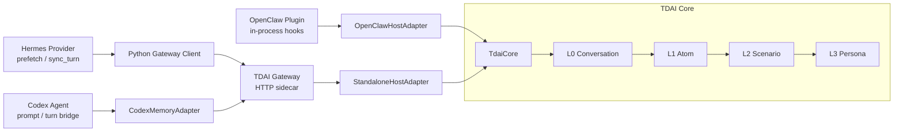

# Cross-Platform Adapters

TencentDB Agent Memory keeps memory logic in `TdaiCore` and exposes it through
host adapters or the HTTP Gateway. A platform adapter should only translate the
platform lifecycle into the core memory operations:

- `recall`: fetch memory before the next model turn.
- `capture`: persist a completed user/assistant turn.
- `searchMemories`: search L1 structured memories.
- `searchConversations`: search L0 raw conversation evidence.
- `endSession`: flush buffered session work.

## Architecture



## Existing Adapters

| Platform | Integration point | Boundary | Recall path | Capture path |
| :--- | :--- | :--- | :--- | :--- |
| OpenClaw | Plugin hooks in `index.ts` | In-process `HostAdapter` | `before_prompt_build` calls `TdaiCore.handleBeforeRecall()` | `agent_end` calls `TdaiCore.handleTurnCommitted()` |
| Hermes | `memory_tencentdb` provider | HTTP Gateway sidecar | `prefetch(query)` calls `POST /recall` | `sync_turn(user, assistant)` calls `POST /capture` |
| Codex | TypeScript client adapter | HTTP Gateway sidecar | `CodexMemoryAdapter.recall()` calls `POST /recall` | `CodexMemoryAdapter.captureTurn()` calls `POST /capture` |

OpenClaw can call `TdaiCore` directly because it owns the plugin process and
provides a host API for logging, state, and LLM execution. Hermes and Codex are
out-of-process integrations, so they use the Gateway as the stable contract.

## Codex Adapter

The Codex adapter lives in `src/adapters/codex/` and is exported from
`src/adapters/index.ts`.

```ts
import { CodexMemoryAdapter } from "@tencentdb-agent-memory/memory-tencentdb/adapters";

const memory = new CodexMemoryAdapter({
  baseUrl: "http://127.0.0.1:8420",
  apiKey: process.env.TDAI_GATEWAY_API_KEY,
  defaultSessionKey: process.env.CODEX_SESSION_ID,
});

const recall = await memory.recall({
  query: userPrompt,
  sessionKey: "codex-thread-235",
});

const promptWithMemory = [
  recall.context,
  userPrompt,
].filter(Boolean).join("\n\n");

await memory.captureTurn({
  userContent: userPrompt,
  assistantContent: assistantReply,
  sessionKey: "codex-thread-235",
});
```

For environment-based setup:

```ts
import { createCodexMemoryAdapterFromEnv } from "@tencentdb-agent-memory/memory-tencentdb/adapters";

const memory = createCodexMemoryAdapterFromEnv();
```

The helper reads:

| Environment variable | Purpose |
| :--- | :--- |
| `MEMORY_TENCENTDB_GATEWAY_URL` or `TDAI_GATEWAY_URL` | Gateway base URL |
| `MEMORY_TENCENTDB_GATEWAY_API_KEY` or `TDAI_GATEWAY_API_KEY` | Bearer token for protected Gateway routes |
| `CODEX_SESSION_ID` or `CODEX_THREAD_ID` | Default session key |

## Gateway Contract

All out-of-process adapters should use the Gateway contract instead of reaching
into core files:

| Method | Endpoint | Required fields | Response |
| :--- | :--- | :--- | :--- |
| `GET` | `/health` | none | Gateway status and store availability |
| `POST` | `/recall` | `query`, `session_key` | prompt context, strategy, memory count |
| `POST` | `/capture` | `user_content`, `assistant_content`, `session_key` | L0 count and scheduler notification |
| `POST` | `/search/memories` | `query` | formatted L1 results |
| `POST` | `/search/conversations` | `query` | formatted L0 results |
| `POST` | `/session/end` | `session_key` | flush status |

Adapters should keep platform naming at their edge and translate to Gateway
snake_case at the HTTP boundary. For example, Codex callers pass `sessionKey`;
the adapter sends `session_key`.

## Best Practices

1. Use one stable `sessionKey` per agent thread. This keeps L0 capture cursors,
   L1 extraction, and session flushes scoped correctly.
2. Call recall before constructing the final model prompt. Inject returned
   context as platform-owned presentation text; TDAI owns retrieval, not prompt
   layout.
3. Call capture after a completed user/assistant turn. Do not capture partial
   tool output unless the platform intentionally treats it as conversation
   evidence.
4. Keep authentication client-side and Gateway-side explicit. A client API key
   only adds `Authorization`; the Gateway must still be configured to enforce it.
5. Fail fast on missing session identity. Silent fallback keys make unrelated
   conversations contaminate each other.
6. Prefer the Gateway for new platforms unless the platform runs inside the
   same process and can implement `HostAdapter` directly.

## Adding Another Platform

1. Identify the platform lifecycle hooks that correspond to recall, capture,
   search, and session end.
2. Decide whether the platform is in-process (`HostAdapter`) or out-of-process
   (Gateway client). Most external agents should use the Gateway.
3. Implement a narrow adapter that maps platform-native names to TDAI names.
4. Add contract tests for route, method, request body, auth, and error handling.
5. Document session identity, startup requirements, and failure behavior.
