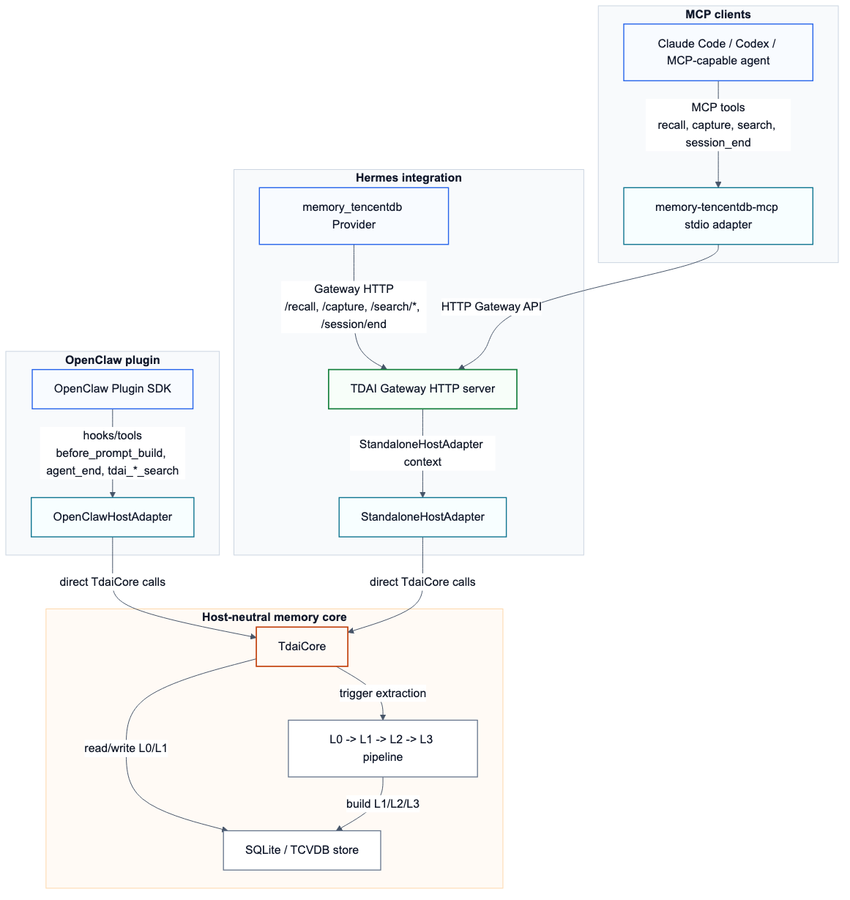

# Cross-Platform Adapters

TencentDB Agent Memory keeps the memory engine host-neutral. Platform-specific
code should translate host lifecycle events into `TdaiCore` calls, or reuse the
Gateway HTTP API when the platform cannot run the core in-process.

## Architecture



## Core Engine Boundary

`TdaiCore` is the stable integration boundary for in-process hosts:

| Core method | Capability | Existing host mapping |
| --- | --- | --- |
| `handleBeforeRecall()` | Recall relevant memories before a model turn | OpenClaw `before_prompt_build`, Hermes/Gateway `/recall` |
| `handleTurnCommitted()` | Capture a completed user/assistant turn | OpenClaw `agent_end`, Hermes/Gateway `/capture` |
| `searchMemories()` | Search L1 structured memories | `tdai_memory_search`, Gateway `/search/memories` |
| `searchConversations()` | Search L0 raw conversation history | `tdai_conversation_search`, Gateway `/search/conversations` |
| `handleSessionEnd()` | Flush session-scoped buffered work | Hermes/Gateway `/session/end` |

Hosts that can provide a `HostAdapter` and `LLMRunnerFactory` can call
`TdaiCore` directly. Hosts that cannot link this package in-process should use
the Gateway and implement a thin client adapter.

## Existing Adapter Patterns

| Adapter | Runtime shape | Data flow | When to use |
| --- | --- | --- | --- |
| OpenClaw plugin | In-process TypeScript plugin | OpenClaw hooks/tools -> `OpenClawHostAdapter` -> `TdaiCore` | Host exposes plugin lifecycle hooks and an embedded LLM runner |
| Hermes Provider | Python provider + Node.js sidecar | Hermes lifecycle/tools -> Provider HTTP client -> Gateway -> `StandaloneHostAdapter` -> `TdaiCore` | Host cannot run the TypeScript core in-process or prefers process isolation |
| MCP stdio adapter | MCP tool server + Gateway | MCP client tool call -> `memory-tencentdb-mcp` -> Gateway -> `TdaiCore` | Claude Code, Codex, or any MCP-capable client that can launch a stdio server |

## Adapter Differences

| Concern | OpenClaw | Hermes | MCP |
| --- | --- | --- | --- |
| Integration boundary | In-process plugin API | Gateway HTTP API | Gateway HTTP API |
| Lifecycle source | Host hooks: `before_prompt_build`, `agent_end`, `gateway_stop` | Provider callbacks: `prefetch()`, `sync_turn()`, `on_session_end()` | JSON-RPC tool calls over stdio |
| Tool surface | Host-registered `tdai_*` tools | Hermes provider tool schemas | MCP `memory_tencentdb_*` tools |
| Process model | One OpenClaw plugin process | Python provider plus managed Node.js Gateway sidecar | MCP server process plus Gateway |
| LLM execution | OpenClaw runner by default; optional standalone override | Gateway standalone OpenAI-compatible runner | Gateway standalone OpenAI-compatible runner |
| Session scoping | OpenClaw `ctx.sessionKey` | Provider `session_id` mapped to Gateway `session_key` | `session_key` argument or `MEMORY_TENCENTDB_MCP_SESSION_KEY` |
| Failure behavior | Hook failures degrade to no recall/capture for that turn | Provider returns empty recall/tool errors while Gateway starts or recovers | Tool call returns structured MCP error when Gateway is unavailable |

For Gateway-based adapters, clients may provide only `user_content`,
`assistant_content`, and `session_key` to `/capture`. The Gateway normalizes
that lightweight shape into a two-message turn with stable timestamps before it
calls `TdaiCore`. Clients that already have full host messages can still pass
`messages` explicitly; those are preserved unchanged.

## MCP Adapter

The MCP adapter is a new cross-platform integration layer. It exposes the
Gateway as MCP tools without depending on OpenClaw or Hermes APIs.

### Tools

| MCP tool | Gateway endpoint | Purpose |
| --- | --- | --- |
| `memory_tencentdb_health` | `GET /health` | Check Gateway availability |
| `memory_tencentdb_recall` | `POST /recall` | Retrieve memory context for the current task |
| `memory_tencentdb_capture` | `POST /capture` | Write a completed user/assistant turn |
| `memory_tencentdb_memory_search` | `POST /search/memories` | Search structured memories |
| `memory_tencentdb_conversation_search` | `POST /search/conversations` | Search raw conversation history |
| `memory_tencentdb_session_end` | `POST /session/end` | Flush a session |

### Build

```bash
npm run build:mcp-adapter
```

The package-level build also includes the MCP adapter:

```bash
npm run build
```

### Run

Start or auto-manage the Gateway separately, then launch the MCP adapter:

```bash
memory-tencentdb-mcp
```

For local source checkouts:

```bash
npm run memory-tencentdb-mcp
```

### Configuration

| Environment variable | Default | Description |
| --- | --- | --- |
| `MEMORY_TENCENTDB_GATEWAY_URL` | `http://127.0.0.1:8420` | Full Gateway URL. Overrides host/port. |
| `MEMORY_TENCENTDB_GATEWAY_HOST` | `127.0.0.1` | Gateway host when URL is unset. |
| `MEMORY_TENCENTDB_GATEWAY_PORT` | `8420` | Gateway port when URL is unset. |
| `MEMORY_TENCENTDB_GATEWAY_API_KEY` | unset | Optional Bearer token sent to the Gateway. |
| `TDAI_GATEWAY_API_KEY` | unset | Fallback Bearer token name, shared with Gateway config. |
| `MEMORY_TENCENTDB_MCP_SESSION_KEY` | `mcp-default` | Default session key used by recall/capture/session_end. |
| `MEMORY_TENCENTDB_MCP_TIMEOUT_MS` | `10000` | Gateway request timeout in milliseconds. |

### Example MCP Client Entry

```json
{
  "mcpServers": {
    "memory-tencentdb": {
      "command": "memory-tencentdb-mcp",
      "env": {
        "MEMORY_TENCENTDB_GATEWAY_URL": "http://127.0.0.1:8420",
        "MEMORY_TENCENTDB_MCP_SESSION_KEY": "codex-main"
      }
    }
  }
}
```

## Functional Validation

The adapter paths were validated with isolated local state directories and a
real OpenAI-compatible LLM endpoint from the local Codex configuration. Secrets
were read only from local runtime configuration and were not written to the
repository.

| Path | Validation scope | Result |
| --- | --- | --- |
| OpenClaw | Installed the local checkout into an isolated OpenClaw profile with `openclaw plugins install --link`, verified `memory-tencentdb` loaded, registered the real `index.ts`, drove `before_prompt_build` and `agent_end`, then verified `tdai_conversation_search`, `tdai_memory_search`, recall injection, and local persistence. | Passed |
| Hermes | Installed Hermes into an isolated `/tmp` environment, loaded the `memory_tencentdb` provider through Hermes discovery, started a real Gateway sidecar on an isolated port, ran `sync_turn`, `memory_tencentdb_conversation_search`, `on_session_end`, `memory_tencentdb_memory_search`, `prefetch`, and checked local persistence. | Passed |
| MCP | Started a real local Gateway with an isolated `TDAI_DATA_DIR`, started `bin/memory-tencentdb-mcp.mjs`, sent JSON-RPC calls over stdio, and verified initialize, tool listing, health, capture, L0 search, L1 search after extraction, recall, session flush, and persistence. | Passed |

All Gateway-side functional runs used Node.js 22. Node.js 20 is not sufficient
for this package because the project declares `node >=22.16.0`.

## Adapter Implementation Checklist

When adding another platform adapter:

1. Decide whether the platform should call `TdaiCore` in-process or talk to
   the Gateway over HTTP.
2. Map platform lifecycle events to `recall`, `capture`, `search`, and
   `session_end`.
3. Preserve `session_key` consistently so L0/L1 records stay scoped to the
   right conversation.
4. Keep authentication at the Gateway boundary when using HTTP.
5. Document startup, configuration, and failure behavior for operators.
