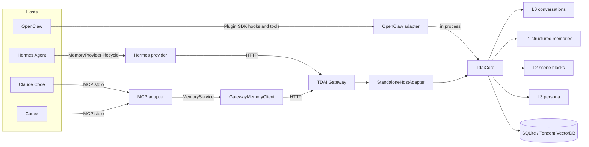
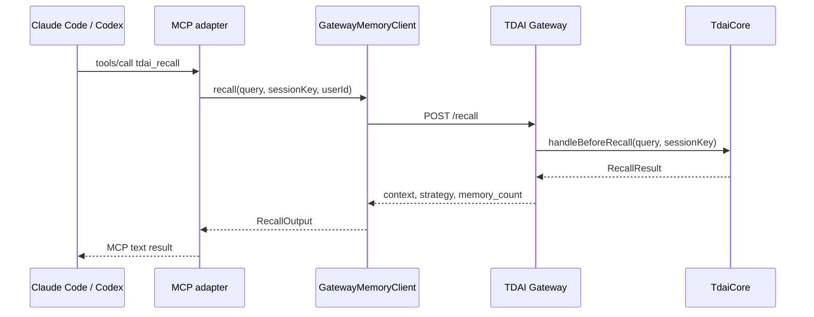
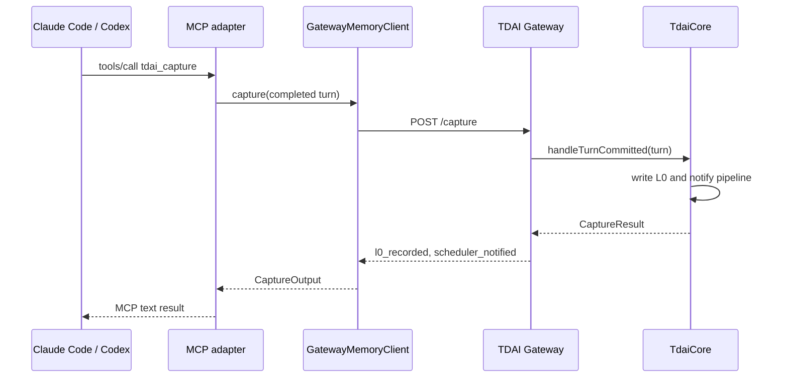

# Cross-Platform Adapter Guide

This document describes the stable memory boundary, the existing OpenClaw and
Hermes integrations, and the MCP adapter for Claude Code and Codex.

## Architecture

TencentDB Agent Memory supports two integration styles:

- **In-process:** the host supplies a `HostAdapter` and calls `TdaiCore`
  directly. OpenClaw uses this path.
- **Sidecar:** the host translates its lifecycle or tool protocol into the
  Gateway HTTP API. Hermes and MCP use this path.



### Recall data flow



### Capture data flow



## Core capability boundary

`TdaiCore` is host-neutral. Platform adapters should map host concepts to this
surface rather than importing lower-level stores or pipeline modules.

| Core method | Purpose | Gateway endpoint | MCP tool |
| :--- | :--- | :--- | :--- |
| `handleBeforeRecall` | Build relevant L1/L3 context before a turn | `POST /recall` | `tdai_recall` |
| `handleTurnCommitted` | Persist L0 messages and schedule extraction | `POST /capture` | `tdai_capture` |
| `searchMemories` | Search L1 structured memories | `POST /search/memories` | `tdai_memory_search` |
| `searchConversations` | Search L0 raw dialogue | `POST /search/conversations` | `tdai_conversation_search` |
| `handleSessionEnd` | Flush one session without stopping shared resources | `POST /session/end` | `tdai_session_end` |
| `destroy` | Stop the complete engine and close stores | Gateway process shutdown | Not exposed |

Important boundaries:

- A stable `session_key` is required for recall, capture, and session flush.
- The Gateway owns storage and LLM configuration. MCP clients do not initialize
  stores or call extraction models themselves.
- `user_id` is transported for API compatibility, but the current core uses a
  shared Gateway data directory and does not provide hard per-user isolation.
  Use separate Gateway data directories/processes when isolation is required.
- Session end and process shutdown are different operations. A platform must
  not stop the shared Gateway when one conversation ends.

## Adapter comparison

| Property | OpenClaw | Hermes | Claude Code / Codex |
| :--- | :--- | :--- | :--- |
| Host binding | Plugin SDK | Python `MemoryProvider` | MCP |
| Core location | In host process | Node.js sidecar | Node.js sidecar |
| Transport | Direct calls | HTTP Gateway | stdio JSON-RPC, then HTTP Gateway |
| Recall trigger | `before_prompt_build` hook | `prefetch()` | `tdai_recall` tool call |
| Capture trigger | `agent_end` hook | `sync_turn()` | `tdai_capture` tool call |
| Search | Registered OpenClaw tools | Provider tool schemas | MCP tools |
| Session flush | Gateway shutdown | `on_session_end` | `tdai_session_end` tool call |
| LLM integration | OpenClaw embedded runtime | Standalone OpenAI-compatible runner | Gateway standalone runner |
| Automatic lifecycle | Yes | Yes | No host hooks; guided tool usage |

MCP deliberately exposes explicit tools because MCP does not define universal
"before prompt" or "turn committed" hooks. The server returns workflow
instructions during MCP initialization, but the host model still decides when
to call tools. Add durable host instructions when deterministic capture is
required.

## Adapter SDK

The package exports a transport-neutral service contract and Gateway client:

```ts
import {
  GatewayMemoryClient,
  type MemoryService,
} from "@tencentdb-agent-memory/memory-tencentdb/adapter-sdk";

const memory: MemoryService = new GatewayMemoryClient({
  baseUrl: "http://127.0.0.1:8420",
  apiKey: process.env.TDAI_GATEWAY_API_KEY,
  timeoutMs: 10_000,
});
```

Protocol adapters depend only on `MemoryService`. This keeps platform-specific
event and tool mapping separate from HTTP details and makes a fake service easy
to inject in tests.

The client:

- maps camelCase SDK inputs to the Gateway's snake_case JSON API;
- applies one timeout to every request;
- optionally sends a Bearer token;
- converts non-2xx and invalid JSON responses into
  `GatewayMemoryClientError`;
- never includes the API key in error messages.

## MCP tools

| Tool | Mode | Description |
| :--- | :---: | :--- |
| `tdai_health` | Read | Check Gateway and store availability |
| `tdai_recall` | Read | Retrieve context relevant to the next response |
| `tdai_capture` | Write | Persist one completed user/assistant turn |
| `tdai_memory_search` | Read | Search L1 structured memories |
| `tdai_conversation_search` | Read | Search L0 raw conversations |
| `tdai_session_end` | Write | Flush pending work for one session |

Read/write and idempotency hints are declared through MCP tool annotations so
hosts can apply appropriate approval policies.

## Run the MCP adapter

### 1. Start the Gateway

From a source checkout:

```bash
export TDAI_LLM_API_KEY="your-api-key"
export TDAI_LLM_BASE_URL="https://api.openai.com/v1"
export TDAI_LLM_MODEL="gpt-4o"
npx tsx src/gateway/server.ts
```

Verify it before configuring an MCP host:

```bash
curl http://127.0.0.1:8420/health
```

### 2. Configure Claude Code

```bash
claude mcp add \
  --scope project \
  --transport stdio \
  --env TDAI_MCP_GATEWAY_URL=http://127.0.0.1:8420 \
  --env TDAI_MCP_SESSION_KEY=my-project \
  tencentdb-memory \
  -- npx -y --package @tencentdb-agent-memory/memory-tencentdb tdai-memory-mcp
```

Use `claude mcp list` or `/mcp` to verify that six tools are available.

### 3. Configure Codex

```bash
codex mcp add tencentdb-memory \
  --env TDAI_MCP_GATEWAY_URL=http://127.0.0.1:8420 \
  --env TDAI_MCP_SESSION_KEY=my-project \
  -- npx -y --package @tencentdb-agent-memory/memory-tencentdb tdai-memory-mcp
```

Use `codex mcp list` or `/mcp` in the Codex TUI to verify the connection.

### Source-checkout command

When developing locally, build once and point either host at the generated
binary:

```bash
npm install
npm run build:plugin
node /absolute/path/to/TencentDB-Agent-Memory/dist/mcp-server.mjs
```

Replace the `npx ... tdai-memory-mcp` command in the host examples with the
absolute `node .../dist/mcp-server.mjs` command.

### Environment variables

| Variable | Default | Description |
| :--- | :--- | :--- |
| `TDAI_MCP_GATEWAY_URL` | `http://127.0.0.1:8420` | Gateway root URL |
| `TDAI_GATEWAY_API_KEY` | unset | Bearer token for protected Gateway routes |
| `TDAI_MCP_TIMEOUT_MS` | `10000` | Positive integer request timeout |
| `TDAI_MCP_SESSION_KEY` | unset | Default session key for tool calls |
| `TDAI_MCP_USER_ID` | unset | Default user identifier |

Tool arguments override the session key and user ID defaults. Never place an
API key in a committed project MCP configuration; pass it through the host
environment.

### Recommended host instruction

Place an equivalent rule in `CLAUDE.md` or `AGENTS.md`:

```md
Before answering requests that may depend on prior context, call
tdai_recall. After each meaningful completed user/assistant turn, call
tdai_capture with the original user message and final response.
```

## Adding another platform

1. Choose in-process integration only when the host can provide the
   `HostAdapter` and LLM runtime contracts. Otherwise use the Gateway.
2. Reuse `GatewayMemoryClient` or provide another `MemoryService`
   implementation.
3. Map the host's pre-turn event to `recall`, completed-turn event to
   `capture`, search tool API to the two search methods, and session close to
   `endSession`.
4. Keep platform dependencies inside a dedicated adapter directory.
5. Preserve stable session keys and avoid using process shutdown for a single
   session.
6. Add contract tests with a fake `MemoryService`, then add one transport-level
   test against a fake Gateway.
7. Document automatic versus model-initiated lifecycle behavior explicitly.

## Verification

The MCP adapter is covered at three levels:

- Gateway client unit tests for routing, authentication, response mapping, and
  error redaction;
- MCP tool contract tests with an injected fake `MemoryService`;
- a stdio end-to-end test that launches the built binary, negotiates MCP,
  discovers tools, and calls recall and capture against a fake HTTP Gateway.
