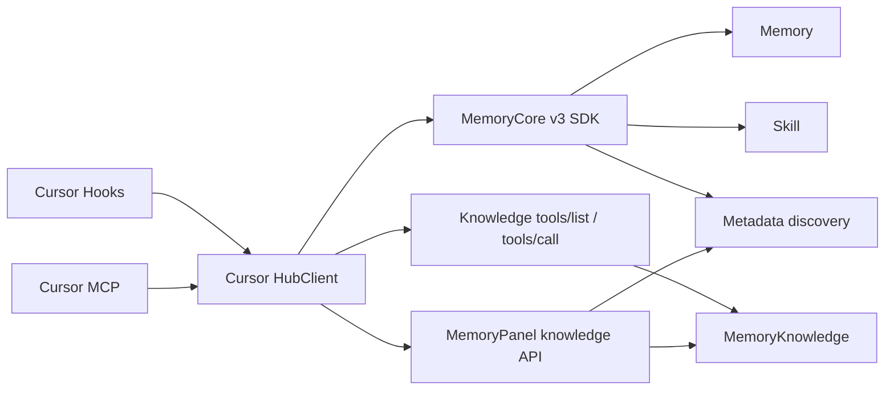

# Cursor 全量适配 Memory Hub 方案

> 最简结论：保留现有 Cursor 生命周期，只增加一个 Hub 薄适配层和三个 MCP 工具；Memory、Skill、Metadata 复用 v3 SDK，Knowledge 查询复用工具发现接口，Knowledge 写入复用 Panel 编排。

## 文档状态

本文是 Cursor 适配 Memory Hub 的方案入口。本阶段只维护本文，不建立重复 PRD、接口副本或实现计划。

当前状态：**方案已确认，尚未实现。**

## 目标

Cursor Adapter 最大化复用 Hub 已落地的 Skill、CodeGraph、Wiki 能力，同时保留现有 Memory L0–L3、Cursor Hooks、MCP、pending 恢复和安全安装行为。写操作默认开放，权限、版本和资源状态由 Hub 最终判定。

## 方案边界

### 包含

- Cursor 会话自动回流 Memory L0 和 Skill conversation buffer。
- Cursor 会话开始时轻量注入 Memory、Skill 和已绑定 Knowledge 资产索引。
- Skill 当前有效的读取、创建、更新、版本、资源文件、归档与删除能力。
- CodeGraph 当前有效的查询、创建、更新元信息、同步与删除能力。
- Wiki 当前有效的查询、创建、原始文件写入、页面读取/删除、构建与资产删除能力。
- Knowledge 资产绑定、解绑、可见性和 ACL 授权。
- 写操作默认注册并可调用。

### 不包含

- Team、User、Agent、Task 等 Hub 管理面通用 CRUD。
- 修改 MemoryCore、MemoryKnowledge、MemoryPanel 或 MemoryProxy。
- 为 Cursor 复制 Panel 编排、Knowledge 引擎或 Hub 服务端校验。
- 私有仓库和 SSH CodeGraph 的可靠性承诺；当前验收只覆盖公开 HTTPS 仓库。
- 已下线的 Agent `skill/extract` 路径。

## 现状

### 已落地：Cursor Adapter

当前 `MemoryCore/cursor-plugin/` 已提供：

- `sessionStart`、`stop`、`sessionEnd` Hook。
- 有界 transcript 读取、每轮 pending、detached worker 和全局投递锁。
- Memory L0 回流、L1/L0 检索、L2 读取、L2/L3 会话注入。
- Hooks、MCP、Rule 的安全安装和卸载。

本方案保留上述边界，只扩充 Hub 数据面。

### 已落地：Hub 能力

| 能力 | 当前入口 | 代码出处 |
|---|---|---|
| Memory L0–L3 | v3 `MemoryClient` | `feat/server_team:sdk/memory-core/typescript/src/v3/client.ts` |
| Skill | v3 `SkillClient` | `feat/server_team:sdk/memory-core/typescript/src/v3/skill-client.ts` |
| Metadata 与固定资产查询 | v3 `MetadataClient` | `feat/server_team:sdk/memory-core/typescript/src/v3/metadata-client.ts` |
| Wiki/CodeGraph 查询发现 | `/v3/tools/list`、`/v3/tools/call` | `feat/server_team:MemoryKnowledge/src/routes/tools.ts` |
| Wiki/CodeGraph 管理 | `/api/v1/knowledge/*` | `feat/server_team:MemoryPanel/src/panel/http/routes/knowledge/` |

`MemoryKnowledge` 的底层管理接口不等于完整 Hub 管理语义。Hub 当前由 Panel 级联处理 Knowledge 服务、Core `entity_knowledge`、`meta_asset`、Agent 绑定和 ACL，因此 Cursor 的管理写入必须走 Panel，不能只调用 Knowledge `service_url`。

Skill 的 `/v3/skill/extract` SDK 方法仍存在，但当前 Agent bridge 已下线该入口。Hub 当前有效路径是每轮调用 `conversation/add`，需要人工触发时调用 `conversation/force-archive`。本方案按有效路径适配。

## 选择：Cursor 原生 MCP 薄适配

采用 **Cursor 原生 MCP 薄适配**：



不采用：

| 方案 | 不采用原因 |
|---|---|
| 全部经过 MemoryProxy | Knowledge 管理能力没有完整 bridge，需要扩大服务端范围 |
| 复制 Hub Prompt/curl 注入 | 重复协议与说明，参数约束弱，容易随 Hub 漂移 |
| 直接调用 Knowledge 管理接口 | 绕过 Panel 级联，可能留下元数据、绑定或 ACL 不一致 |

## 调用链

```text
Cursor Hooks
├─ sessionStart：并发召回和资产索引注入
├─ stop：生成双目标 pending 并唤醒 worker
└─ sessionEnd：唤醒 worker 并清理 marker

Cursor MCP
└─ HubClient
   ├─ MemoryClient：L0–L3
   ├─ SkillClient：Skill 与 conversation buffer
   ├─ MetadataClient：已绑定资产发现
   ├─ Knowledge Tool Client：只调用 tools/list、tools/call
   └─ Panel Client：只调用 /api/v1/knowledge/*
```

`HubClient` 只属于 `MemoryCore/cursor-plugin/`。不新增公共包，不跨包导入 MemoryPanel 或 MemoryKnowledge 源码。

## 模块契约

| 模块 | 输入 | 输出 |
|---|---|---|
| Hooks | Cursor lifecycle payload、Hub 配置 | `additional_context`、pending、worker 唤醒 |
| pending | 完整 user/assistant 轮次、各目标 ACK | 可恢复的双目标投递记录 |
| worker | pending、MemoryClient、SkillClient | Memory L0 与 Skill buffer ACK |
| HubClient | domain、action、params、固定身份 | Hub 原始业务结果或 bounded 错误 |
| MCP | `tdai_hub_*` 参数 | 资产目录、查询结果、写入结果 |
| installer | Cursor 配置文件 | 合并后的 Hooks、MCP、Rule |

## MCP 接口

保留现有 `tdai_memory_search`、`tdai_conversation_search`、`tdai_read_cos`，新增三个 Hub 工具：

| 工具 | 输入 | 输出 | MCP 属性 |
|---|---|---|---|
| `tdai_hub_list` | 可选 domain、asset ID | 已绑定资产、可用 action、参数说明 | 只读、幂等 |
| `tdai_hub_read` | domain、action、params | Hub 查询结果 | 只读、幂等 |
| `tdai_hub_write` | domain、action、params | Hub 写入或异步受理结果 | 可修改外部状态、可能具有破坏性 |

不把约 40 个 Hub action 注册为独立 MCP 工具。三工具结构保留 Hub 的渐进发现能力，减少 Cursor 每轮的工具描述占用。

以下 action 表即为白名单；“读”“写”表示 MCP 工具的路由类别。

### Skill action

| 类别 | action |
|---|---|
| 读 | `list`、`listing`、`search`、`get`、`versions`、`files_read` |
| 写 | `create`、`update`、`patch`、`delete`、`files_write`、`files_remove`、`force_archive` |
| Hook 内部 | `conversation_add`，不向 Agent 暴露 |

`force_archive` 必须携带 `session_key`。`sessionStart` 将当前 `cursor:<conversation_id>` 作为非敏感会话标识注入工具指南。

### CodeGraph action

| 类别 | action |
|---|---|
| 读 | `list`、`get`、`search`、`explore`、`callers`、`callees`、`impact`、`node`、`status`、`files` |
| 写 | `create`、`update_meta`、`sync`、`register_meta`、`delete` |

### Wiki action

| 类别 | action |
|---|---|
| 读 | `list`、`get`、`search`、`graph`、`raw_list`、`raw_read`、`page_list`、`page_read` |
| 写 | `create`、`raw_write`、`raw_remove`、`page_remove`、`ingest`、`delete` |

### Knowledge 资产 action

| 类别 | action |
|---|---|
| 读 | `agent_fixed` |
| 写 | `allocate`、`unbind`、`set_visibility`、`grant` |

action 白名单和参数仅映射 Hub 当前接口，不引入新的业务语义。写工具始终注册，不增加 `allowWrite` 开关；Hub 权限是唯一裁决者。

## 配置与鉴权

继续使用现有 Gateway 和隔离配置，仅新增两项：

| 配置 | 必填 | 用途 |
|---|---:|---|
| `MEMORY_TENCENTDB_PANEL_URL` | 是 | Wiki/CodeGraph 管理和 Knowledge 资产操作 |
| `MEMORY_TENCENTDB_USER_KEY` | 是 | Panel caller 身份、资产可见性和 ACL 校验 |

已有 `gatewayUrl`、`gatewayApiKey`、service/team/agent/user/task、timeout 和 transcript root 全部复用。Knowledge 查询地址从 Hub 返回的 `service_url` 获取，不新增静态 Knowledge URL。Panel Client 固定将现有 service ID 和新增 User Key 分别映射为 `x-tdai-service-id`、`x-tdai-user-key`，不接受 MCP 参数覆盖。

`MEMORY_TENCENTDB_PANEL_URL` 固定填写 Panel origin，例如 `http://127.0.0.1:8125`，不包含 `/api/v1`；Client 去除尾部 `/` 后统一追加 `/api/v1/knowledge/*`。

| 调用面 | 鉴权 |
|---|---|
| MemoryCore SDK | `Authorization: Bearer <gatewayApiKey>`、`x-tdai-service-id`；Metadata 额外携带 `x-tdai-user-key` |
| MemoryPanel | `x-tdai-service-id`、`x-tdai-user-key` |
| MemoryKnowledge tools | `x-tdai-service-id`；按当前 Hub tools 契约不复用 Panel User Key |

API key、User Key 不进入 MCP 参数、prompt、pending 或日志。

## 数据流

### 1. 会话开始

1. 识别顶层非 Background Agent 会话并写 marker。
2. 在现有 2 秒总预算内并发调用：`readCore()`、`listScenarios()`、`SkillClient.listing()`、`MetadataClient.listAgentFixedAssetsWithDetail()`。
3. 固定资产列表成功后，用其中的 Knowledge IDs 调用 `MetadataClient.listKnowledge()` 获取 `service_url`；不从固定资产详情推断地址。
4. 使用 `Promise.allSettled` 保留成功结果；`service_url` 为空或资源未 `ready` 时只展示状态，不开放内容调用。
5. 注入 L3、L2 导航、Skill listing、已绑定 Wiki/CodeGraph 摘要、三个 Hub 工具说明和当前 `session_key`。
6. 全部远端调用失败时仍返回最小工具说明，Cursor 正常进入会话。

### 2. 每轮结束

1. `stop` 沿用现有受限 transcript 读取，得到最后完整 user/assistant 轮次。
2. 将一份轮次写入 pending，不重复保存正文。
3. worker 在现有全局锁内分别投递：
   - `MemoryClient.addConversation()`；
   - `SkillClient.conversationAdd()`。
4. 每个目标成功后立即追加自己的 ACK。
5. 两个目标都进入终态后删除 pending。

### 3. Skill 手动归档

`SkillClient.conversationAdd()` 和 `SkillClient.conversationForceArchive()` 每次都显式传入 `session_id`、`user_id`、`team_id`、`agent_id`；`task_id` 可选。SDK 不会为这两条接口合并 constructor defaults，缺字段必须本地报错，不能落入默认空间。

`tdai_hub_write(domain=skill, action=force_archive)` 使用注入的 `session_key` 作为 `session_id` 调用 `SkillClient.conversationForceArchive()`。返回 `empty` 或 `archived` 原始语义；只有 `archived` 表示归档任务已产生，不表示 Skill 已完成提取。

### 4. Knowledge 查询与写入

- 资产目录：`tdai_hub_list` 通过 Metadata SDK 获取当前 Agent 的固定资产；team list 和资源 get 走 Panel 权限门控。
- 内容查询：通过资源 `service_url` 调用 `/v3/tools/list`、`/v3/tools/call`，与 Hub 当前 Agent 运行时一致。
- 写入与资产操作：`tdai_hub_write` 调用 Panel `/api/v1/knowledge/*`，由 Panel 完成权限校验及 Knowledge 服务与 Core 资产的级联。
- `create`、`ingest`、`sync` 返回异步受理不等于资源可用；必须用 `get` 或 `status` 观察到 `ready`。

## Pending 与重试

### 数据结构

保留现有 user、assistant、stop 事件；设计新增投递终态事件：

```json
{"v":2,"event":"delivery_ack","conversation_id":"c1","generation_id":"g1","sink":"memory","outcome":"acked","at_ms":0}
```

| 字段 | 值 | 用途 |
|---|---|---|
| `sink` | `memory`、`skill` | 区分两个真实消费者 |
| `outcome` | `acked`、`discarded` | 成功或明确不可重试 |
| `code` | 可选数字 | 记录 bounded 错误码，不记录正文 |

### 投递规则

worker 只调用尚未进入终态的 sink。ACK 追加后必须对文件执行 `sync()`，再把该 sink 视为本地终态。不可重试白名单固定为：Memory `400`、`413`；Skill `conversation/add` 的 `40001`、`41301`。其他自动投递错误全部保留 pending 并等待后续唤醒。处理当前 pending 时，即使一个 sink 失败，也要尝试另一个 sink；随后停止本轮 drain，保持 FIFO。

Skill CRUD 的 Owner、版本、冲突等错误只返回当前 MCP 调用，不进入 pending，也不阻塞 worker。`conversation/add` 返回 404 表示 Skill 模块尚未启用，属于可修复部署错误，因此保留并阻塞 FIFO，待配置恢复后继续。

### 兼容与崩溃语义

现有 v1 pending 可直接读取；没有 `delivery_ack` 即视为两个 sink 均未投递。新 ACK 使用 v2 事件，并与 v1 基础事件混合折叠。ACK 写入或 `sync()` 失败时保留文件，下次允许重放该 sink。

这是本方案唯一新增的本地持久化状态，用于减少双目标部分成功后的常规重复投递。远端成功与本地 ACK durable 之间仍存在崩溃窗口，因此整体语义是 **at-least-once**，不承诺 exactly-once；服务端没有稳定幂等键前，方案不得宣称完全消除重复。

## 失败语义

- 所有 Hook 保持 fail-open；`stop`、`sessionEnd` 前台不访问网络。
- `sessionStart` 共享现有 2 秒总预算，单项失败不影响其它结果。
- MCP 查询失败返回截断后的可读错误，不阻断 Cursor。
- MCP 写失败返回 Hub 原始错误码和 bounded message，不包装为成功。
- `create`、`ingest`、`sync` 只承诺请求被接受，不承诺后台处理成功。
- Memory 或 Skill 单边瞬时失败时保留 pending，只重试未 ACK 的目标。
- 远端成功但 ACK durable 前进程退出时允许重放，按 at-least-once 记录和验收。
- Adapter 不启动、不停止、不重启 MemoryCore、MemoryKnowledge、MemoryPanel 或 MemoryProxy。

## 复用约束

| 能力 | 复用方式 | Cursor 仅新增 |
|---|---|---|
| Memory | `MemoryClient` | 无 |
| Skill | `SkillClient` | action 路由与 pending ACK |
| Metadata discovery | `MetadataClient` | 固定资产结果格式化 |
| Knowledge 内容查询 | `/tools/list`、`/tools/call` | 通用信封 HTTP 调用 |
| Knowledge 控制与管理 | Panel `/api/v1/knowledge/*` | action→路径白名单 |
| Cursor 生命周期 | 现有 Hooks、pending、worker、installer | 双目标投递和轻量上下文扩展 |

禁止复制 Panel 级联、MemoryKnowledge 工具定义、SDK request/response 类型或服务端校验。

当前目标分支 SDK 源码已经包含 `SkillClient.conversationForceArchive()`，但当前安装的同版本 npm 产物尚未包含该方法。实现必须依赖包含该方法的正式 SDK 产物或目标分支 SDK workspace；不得在 Cursor 内复制该请求。SDK 产物对齐是开工前置门禁。

## 接口索引

| 状态 | 接口 | 用途 | 出处 |
|---|---|---|---|
| 已落地 | `/v3/skill/*` | Skill CRUD、版本、文件和 listing | `feat/server_team:MemoryCore/src/gateway/skill-handlers.ts` |
| 已落地 | `/v3/skill/conversation/add` | 每轮积累 Skill buffer | 同上 `handleConversationAdd` |
| 已落地 | `/v3/skill/conversation/force-archive` | 手动归档当前 buffer | 同上 `handleForceArchive` |
| 已落地 | `/v3/tools/list`、`/v3/tools/call` | Knowledge 渐进发现与查询 | `feat/server_team:MemoryKnowledge/src/routes/tools.ts` |
| 已落地 | `/api/v1/knowledge/wiki/*` | Wiki 管理 | `feat/server_team:MemoryPanel/src/panel/http/routes/knowledge/wiki-routes.ts` |
| 已落地 | `/api/v1/knowledge/code-graph/*` | CodeGraph 管理 | `feat/server_team:MemoryPanel/src/panel/http/routes/knowledge/code-graph-routes.ts` |
| 已落地 | `/api/v1/knowledge/allocate` 等 | 绑定、可见性和 ACL | `feat/server_team:MemoryPanel/src/panel/http/routes/knowledge/allocate-routes.ts` |
| 设计新增 | `tdai_hub_list/read/write` | Cursor MCP 最小能力面 | 本文 |
| 设计新增 | pending `delivery_ack` | 双目标独立重试 | 本文 |

## 验收标准

### 自动化测试

1. 现有 Cursor Adapter 单元测试、类型检查和构建全部通过。
2. Hub action 白名单逐项覆盖本文能力表；未知 domain、action、额外参数被拒绝。
3. Skill、Metadata 使用 SDK；生产源码不复制 SDK 类型或拼装对应 v3 请求体。
4. Knowledge 内容查询只走 `/tools/list`、`/tools/call`；目录/get、管理和资产操作只走 Metadata SDK 或 Panel API。
5. SDK 依赖实际导出 `conversationAdd()` 和 `conversationForceArchive()`；缺任一方法不得以 Cursor 私有 HTTP 实现绕过。
6. `conversationAdd()`、`conversationForceArchive()` 缺任一必填隔离字段时本地失败，不发送请求。
7. `sessionStart` 四类请求及 Knowledge 地址补全共享 2 秒预算并可独立降级。
8. 双目标 pending 覆盖 Memory 成功/Skill 失败、Skill 成功/Memory 失败、ACK 写入失败、进程中断和 v1 兼容；正常恢复不重复调用已 ACK sink，崩溃窗口按 at-least-once 验证。
9. 日志、MCP 输出、pending 和注入内容均不包含 API key 或 User Key。

### 真实 Hub E2E

1. Memory：本轮写入、新会话召回和 L2 正文读取。
2. Skill：会话积累、force-archive、创建、搜索、版本、文件读写、更新和删除。
3. CodeGraph：公开 HTTPS 仓库创建、`ready`、explore/callers/impact、同步和删除。
4. Wiki：创建、raw 上传、ingest、`ready`、搜索、页面读取/删除和资产删除。
5. 资产：绑定、解绑、可见性和 ACL 生效；无权操作由 Hub 拒绝。
6. Hub 任一服务不可用时 Cursor 前台不阻塞，pending 和写入错误符合本文语义。

单元测试或 mock 通过不能替代真实 Hub E2E；未执行的 E2E 只能标记为待验证。

## 实施顺序

1. 扩展配置与 Hub clients。
2. 建立三个 MCP 工具和 action 白名单。
3. 扩展 `sessionStart` 轻量注入。
4. 以 TDD 增加双目标 pending ACK 和 worker 投递。
5. 更新 installer Rule 与使用说明。
6. 完成自动化回归。
7. 完成真实 Cursor + Hub E2E。
