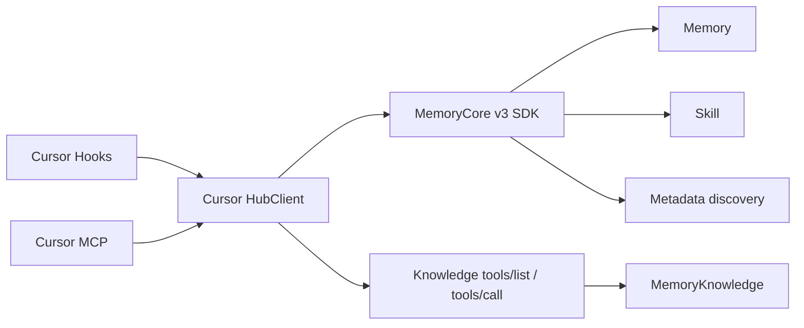

# Cursor 全量适配 Memory Hub 方案

> 最简结论：保留现有 Cursor 生命周期，增加一个 Hub 薄适配层和两个只读 MCP 工具；Memory / Skill / Metadata 升级现有 v3 SDK，Knowledge 查询复用 `tools/list`+`tools/call`。写面与资产预注入一期不做；双 sink 用双目录 pending，不引入新事件类型。

## 文档状态

云脑方案入口：`docs/cursor-hub-adapter/prd.md`。本文保留细则与白名单全文，避免与 PRD 双写冲突时以本文与代码为准。

当前状态：**方案已按诊断修订，尚未实现。**  
修订依据：`docs/cursor-hub-adapter/diagnosis.md`。主要结果：修正 SDK/密钥等事实；sessionStart 不再预注入资产；一期只读 MCP；双目录 pending 替代 v2 ACK；注入加硬上限。不合并 `tdai_hub_list` 进 `tdai_hub_read`。

## 目标

Cursor Adapter 最大化复用 Hub 已落地的 Skill、CodeGraph、Wiki **查询**能力，同时保留现有 Memory L0–L3、Cursor Hooks、MCP、pending 恢复和安全安装行为。管理写入继续走 Panel UI；Cursor 侧一期只读。

## 方案边界

### 包含

- Cursor 会话自动回流 Memory L0 和 Skill conversation buffer。
- Cursor 会话开始时轻量注入 Memory（L3/L2）与工具指南；已绑定 Knowledge 资产按需用 `tdai_hub_list` 发现。
- Skill / CodeGraph / Wiki / 固定资产的当前有效**读**能力（白名单 25 项）。
- Hook 内部 `conversation_add`（不向 Agent 暴露）。

### 不包含

- Team、User、Agent、Task 等 Hub 管理面通用 CRUD。
- Wiki / CodeGraph / Skill / ACL 的 Cursor 侧写 action（一期）；需要时走 Panel。
- `tdai_hub_write` 与 `force_archive` MCP 暴露（一期）。
- sessionStart 预注入资产索引（与 `tdai_hub_list` 重复）。
- 修改 MemoryCore、MemoryKnowledge、MemoryPanel 或 MemoryProxy。
- 为 Cursor 复制 Panel 编排、Knowledge 引擎或 Hub 服务端校验。
- 私有仓库和 SSH CodeGraph 的可靠性承诺；当前验收只覆盖公开 HTTPS 仓库。
- 已下线的 Agent `skill/extract` 路径。

## 现状

### 已落地：Cursor Adapter

当前 `MemoryCore/cursor-plugin/` 已提供：

- `sessionStart`、`stop`、`sessionEnd` Hook。
- 有界 transcript 读取、每轮 pending、detached worker 和全局投递锁。
- Memory L0 回流、L1/L0 检索、L2 读取、L2/L3 会话注入。
- Hooks、MCP、Rule 的安全安装和卸载。

本方案保留上述边界，只扩充 Hub 数据面。

### 已落地：Hub 能力

| 能力 | 当前入口 | 代码出处 |
|---|---|---|
| Memory L0–L3 | v3 `MemoryClient` | `feat/server_team:sdk/memory-core/typescript/src/v3/client.ts` |
| Skill | v3 `SkillClient` | `feat/server_team:sdk/memory-core/typescript/src/v3/skill-client.ts` |
| Metadata 与固定资产查询 | v3 `MetadataClient` | `feat/server_team:sdk/memory-core/typescript/src/v3/metadata-client.ts` |
| Wiki/CodeGraph 查询发现 | `/v3/tools/list`、`/v3/tools/call` | `feat/server_team:MemoryKnowledge/src/routes/tools.ts` |
| Wiki/CodeGraph 管理 | `/api/v1/knowledge/*` | `feat/server_team:MemoryPanel/src/panel/http/routes/knowledge/` |

`MemoryKnowledge` 的底层管理接口不等于完整 Hub 管理语义。Hub 当前由 Panel 级联处理 Knowledge 服务、Core `entity_knowledge`、`meta_asset`、Agent 绑定和 ACL，因此 **若将来开放管理写入，必须走 Panel**，不能只调用 Knowledge `service_url`。一期 Cursor 不接 Panel 写面。

Skill 的 `/v3/skill/extract` SDK 方法仍存在，但当前 Agent bridge 已下线该入口。Hub 当前有效路径是每轮调用 Core `conversation/add`；需要人工触发时调用 Core `conversation/force-archive`。Panel `SKILL_ACTIONS` 白名单不含这两条，故不能经 Panel 代理，只能走 Core SDK。本方案按有效路径适配；一期仅 Hook 自动 `conversationAdd`，不暴露 MCP `force_archive`。

复用的是同一 npm 包 `@tencentdb-agent-memory/memory-sdk-ts-v2` 的版本升级（当前适配器已依赖 `1.0.0-beta.2`），不是引入新依赖。

## 选择：Cursor 原生 MCP 薄适配

采用 **Cursor 原生 MCP 薄适配**：



不采用：

| 方案 | 不采用原因 |
|---|---|
| 全部经过 MemoryProxy | Knowledge 管理能力没有完整 bridge，需要扩大服务端范围 |
| 复制 Hub Prompt/curl 注入 | 重复协议与说明，参数约束弱，容易随 Hub 漂移 |
| 直接调用 Knowledge 管理接口 | 绕过 Panel 级联，可能留下元数据、绑定或 ACL 不一致 |
| 一期接 Panel 写面 | 与「排除 Team/User 管理面」边界不一致；Panel UI 已覆盖 |

## 调用链

```text
Cursor Hooks
├─ sessionStart：并发召回 Memory（现状 2 路），注入工具指南
├─ stop：写入 pending/memory 与 pending/skill 后唤醒 worker
└─ sessionEnd：唤醒 worker 并清理 marker

Cursor MCP
└─ HubClient
   ├─ MemoryClient：L0–L3
   ├─ SkillClient：Skill 读 + Hook 内 conversationAdd
   ├─ MetadataClient：已绑定资产发现（按需）
   └─ Knowledge Tool Client：只调用 tools/list、tools/call
```

`HubClient` 只属于 `MemoryCore/cursor-plugin/`。不新增公共包，不跨包导入 MemoryPanel 或 MemoryKnowledge 源码。

## 模块契约

| 模块 | 输入 | 输出 |
|---|---|---|
| Hooks | Cursor lifecycle payload、Hub 配置 | `additional_context`、双目录 pending、worker 唤醒 |
| pending | 完整 user/assistant 轮次（每 sink 一份） | 可恢复的单 sink 投递记录；删文件即终态 |
| worker | 双目录 pending、MemoryClient、SkillClient | Memory L0 与 Skill buffer ACK |
| HubClient | domain、action、params、固定身份 | Hub 原始业务结果或 bounded 错误 |
| MCP | `tdai_hub_list` / `tdai_hub_read` | 资产目录、查询结果 |
| installer | Cursor 配置文件 | 合并后的 Hooks、MCP、Rule |

## MCP 接口

保留现有 `tdai_memory_search`、`tdai_conversation_search`、`tdai_read_cos`，新增两个 Hub 工具：

| 工具 | 输入 | 输出 | MCP 属性 |
|---|---|---|---|
| `tdai_hub_list` | 可选 domain、asset ID | 已绑定资产、可用 action、参数说明 | 只读、幂等 |
| `tdai_hub_read` | domain、action、params | Hub 查询结果 | 只读、幂等 |

不把 25 个读 action 注册为独立 MCP 工具；也不把 `tdai_hub_list` 并入 `tdai_hub_read`（保留自述入口的可发现性）。

以下 action 表即为白名单；「读」表示 MCP 路由类别。`SDK 方法` 列给出与 action 名不一致时的映射，避免实现按 action 名在 SDK 上落空。

### Skill action

| 类别 | action | SDK 方法 |
|---|---|---|
| 读 | `list`、`listing`、`search`、`get`、`versions`、`files_read` | 同名；`files_read` → `readFile` |
| Hook 内部 | `conversation_add`，不向 Agent 暴露 | `conversationAdd` |

`sessionStart` 将当前 `cursor:<conversation_id>` 作为非敏感会话标识注入工具指南，供后续扩展使用。

### CodeGraph action

| 类别 | action |
|---|---|
| 读 | `list`、`get`、`search`、`explore`、`callers`、`callees`、`impact`、`node`、`status`、`files` |

### Wiki action

| 类别 | action |
|---|---|
| 读 | `list`、`get`、`search`、`graph`、`raw_list`、`raw_read`、`page_list`、`page_read` |

### Knowledge 资产 action

| 类别 | action |
|---|---|
| 读 | `agent_fixed` |

action 白名单和参数仅映射 Hub 当前接口，不引入新的业务语义。一期无写工具；若二期恢复写面，破坏性 action（`delete` / `unbind` / `grant` 等）须显式 env 开启，不得默认注册。

## 配置与鉴权

继续使用现有 Gateway 和隔离配置，仅新增一项：

| 配置 | 必填 | 用途 |
|---|---:|---|
| `MEMORY_TENCENTDB_USER_KEY` | 是 | `sk-mem-*` 前缀的用户 API 密钥；Metadata 固定资产查询（`agent-fixed-asset/list-with-detail`）与资产可见性校验必须携带。由 Panel `auth/verify` 换 `user_id`，不是普通「身份字符串」 |

已有 `gatewayUrl`、`gatewayApiKey`、service/team/agent/user/task、timeout 和 transcript root 全部复用。Knowledge 查询地址从 Hub 返回的 `service_url` 获取，不新增静态 Knowledge URL。一期不新增 `MEMORY_TENCENTDB_PANEL_URL`。

Metadata / 需要 user-key 的调用固定将现有 service ID 和新增 User Key 分别映射为 `x-tdai-service-id`、`x-tdai-user-key`，不接受 MCP 参数覆盖。

| 调用面 | 鉴权 |
|---|---|
| MemoryCore SDK | `Authorization: Bearer <gatewayApiKey>`、`x-tdai-service-id`；Metadata 额外携带 `x-tdai-user-key` |
| MemoryKnowledge tools | `x-tdai-service-id`；按当前 Hub tools 契约不复用 Panel User Key |

API key、User Key 不进入 MCP 参数、prompt、pending 或日志。User Key 与 `gatewayApiKey` 同级保管；存放位置与轮换约定与现有 Gateway 密钥一致（env / 安装配置，不入库）。

## 数据流

### 1. 会话开始

1. 识别顶层非 Background Agent 会话并写 marker。
2. 在现有 2 秒总预算内并发调用：`readCore()`、`listScenarios()`（与现状一致，见 `context.ts`）。
3. 使用 `Promise.allSettled` 保留成功结果。
4. 注入 L3、L2 导航、Hub 工具说明（含「已绑定 Wiki/CodeGraph 资产用 `tdai_hub_list` 发现」）和当前 `session_key`。
5. 注入总量设硬上限并截断（含 persona 原文）；超限优先保留工具指南与截断标记。
6. 全部远端调用失败时仍返回最小工具说明，Cursor 正常进入会话。

不在 sessionStart 拉取 Skill listing 或固定资产索引；按需由 MCP 发现，避免与 `tdai_hub_list` 重复并挤占 2 秒预算。

### 2. 每轮结束

1. `stop` 沿用现有受限 transcript 读取，得到最后完整 user/assistant 轮次。
2. 将同一轮次分别写入 `pending/memory/<key>.jsonl` 与 `pending/skill/<key>.jsonl`，事件格式沿用现有 v1（`user` / `assistant` / `stop`），不新增事件类型。
3. worker 在现有全局锁内串行 drain 两个目录：
   - memory：`MemoryClient.addConversation()`；
   - skill：`SkillClient.conversationAdd()`。
4. 每个目录投递成功（或命中不可重试白名单）后删除对应文件；删除本身即该 sink 终态。
5. 处理时即使一个 sink 失败，也要尝试另一个 sink；随后停止本轮 drain，保持 FIFO。

代价：本轮正文在本地暂存两份（有界，投递后即删）。收益：不引入 `delivery_ack`、不改 `foldPending`、无 v1/v2 混合折叠。

### 3. Skill buffer 身份字段

`SkillClient.conversationAdd()` 每次都显式传入 `session_id`、`user_id`、`team_id`、`agent_id`；`task_id` 可选。SDK 不会为该接口合并 constructor defaults，缺字段必须本地报错，不能落入默认空间。

### 4. Knowledge 查询

- 资产目录：`tdai_hub_list` 通过 Metadata SDK 获取当前 Agent 的固定资产；详情无 `service_url` 时再调 `listKnowledge()` 补地址（与 Hub 两段式一致，非冗余）。
- 内容查询：通过资源 `service_url` 调用 `/v3/tools/list`、`/v3/tools/call`，与 Hub 当前 Agent 运行时一致。
- `service_url` 为空或资源未 `ready` 时只展示状态，不开放内容调用。

## Pending 与重试

### 目录与格式

| 路径 | sink | 格式 |
|---|---|---|
| `pending/memory/*.jsonl` | Memory L0 | 现有 v1 事件 |
| `pending/skill/*.jsonl` | Skill buffer | 现有 v1 事件 |

兼容：若仍存在旧路径 `pending/*.jsonl`（无子目录），按 memory sink 处理，直至迁移完成。

不新增 `delivery_ack` v2 事件；不把 ACK 写入同一文件。

### 投递规则

worker 对每个目录独立判定：文件在且可 `foldPending` → 未完成；投递成功或不可重试 → 删文件。不可重试白名单固定为：Memory `400`、`413`；Skill `conversation/add` 的 `40001`、`41301`。其他自动投递错误全部保留 pending 并等待后续唤醒。

Skill 读面的 Owner、版本等错误只返回当前 MCP 调用，不进入 pending，也不阻塞 worker。`conversation/add` 返回 404 表示 Skill 模块尚未启用，属于可修复部署错误，因此保留并阻塞 FIFO，待配置恢复后继续。

### 崩溃语义

远端成功与本地删文件之间仍存在崩溃窗口，因此整体语义是 **at-least-once**，不承诺 exactly-once；服务端没有稳定幂等键前，方案不得宣称完全消除重复。删文件失败时保留文件并允许重放该 sink。

本方案**不新增**本地持久化事件类型；唯一相对现状的变化是 pending 拆成两个目录。

## 失败语义

- 所有 Hook 保持 fail-open；`stop`、`sessionEnd` 前台不访问网络。
- `sessionStart` 共享现有 2 秒总预算，单项失败不影响其它结果。
- MCP 查询失败返回截断后的可读错误，不阻断 Cursor。
- Memory 或 Skill 单边瞬时失败时保留对应目录 pending，只重试未完成的目标。
- 远端成功但删文件前进程退出时允许重放，按 at-least-once 记录和验收。
- Adapter 不启动、不停止、不重启 MemoryCore、MemoryKnowledge、MemoryPanel 或 MemoryProxy。

## 复用约束

| 能力 | 复用方式 | Cursor 仅新增 |
|---|---|---|
| Memory | `MemoryClient` | 无 |
| Skill | `SkillClient` | 读 action 路由；Hook `conversationAdd`；双目录 pending |
| Metadata discovery | `MetadataClient` | 固定资产结果格式化；按需 `listKnowledge` 补地址 |
| Knowledge 内容查询 | `/tools/list`、`/tools/call` | 通用信封 HTTP 调用 |
| Cursor 生命周期 | 现有 Hooks、pending、worker、installer | 双目录投递和工具指南扩展 |

禁止复制 Panel 级联、MemoryKnowledge 工具定义、SDK request/response 类型或服务端校验。

当前目标分支 SDK 源码已经包含 `SkillClient.conversationForceArchive()`，但当前安装的同版本 npm 产物尚未包含该方法。Hook 路径一期只用 `conversationAdd()`；若二期暴露 `force_archive`，实现必须依赖包含该方法的正式 SDK 产物或目标分支 SDK workspace，不得在 Cursor 内复制该请求。SDK 产物对齐是开工前置门禁（至少覆盖 `conversationAdd`）。

## 接口索引

| 状态 | 接口 | 用途 | 出处 |
|---|---|---|---|
| 已落地 | `/v3/skill/*` | Skill CRUD、版本、文件和 listing | `feat/server_team:MemoryCore/src/gateway/skill-handlers.ts` |
| 已落地 | `/v3/skill/conversation/add` | 每轮积累 Skill buffer | 同上 `handleConversationAdd` |
| 已落地 | `/v3/skill/conversation/force-archive` | 手动归档当前 buffer（二期可选） | 同上 `handleForceArchive` |
| 已落地 | `/v3/tools/list`、`/v3/tools/call` | Knowledge 渐进发现与查询 | `feat/server_team:MemoryKnowledge/src/routes/tools.ts` |
| 已落地 | `/api/v1/knowledge/*` | Wiki/CodeGraph/资产管理（Panel；一期 Cursor 不调用） | `feat/server_team:MemoryPanel/src/panel/http/routes/knowledge/` |
| 设计新增 | `tdai_hub_list` / `tdai_hub_read` | Cursor MCP 最小读能力面 | 本文 |
| 设计新增 | `pending/{memory,skill}/` | 双 sink 独立重试（沿用 v1 事件） | 本文 |

## 验收标准

### 自动化测试

1. 现有 Cursor Adapter 单元测试、类型检查和构建全部通过。
2. Hub 读 action 白名单逐项覆盖本文能力表；未知 domain、action、额外参数被拒绝；写 action 一律拒绝。
3. Skill、Metadata 使用 SDK；生产源码不复制 SDK 类型或拼装对应 v3 请求体。
4. Knowledge 内容查询只走 `/tools/list`、`/tools/call`；目录走 Metadata SDK；不调用 Panel knowledge 写接口。
5. SDK 依赖实际导出 `conversationAdd()`；缺方法不得以 Cursor 私有 HTTP 实现绕过。
6. `conversationAdd()` 缺任一必填隔离字段时本地失败，不发送请求。
7. `sessionStart` 仅 Memory 两路召回共享 2 秒预算并可独立降级；不发起资产索引或 Skill listing 请求。
8. 双目录 pending 覆盖 Memory 成功/Skill 失败、Skill 成功/Memory 失败、删文件失败、进程中断和旧 `pending/*.jsonl` 兼容；正常恢复不重复调用已删文件的 sink，崩溃窗口按 at-least-once 验证。
9. 日志、MCP 输出、pending 和注入内容均不包含 API key 或 User Key。
10. 注入总量硬上限：超限截断后仍包含工具指南。

### 真实 Hub E2E

1. Memory：本轮写入、新会话召回和 L2 正文读取。
2. Skill：会话经 Hook 积累；读面创建、搜索、版本、文件读取。
3. CodeGraph / Wiki：已绑定公开资源的 explore/search/页面读取；未 `ready` 时不开放内容调用。
4. Hub 任一服务不可用时 Cursor 前台不阻塞，pending 和读错误符合本文语义。

单元测试或 mock 通过不能替代真实 Hub E2E；未执行的 E2E 只能标记为待验证。

## 实施顺序

1. 扩展配置（`USER_KEY`）与 Hub 只读 clients；升级 SDK 产物门禁。
2. 建立两个 MCP 工具和读 action 白名单（含 SDK 方法映射）。
3. 扩展 `sessionStart` 工具指南与注入字节上限（不拉资产索引）。
4. 以 TDD 增加双目录 pending 与 worker 双 sink 投递。
5. 更新 installer Rule 与使用说明。
6. 完成自动化回归。
7. 完成真实 Cursor + Hub E2E。
