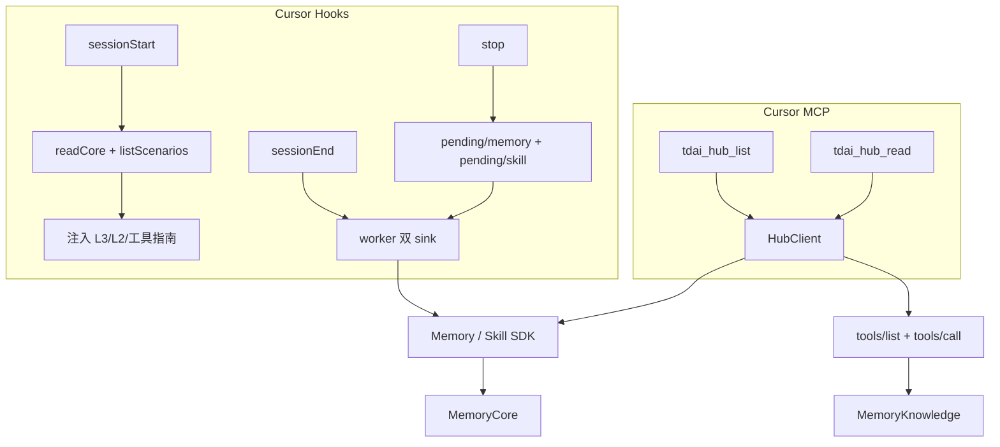

# 【云脑方案文档】Cursor 全量适配 Memory Hub

> 方案细则：`docs/cursor-hub-adapter/README.md`  
> 修订依据：`docs/cursor-hub-adapter/diagnosis.md`  
> 状态：**方案已按诊断修订，尚未实现**

# 需求分析

复用现有 Cursor Adapter 生命周期；加 Hub 薄适配层与两个只读 MCP 工具。会话可回流 Memory/Skill，并按需查已绑定 Skill、CodeGraph、Wiki。写面与资产预注入一期不做。

## 功能需求


| #   | 约束                                                                                                            |
| --- | ------------------------------------------------------------------------------------------------------------- |
| 1   | 保留现有 Cursor Hook、transcript、pending、worker、installer 边界，只扩充 Hub 数据面                                           |
| 2   | `sessionStart` 仅并发召回 Memory（`readCore` / `listScenarios`），注入 L3、L2 导航、Hub 工具指南与 `session_key`；不预注入资产索引        |
| 3   | `stop` 将同一轮次分别写入 `pending/memory/` 与 `pending/skill/`（沿用 v1 事件）；worker 双 sink 投递 Memory L0 与 Skill buffer     |
| 4   | MCP 保留现有三个 Memory 工具，新增 `tdai_hub_list`、`tdai_hub_read`；一期只读，白名单 25 个读 action + Hook 内部 `conversation_add`    |
| 5   | 新增必填 `MEMORY_TENCENTDB_USER_KEY`（`sk-mem-*`，经 Panel `auth/verify` 换 `user_id`）；密钥不进 MCP 参数、prompt、pending 或日志 |
| 6   | 不修改 MemoryCore、MemoryKnowledge、MemoryPanel、MemoryProxy；管理写入继续走 Panel UI                                       |


## 非功能需求


| 指标                | 要求                                               |
| ----------------- | ------------------------------------------------ |
| `sessionStart` 预算 | 现状 2 秒总预算；单项失败独立降级                               |
| Hook 失败语义         | 全部 fail-open；`stop` / `sessionEnd` 前台不访问网络       |
| 投递语义              | at-least-once；不承诺 exactly-once                   |
| 注入体积              | 硬上限截断；超限优先保留工具指南与截断标记                            |
| SDK 门禁            | 生产依赖须导出 `conversationAdd()`；禁止 Cursor 私有 HTTP 绕过 |
| 验收范围              | CodeGraph 只覆盖公开 HTTPS 仓库；私有/SSH 不做可靠性承诺          |


## 现状分析


### 已落地：Cursor Adapter

`MemoryCore/cursor-plugin/` 已有：`sessionStart` / `stop` / `sessionEnd`、有界 transcript、单目录 pending、detached worker、Memory L0–L3、Hooks/MCP/Rule 安全安装。本需求复用该骨架。

### 已落地：Hub 能力


| 能力                  | 入口                                | 出处                                                                             |
| ------------------- | --------------------------------- | ------------------------------------------------------------------------------ |
| Memory L0–L3        | v3 `MemoryClient`                 | `feat/server_team:sdk/memory-core/typescript/src/v3/client.ts`                 |
| Skill               | v3 `SkillClient`                  | `feat/server_team:sdk/memory-core/typescript/src/v3/skill-client.ts`           |
| Metadata / 固定资产     | v3 `MetadataClient`               | `feat/server_team:sdk/memory-core/typescript/src/v3/metadata-client.ts`        |
| Wiki / CodeGraph 查询 | `/v3/tools/list`、`/v3/tools/call` | `feat/server_team:MemoryKnowledge/src/routes/tools.ts`                         |
| Knowledge 管理        | `/api/v1/knowledge/*`             | `feat/server_team:MemoryPanel/src/panel/http/routes/knowledge/`（一期 Cursor 不调用） |


复用同一 npm 包 `@tencentdb-agent-memory/memory-sdk-ts-v2` 的版本升级，不引入新依赖名。Skill `conversation/add` 与 `force-archive` 不在 Panel `SKILL_ACTIONS` 白名单内，只能走 Core SDK。

## 收益及风险


### 收益


| 点   | 说明                                                           |
| --- | ------------------------------------------------------------ |
| 读能力 | Cursor 获得 Hub Skill / CodeGraph / Wiki 当前有效读能力，无需复制 Panel 编排 |
| 投递  | 双目录 pending 替代 v2 ACK，不新增事件类型、不改 `foldPending`               |
| 写面  | 一期只读，破坏性写 action 默认不注册                                       |


### 风险


| 风险                                    | 处理                                       |
| ------------------------------------- | ---------------------------------------- |
| SDK 产物缺 `conversationAdd`             | 开工前置门禁；缺方法不得私自拼 HTTP                     |
| `USER_KEY` 配错或泄露                      | 与 `gatewayApiKey` 同级保管；日志/MCP/pending 禁出 |
| 双 sink 单边失败                           | 各目录独立重试；另一 sink 仍尝试投递                    |
| 远端成功、删文件前崩溃                           | at-least-once 验收；不宣称 exactly-once        |
| Knowledge 未 `ready` / 无 `service_url` | 只展示状态，不开放内容调用                            |


### 残留风险


| 残留               | 说明                                     |
| ---------------- | -------------------------------------- |
| at-least-once 重复 | 服务端无稳定幂等键前，崩溃窗口可能重放同一轮                 |
| 注入硬上限            | 超限截断可能丢掉部分 persona/L2 正文；工具指南优先保留      |
| 密钥轮换             | `USER_KEY` 与 Gateway 密钥同级运维，本方案不新增轮换机制 |


# 业务流程


## 核心业务流程图




## 降级容错


| 场景                  | 行为                                 |
| ------------------- | ---------------------------------- |
| `sessionStart`      | `Promise.allSettled`；全部失败仍返回最小工具说明 |
| Memory / Skill 单边失败 | 保留对应目录 pending，只重试未完成 sink         |
| MCP 失败              | 返回截断可读错误，不阻断 Cursor                |
| 进程边界                | Adapter 不启动、不停止、不重启任一 Hub 服务进程     |


# 概要设计


## 总体架构

**Cursor 原生 MCP 薄适配**；`HubClient` 仅属于 `MemoryCore/cursor-plugin/`。

```text
Cursor Hooks / MCP → HubClient
  ├─ MemoryClient / SkillClient / MetadataClient
  └─ Knowledge tools/list + tools/call（service_url 动态获取）
```

不采用：全部经 MemoryProxy、复制 Hub Prompt/curl、直连 Knowledge 管理接口、一期接 Panel 写面。

## 输入与输出


| 大模块            | 输入                                           | 输出                                                                       |
| -------------- | -------------------------------------------- | ------------------------------------------------------------------------ |
| 生命周期与双 sink 投递 | Cursor lifecycle payload、transcript 完整轮次     | `additional_context`；双目录 pending；各 sink 成功或不可重试后删文件（非 v2 `delivery_ack`） |
| Hub 只读查询面      | domain / action / params、固定身份                | 资产目录、查询结果或 bounded 错误                                                    |
| 配置鉴权与安装        | Gateway / isolation / `USER_KEY`、Cursor 配置文件 | 校验通过的运行配置；合并后的 Hooks、MCP、Rule                                            |


文件下钻：


| 大模块         | 主要文件                                                                                       |
| ----------- | ------------------------------------------------------------------------------------------ |
| 生命周期与双 sink | `MemoryCore/cursor-plugin/src/hooks.ts`、`context.ts`、`pending.ts`、`worker.ts`、`session.ts` |
| Hub 只读查询面   | `MemoryCore/cursor-plugin/src/client.ts`（HubClient）、`mcp.ts`                               |
| 配置鉴权与安装     | `MemoryCore/cursor-plugin/src/config.ts`、`installer.ts`、Rule 文案                            |


## 数据结构


| 键或字段                         | TTL           | 用途                                   |
| ---------------------------- | ------------- | ------------------------------------ |
| `sessions/<hash>`            | 会话结束清理        | 顶层会话 marker                          |
| `pending/memory/<key>.jsonl` | 不完整 24h（沿用现状） | Memory L0 可重试投递                      |
| `pending/skill/<key>.jsonl`  | 同上            | Skill buffer 可重试投递                   |
| 旧 `pending/*.jsonl`          | 迁移期           | 按 memory sink 兼容                     |
| `MEMORY_TENCENTDB_USER_KEY`  | 配置长期有效        | Metadata 固定资产查询必填                    |
| `cursor:<conversation_id>`   | 会话期           | 注入的 `session_key`；Skill `session_id` |


不新增 `delivery_ack` 事件类型；删文件即该 sink 终态。细则见 README「Pending 与重试」。

## 交互接口


| 状态   | 接口                                  | 用途                                        | 出处                                                                                               |
| ---- | ----------------------------------- | ----------------------------------------- | ------------------------------------------------------------------------------------------------ |
| 已落地  | `/v3/conversation/add` 等 Memory API | L0 回流、L1/L0/L2/L3                         | `feat/server_team:sdk/memory-core/typescript/src/v3/client.ts`（`addConversation` 等）              |
| 已落地  | `/v3/skill/*` 读面                    | Skill list/search/get/versions/files      | `feat/server_team:MemoryCore/src/gateway/skill-handlers.ts`；action `files_read` → SDK `readFile` |
| 已落地  | `/v3/skill/conversation/add`        | Hook 内 Skill buffer（只走 Core SDK，不经 Panel） | 同上 `handleConversationAdd`；SDK `SkillClient.conversationAdd`                                     |
| 已落地  | `/v3/tools/list`、`/v3/tools/call`   | Wiki/CodeGraph 查询                         | `feat/server_team:MemoryKnowledge/src/routes/tools.ts`                                           |
| 已落地  | Metadata 固定资产查询                     | `tdai_hub_list` 目录                        | `feat/server_team:sdk/memory-core/typescript/src/v3/metadata-client.ts`；须 `x-tdai-user-key`      |
| 已落地  | Panel `/api/v1/knowledge/*`         | 管理写面                                      | `feat/server_team:MemoryPanel/src/panel/http/routes/knowledge/`；**一期 Cursor 不调用**                |
| 设计新增 | `tdai_hub_list` / `tdai_hub_read`   | Cursor MCP 最小读面                           | `docs/cursor-hub-adapter/README.md`「MCP 接口」                                                      |
| 设计新增 | `pending/{memory,skill}/`           | 双 sink 独立重试                               | `docs/cursor-hub-adapter/README.md`「Pending 与重试」                                                 |


### MCP 硬约束


| 工具              | 输入                   | 输出                   | 属性    |
| --------------- | -------------------- | -------------------- | ----- |
| `tdai_hub_list` | 可选 domain、asset ID   | 已绑定资产、可用 action、参数说明 | 只读、幂等 |
| `tdai_hub_read` | domain、action、params | Hub 查询结果             | 只读、幂等 |


| 项                 | 约束                                                                                                                                             |
| ----------------- | ---------------------------------------------------------------------------------------------------------------------------------------------- |
| 一期范围              | 读 action **25** + Hook 内部 `conversation_add`；不注册写工具；不把 list 并入 read                                                                            |
| 映射与参数             | 白名单、SDK 方法映射、参数约束见 README「MCP 接口」                                                                                                              |
| 鉴权                | MemoryCore：Bearer + `x-tdai-service-id`（Metadata 另加 `x-tdai-user-key`）；Knowledge tools：只用 `x-tdai-service-id`。身份字段不接受 MCP 覆盖。细则见 README「配置与鉴权」 |
| `conversationAdd` | 每次显式传 `session_id`、`user_id`、`team_id`、`agent_id`；缺字段本地失败                                                                                      |
| 不可重试 / 删文件        | Memory `400`/`413`；Skill `40001`/`41301`；成功或不可重试后删对应目录文件。Skill `404`（模块未启用）保留 pending 并阻塞 FIFO                                                 |


# 验收标准


### 自动化


| #   | 条目                                                                             |
| --- | ------------------------------------------------------------------------------ |
| 1   | 现有 Cursor Adapter 单测、类型检查、构建全部通过                                               |
| 2   | 读 action 白名单逐项覆盖；未知 domain/action/额外参数拒绝；写 action 一律拒绝                         |
| 3   | Skill / Metadata 走 SDK；生产源码不复制 SDK 类型或拼装对应 v3 请求体                              |
| 4   | Knowledge 内容只走 `/tools/list`、`/tools/call`；目录走 Metadata；不调 Panel knowledge 写接口 |
| 5   | SDK 实际导出 `conversationAdd()`；缺方法不得私有 HTTP 绕过                                   |
| 6   | `conversationAdd()` 缺必填隔离字段时本地失败                                               |
| 7   | `sessionStart` 仅 Memory 两路共享 2 秒预算；不发起资产索引或 Skill listing                      |
| 8   | 双目录 pending 覆盖单边失败、删文件失败、进程中断、旧路径兼容；崩溃窗口按 at-least-once                        |
| 9   | 日志、MCP、pending、注入均不含 API key / User Key                                        |
| 10  | 注入硬上限：超限截断后仍含工具指南                                                              |


### 真实 Hub E2E


| #   | 条目                                                             |
| --- | -------------------------------------------------------------- |
| 1   | Memory：本轮写入、新会话召回、L2 正文读取                                      |
| 2   | Skill：Hook 积累；读面 listing / 搜索 / 版本 / 文件读取                      |
| 3   | CodeGraph / Wiki：已绑定公开资源 explore/search/页面读取；未 `ready` 不开放内容调用 |
| 4   | Hub 任一服务不可用时 Cursor 前台不阻塞                                      |


单元测试或 mock 不能替代真实 Hub E2E；未执行的 E2E 标记为待验证。

## 实施顺序


| 步   | 动作                                        |
| --- | ----------------------------------------- |
| 1   | 扩展配置（`USER_KEY`）与 Hub 只读 clients；SDK 产物门禁 |
| 2   | 两个 MCP 工具与读 action 白名单（含 SDK 方法映射）        |
| 3   | 扩展 `sessionStart` 工具指南与注入字节上限             |
| 4   | TDD：双目录 pending 与 worker 双 sink           |
| 5   | 更新 installer Rule 与使用说明                   |
| 6   | 自动化回归 → 真实 Cursor + Hub E2E               |


## 二期边界（非本期）


| 边界                 | 说明                                                                              |
| ------------------ | ------------------------------------------------------------------------------- |
| 写面                 | `tdai_hub_write`、MCP `force_archive`、Cursor 侧 Wiki/CodeGraph/Skill/ACL 写 action |
| `force_archive` 门禁 | 开工前 SDK 产物须导出 `conversationForceArchive()`；禁止 Cursor 私有 HTTP 绕过                 |
| Wiki/CodeGraph 写面  | 若恢复：须显式处理「异步受理 ≠ `ready`」；不得把受理成功当作内容可用                                         |
| 破坏性 action         | 若恢复，须显式 env 开启，不得默认注册                                                           |
| Panel              | `MEMORY_TENCENTDB_PANEL_URL` 与 Panel 写面级联                                       |


