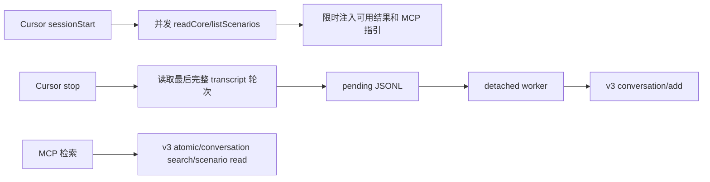

# 【云脑方案文档】阶段 1：Cursor 接入 feat/server_team

> 范围：复用现有 Cursor Adapter 的已验证骨架，只实现接入目标分支的差异。

# 需求分析

复用当前 Cursor Adapter，接入 `feat/server_team` 的 MemoryCore v3。范围包括 L0 回流、L1/L0 检索和 L2/L3 轻量注入；不包含 Codex CLI。

## 功能需求

1. 保留现有 Cursor Hook 生命周期、transcript、pending、worker 投递骨架，以及 installer 的安全合并语义。
2. 使用 `feat/server_team` 的 TypeScript v3 SDK，替换旧 `/capture` 与 `/search/*`，并删除随之失效的 Gateway、ctl、本地数据目录和 session-end 参数链。
3. 每次调用必须携带 service/team/agent/user；task 可选，session 从 Cursor 会话派生。
4. `stop`、`sessionEnd` 前台不访问网络；`sessionStart` 只允许 2 秒预算内的 L2/L3 并发查询，并保持 fail-open。
5. MemoryCore 不可用时保留完整 pending，恢复后由后续 `stop` 或 `sessionEnd` 推进。
6. `sessionEnd` 只无参数唤醒 worker 并清理 marker，不再传递 `sessionEndKey`。

## 非功能需求

- `sessionStart` 网络查询必须有独立短超时；其它前台 Hook 不增加网络。
- 不在日志中保存完整 prompt、response、API key 或隔离凭据。
- 安装和卸载只修改 Adapter 自己拥有的配置。
- 阶段 1 不为 Codex CLI 建设公共框架。

## 现状分析

### 当前 Cursor 基线

当前 `src/adapters/cursor/` 已实现完整客户端链路：

```text
sessionStart → marker/context
stop → transcript → pending → detached worker → /capture
MCP → /search/memories | /search/conversations
```

因此，本阶段只处理旧 Gateway 契约到 v3 契约的适配。

### feat/server_team

目标分支已提供 MemoryCore v3 SDK 和 L0–L3 HTTP API。新接入必须使用 service/team/agent/user 严格隔离；L0 写入还需要 session。

`MemoryCore/openclaw-plugin/` 已证明 Agent Adapter 可直接使用 v3 SDK。当前分支没有 Cursor Adapter，也没有可直接复用的 Cursor Hook 安装与 transcript 处理。

## 收益及风险

### 收益

- 最大化复用已验证的 Cursor 代码。
- 不修改 MemoryCore 和 MemoryProxy，降低服务端回归范围。
- Cursor 数据进入 Team/Agent/User 隔离的 v3 存储。
- 阶段 1 可独立测试、发布和回滚。

### 风险

| 风险 | 处理 |
|---|---|
| server_team 可远端部署，旧本地文件注入失效 | `sessionStart` 限时直读 v3 L2/L3 |
| isolation 配错导致写入错误空间 | 启动校验必填字段，E2E 核对服务端维度 |
| 服务端不可用 | 前台 fail-open，pending 保留 |
| `sessionStart` 网络慢 | 2 秒内部预算；partial success；超时只注入工具指引 |
| L2 导航没有本地正文路径 | `tdai_read_cos` 复用 OpenClaw 工具名，Cursor 内部调用 v3 `readScenario()` |
| 现有 Cursor 门禁未闭环 | 延续原状态，不包装为本阶段成果 |

# 业务流程

## 核心业务流程图



## 降级容错方案

- `sessionStart` 查询失败或超时：只使用已成功结果；全部失败时只注入 MCP 指引。
- L0 写入失败：保留 pending，等待下次唤醒。
- MCP 查询失败：返回 bounded 可读错误，不阻断 Cursor。
- MemoryCore 进程由部署系统管理，Adapter 不尝试拉起。

# 概要设计

## 总体架构

生产代码迁入：

```text
MemoryCore/cursor-plugin/
```

复用现有模块边界，只替换数据面和配置：

| 模块 | 输入 | 输出 | 处理 |
|---|---|---|---|
| Hooks | Cursor 生命周期 payload | context、pending、worker 唤醒 | 复用事件路由，修改 context 调用 |
| transcript/pending | Cursor transcript | 一轮可重试记录 | 复用 |
| worker | pending、v3 配置 | L0 ACK | 修改为 SDK 错误模型 |
| MCP | 查询参数或场景 path | L1/L0 结果、L2 正文 | 修改并复用 OpenClaw 工具名 |
| installer | Cursor 配置 | Hooks/MCP/Rule | 复用安全合并，修改 Rule 文案 |

### 只改差异

| 删除或替换 | 新行为 |
|---|---|
| `/capture` | v3 `MemoryClient.addConversation()` |
| `/search/memories` | v3 `searchAtomic()` |
| `/search/conversations` | v3 `searchConversation()` |
| 直接读取 Gateway 数据目录 | `sessionStart` 限时调用 `readCore()`、`listScenarios()` |
| 绝对路径读取场景正文 | `tdai_read_cos` → v3 `readScenario()`；沿用 OpenClaw 命名，只读 L2 场景相对 path，不访问 COS/STS |
| `memory-tencentdb-ctl.sh start` | 删除；服务端独立管理 |
| `/session/end` | 删除；v3 无对应消费者 |
| `sessionEndKey` | 从 hooks、CLI、worker 和测试中整链删除 |
| Cursor `gateway.ts` 及其对 `src/gateway/types.ts` 的引用 | 删除 Cursor 侧依赖；保留共享类型文件 |
| `ctlPath`、`dataDir` | 从配置、调用链和测试夹具中删除 |
| 现有 Rule/工具指引 | 改为通过 MCP 读取场景正文 |
| spike 源码、CLI 命令和测试 | 仅作验证资产，不纳入生产构建产物或运行时依赖 |

### Recall 复用

以 `MemoryCore/openclaw-plugin/src/hooks/recall.ts` 的并发降级方式和 `MemoryCore/openclaw-plugin/src/format.ts` 的上下文格式为参考，不直接导入 OpenClaw 源码。Cursor `sessionStart` 只需要 L2/L3，因此不额外执行 L1 搜索。最小适配代码放在 `cursor-plugin` 内，不新增公共抽象。

## 数据结构

| 键或字段 | TTL | 用途 |
|---|---:|---|
| `sessions/<hash>` | 会话结束清理 | 顶层会话 marker |
| `pending/<hash>.jsonl` | 不完整记录 24 小时 | L0 可重试投递 |
| service/team/agent/user | 配置长期有效 | v3 严格隔离 |
| task | 可选 | 当前任务关联 |
| `cursor:<conversation_id>` | 会话期 | v3 session |

阶段 1 不新增本地缓存、索引或同步状态。

## 交互接口

| 状态 | 接口 | 用途 | 出处 |
|---|---|---|---|
| 已落地 | `/v3/conversation/add` | 回流本轮 L0 | `feat/server_team:sdk/memory-core/typescript/src/v3/client.ts#addConversation` |
| 已落地 | `/v3/atomic/search` | L1 主动检索 | 同文件 `searchAtomic` |
| 已落地 | `/v3/conversation/search` | L0 证据检索 | 同文件 `searchConversation` |
| 已落地 | `/v3/scenario/ls` | `sessionStart` 获取 L2 导航 | 同文件 `listScenarios` |
| 已落地 | `/v3/scenario/read` | MCP 读取 L2 正文 | 同文件 `readScenario` |
| 已落地 | `/v3/core/read` | `sessionStart` 获取 L3 | 同文件 `readCore` |
| 设计新增 | `tdai_read_cos` | L2 场景相对 path → `readScenario()` | 沿用 OpenClaw 命名；不访问 COS/STS |

### v3 错误处理

worker 不再按 HTTP status 分类。SDK 正常返回才 ACK；允许删除 pending 的错误码仅有 `400`、`413`；其他错误全部保留并停止本次 drain。

`cursor-plugin/package.json` 精确依赖已发布的 `@tencentdb-agent-memory/memory-sdk-ts-v2@1.0.0-beta.2`，不复制 SDK，不新增打包方案。

# 验收标准

1. 现有 Cursor Adapter 测试迁移后全部通过。
2. 迁移后的 Cursor Adapter 不再引用旧 `/capture`、`/search/*`、ctl 或 `/session/end`；Cursor `gateway.ts`、`sessionEndKey`、`ctlPath`、`dataDir` 及相关调用与测试已删除，MemoryCore 兼容接口不在删除范围。
3. v3 写入和查询均携带正确 isolation。
4. `sessionStart` 在 2 秒内部预算内并发获取 L2/L3，任一失败可独立降级；开工前真实延迟 spike 通过。
5. MCP 提供 L1、L0、L2 正文三个只读工具；第三个工具名为 `tdai_read_cos`，但仅通过 v3 `readScenario()` 读取 L2，Rule 不再依赖本地绝对路径。
6. worker 仅删除 SDK 成功 ACK 或错误码 `400`/`413` 对应的 pending；其余错误全部保留。
7. `stop`、`sessionEnd` 不访问网络，所有 Hook 均 fail-open；Adapter 不管理 MemoryCore 进程。
8. 真实 Cursor E2E 完成“本轮写入、新会话实时召回、L2 正文读取、隔离核对”。
9. 阶段 1 的代码、测试和文档不包含 Codex CLI 实现。
10. 生产包不包含 spike 工具，也不引用 `MemoryCore/src/*` 或 `MemoryCore/openclaw-plugin/src/*`。

## 阶段 2 边界

Codex CLI 独立记录于 `docs/codex-cli-server-team/`。阶段 1 不为其预建代码、抽象、配置或测试；阶段 1 验收也不依赖阶段 2。
