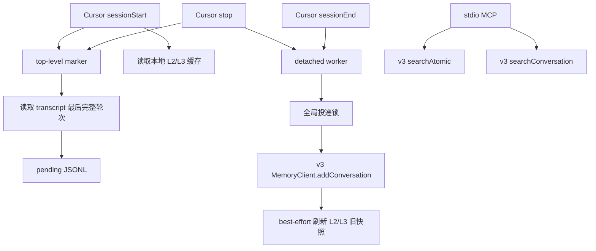

# 阶段 1：Cursor 接入 feat/server_team

> 范围：只迁移现有 Cursor Adapter 与目标分支的差异。

## 结论

本阶段复用现有 Cursor Adapter，不重做 Hook、transcript、pending、worker、MCP、安装和容错。只将数据面切换为 `feat/server_team` 的 MemoryCore v3：

```text
Cursor Hooks / MCP
        │
        │ 复用现有 Adapter
        ▼
MemoryCore v3 SDK
        │
        ▼
feat/server_team MemoryCore Gateway
```

阶段边界见下表。

## 事实基线

### 已落地：现有 Cursor Adapter

基线为当前 checkout 的 `src/adapters/cursor/`：

- `hooks.ts`：`sessionStart`、`stop`、`sessionEnd`。
- `pending.ts`：受限读取 transcript，并写入每轮 pending JSONL。
- `worker.ts`：detached one-shot、全局锁、重试与 ACK 后删除。
- `mcp.ts`：L1/L0 两个只读检索工具。
- `installer.ts`：安全合并 Hooks、MCP 和 Rule。
- `session.ts`、`logger.ts`：顶层会话识别和 bounded 日志。

Linux Cursor 3.12.30 已有 transcript 与 Hook spike 证据；Hook timeout 和真 Background Agent 仍是既有发布门禁。本阶段不把既有未关闭门禁表述为已解决。

### 已落地：feat/server_team

目标分支已有：

- `MemoryCore/src/gateway/v2-router.ts`：`/v3/conversation/*`、`/v3/atomic/*`、`/v3/scenario/*`、`/v3/core/*`。
- `sdk/memory-core/typescript/src/v3/client.ts`：严格隔离的 `MemoryClient`。
- `MemoryCore/openclaw-plugin/`：其它 Agent 通过 v3 SDK 接入的参考实现。

v3 构造时要求 `serviceId`、`teamId`、`agentId`、`userId`；`taskId` 可选。L0 写入还要求 `sessionId`。

## 阶段边界

| 阶段 1 包含 | 阶段 1 不包含 |
|---|---|
| 将现有 Cursor Adapter 迁入 `MemoryCore/src/adapters/cursor/` | Codex CLI 代码或配置 |
| `/capture` 改为 v3 `addConversation()` | MemoryProxy 或 Responses API |
| L0/L1 MCP 改为 v3 SDK | Skill、Knowledge 接入 |
| 增加严格隔离配置 | 交互式 Team/Agent/Task 选择 |
| L2/L3 改为远端数据的本地只读缓存 | 为阶段 2 提前建设公共框架 |
| 保留 pending、worker、锁和安装语义 | 修复主干或服务端既有问题 |

**阶段 2 独立排期，不是阶段 1 的依赖、验收项或可靠性承诺。**

## 架构



### 模块输入与输出

| 模块 | 输入 | 输出 |
|---|---|---|
| Cursor Hooks | Cursor payload、会话 marker、本地缓存 | `additional_context`、pending、worker 唤醒 |
| transcript parser | 受限 `transcript_path` | 一轮 user/assistant 内容 |
| pending | conversation/generation、本轮内容 | 可重试 JSONL |
| worker | 完整 pending、v3 配置 | L0 写入、pending 清理、缓存刷新 |
| MCP | 查询词、limit、可选 session | L1/L0 检索结果 |
| installer | 目标作用域、已有 Cursor 配置 | 安全合并后的 Hooks、MCP、Rule |

## 复用与差异

### 原样保留

- 顶层交互式会话 marker。
- transcript 根路径、`agent-transcripts`、符号链接和 16 MiB 限制。
- 最后一个 `turn_ended` 封口规则。
- 每轮一个 append-only pending JSONL。
- detached one-shot、全局锁、锁内扫描到安静。
- 2xx/永久错误删除，其余错误保留的基本原则。
- bounded 日志、前台 fail-open。
- 单一作用域安装和所有权标识。

### 必须修改

| 旧行为 | 阶段 1 行为 | 原因 |
|---|---|---|
| `POST /capture` | `MemoryClient.addConversation()` | 目标分支推荐使用 v3 数据面 |
| `POST /search/memories` | `MemoryClient.searchAtomic()` | 使用严格隔离的 L1 接口 |
| `POST /search/conversations` | `MemoryClient.searchConversation()` | 使用严格隔离的 L0 接口 |
| 读取 Gateway 本地 L2/L3 文件 | 读取 Adapter 本地只读缓存 | server_team 可独立或远端部署 |
| worker 调用 ctl 拉起 Gateway | 删除 | Adapter 不拥有服务端生命周期 |
| best-effort `/session/end` | 删除 | v3 SDK 没有对应契约，且阶段 1 无直接消费者 |
| 三字段 capture body | v3 isolation + messages | v3 L0 写入契约要求 |

## 配置

以下为设计新增配置；命名只服务 Cursor，不为 Codex 预留通用配置层。

| 配置 | 必填 | 用途 |
|---|---:|---|
| `gatewayUrl` | 是 | MemoryCore Gateway 地址 |
| `gatewayApiKey` | 是 | Bearer 鉴权 |
| `serviceId` | 是 | `x-tdai-service-id` |
| `teamId` | 是 | v3 `team_id` |
| `agentId` | 是 | v3 `agent_id` |
| `userId` | 是 | v3 `user_id` |
| `taskId` | 否 | v3 `task_id` |
| `captureTimeoutMs` | 否 | 后台写入超时 |
| `transcriptsRoot` | 否 | Cursor transcript 允许根目录 |

会话 ID 固定为 `cursor:<conversation_id>`，同时用于 pending 折叠后的 v3 `session_id`。

## 数据结构

| 键或文件 | 变化 | TTL | 用途 |
|---|---|---:|---|
| `sessions/<sha256(conversation_id)>` | 不变 | 会话结束清理 | 顶层会话 marker |
| `pending/<pending_key>.jsonl` | 不变 | 不完整记录 24 小时 | 可重试的一轮对话 |
| `logs/cursor-hook.log` | 不变 | 按大小轮转 | bounded 运行日志 |
| `cache/context.json` | 设计新增 | 无硬 TTL | L2/L3 最近一次成功快照 |

`cache/context.json` 只包含隔离指纹、`refreshed_at`、L3 文本和 L2 导航摘要。写临时文件后原子替换；刷新失败保留旧快照。`sessionStart` 只使用隔离指纹与当前配置完全一致的快照，否则按缓存缺失处理。它不保存 L0、L1 或完整场景正文。

MemoryCore 在 L0 ACK 后异步推进 L1/L2/L3，因此缓存只表示“刷新时可见的最近快照”，不承诺包含刚写入的本轮内容。阶段 1 不新增抽取完成通知或轮询协议。

## 交互接口

| 状态 | 调用 | 输入 | 输出 | 出处 |
|---|---|---|---|---|
| 已落地 | `POST /v3/conversation/add` | isolation、session、messages | accepted IDs/total | `feat/server_team:sdk/memory-core/typescript/src/v3/client.ts#addConversation` |
| 已落地 | `POST /v3/atomic/search` | isolation、query、limit | L1 items | 同文件 `searchAtomic` |
| 已落地 | `POST /v3/conversation/search` | isolation、query、limit、可选 session | L0 messages | 同文件 `searchConversation` |
| 已落地 | `POST /v3/scenario/ls` | team/agent/user | L2 entries | 同文件 `listScenarios` |
| 已落地 | `POST /v3/core/read` | team/agent/user | L3 content | 同文件 `readCore` |
| 设计新增 | Cursor 本地缓存 | v3 L2/L3 结果 | `additional_context` 输入 | 本规格 |

阶段 1 不直接拼 HTTP body；统一通过目标分支 TypeScript v3 SDK 调用。

## 数据流

### 会话开始

1. `sessionStart` 识别顶层交互式会话并写 marker。
2. 只读取 `cache/context.json`，不访问网络。
3. 缓存存在时注入 L3、L2 导航和 MCP 指引；不存在时只注入 MCP 指引。

### 每轮结束

1. `stop` 校验 marker 和 transcript 路径。
2. 提取最后完整 user/assistant 轮次。
3. 单次 append 写入 pending，随后唤醒 detached worker。
4. worker 在全局锁内调用 `addConversation()`。
5. 写入成功后删除 pending，再 best-effort 拉取当时可见的 L2/L3 并原子刷新缓存。

缓存刷新与 L0 ACK 解耦。刷新结果允许落后于后台抽取；新会话验证本轮内容时以实时 L0/L1 MCP 证据为准，不以缓存立即更新为准。

### 主动检索

1. Rule 指导 Agent 在依赖历史时先调用 `tdai_memory_search`。
2. 需要原话和证据时调用 `tdai_conversation_search`。
3. MCP 直接调用 v3 SDK，不读取本地缓存。

## 失败语义

- 前台 Hook 不访问网络，内部错误退出 0。
- 网络、超时、鉴权、隔离或未知错误保留完整 pending，并结束本次 drain。
- 明确的 payload/schema/大小永久错误写 bounded 摘要后删除该 pending。
- `addConversation()` 成功是删除 pending 的唯一业务 ACK。
- 缓存刷新失败不影响已 ACK 的 L0，也不删除旧缓存。
- 缓存缺失只降低自动注入；MCP 仍可实时查询。
- Adapter 不启动、不停止、不重启 MemoryCore。

## 测试与验收

### 回归

- 现有 Cursor Adapter 单元测试迁移后全部通过。
- transcript、marker、pending、锁、installer 的既有语义不变。
- 迁移后的 Cursor Adapter 不再引用旧 `/capture`、`/search/*`、ctl 和 `/session/end`；不删除 MemoryCore 的兼容接口。

### v3 契约

- fake v3 client 核对 service/team/agent/user/session/task 映射。
- L0 写入仅发送本轮 user/assistant messages。
- MCP 分别映射 `searchAtomic` 与 `searchConversation`。
- 不同 isolation 的缓存和 pending 不串用。
- 成功删除、可重试保留、永久错误删除符合本规格。

### 真实 E2E

1. 在 `feat/server_team` 启动 MemoryCore。
2. Cursor 完成一轮带唯一标记的对话。
3. 服务端 v3 L0 在正确 Team/Agent/User/Session 下可查询。
4. 新会话通过注入或 MCP 找到该标记并给出来源证据。
5. 服务端停止时 Agent 前台不受阻，pending 保留；恢复后由后续事件推进。

只有真实 E2E 通过后，才能声明阶段 1 完成。既有 Hook timeout 与真 Background Agent 门禁仍需单独标注状态。
