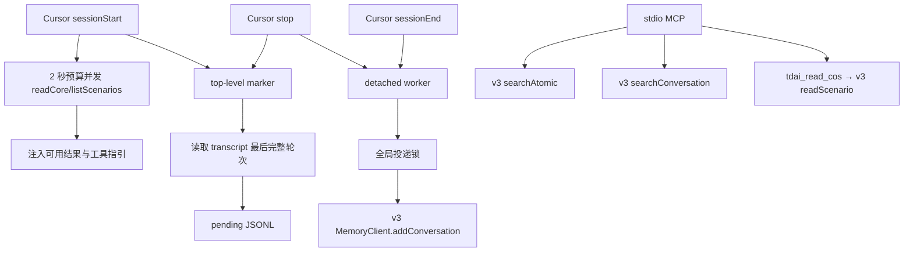

# 阶段 1：Cursor 接入 feat/server_team

> 范围：只迁移现有 Cursor Adapter 与目标分支的差异。

## 结论

本阶段复用现有 Cursor Adapter 的会话识别、transcript、pending、worker 和安全安装机制。数据面切换到 `feat/server_team` 的 MemoryCore v3；删除 Cursor 对旧 Gateway 客户端的依赖及参数链，`sessionStart` 直接并发读取远端 L2/L3，不新增本地缓存。

```text
Cursor Hooks / MCP
        │
        │ 复用已验证骨架
        ▼
MemoryCore v3 SDK
        │
        ▼
feat/server_team MemoryCore Gateway
```

阶段边界见下表。

## 事实基线

### 已落地：现有 Cursor Adapter

基线为当前 checkout 的 `src/adapters/cursor/`：

- `hooks.ts`：`sessionStart`、`stop`、`sessionEnd`。
- `pending.ts`：受限读取 transcript，并写入每轮 pending JSONL。
- `worker.ts`：detached one-shot、全局锁、重试与 ACK 后删除。
- `mcp.ts`：L1/L0 两个只读检索工具。
- `installer.ts`：安全合并 Hooks、MCP 和 Rule。
- `session.ts`、`logger.ts`：顶层会话识别和 bounded 日志。

Linux Cursor 3.12.30 已有 transcript 与 Hook spike 证据；Hook timeout 和真 Background Agent 仍是既有发布门禁。本阶段不把既有未关闭门禁表述为已解决。

### 已落地：feat/server_team

目标分支已有：

- `MemoryCore/src/gateway/v2-router.ts`：`/v3/conversation/*`、`/v3/atomic/*`、`/v3/scenario/*`、`/v3/core/*`。
- `sdk/memory-core/typescript/src/v3/client.ts`：严格隔离的 `MemoryClient`。
- `MemoryCore/openclaw-plugin/`：其它 Agent 通过 v3 SDK 接入的参考实现。

v3 构造时要求 `serviceId`、`teamId`、`agentId`、`userId`；`taskId` 可选。L0 写入还要求 `sessionId`。

## 阶段边界

| 阶段 1 包含 | 阶段 1 不包含 |
|---|---|
| 将现有 Cursor Adapter 迁入 `MemoryCore/cursor-plugin/` | Codex CLI 代码或配置 |
| `/capture` 改为 v3 `addConversation()` | MemoryProxy 或 Responses API |
| L0/L1 MCP 改为 v3 SDK；增加 L2 正文读取 | Skill、Knowledge 接入 |
| 增加严格隔离配置 | 交互式 Team/Agent/Task 选择 |
| `sessionStart` 限时直读远端 L2/L3 | 为阶段 2 提前建设公共框架 |
| 保留 pending、worker、锁和安装语义 | 修复主干或服务端既有问题 |

**阶段 2 独立排期，不是阶段 1 的依赖、验收项或可靠性承诺。**

## 架构



### 模块输入与输出

| 模块 | 输入 | 输出 |
|---|---|---|
| Cursor Hooks | Cursor payload、会话 marker、v3 L2/L3 查询 | `additional_context`、pending、worker 唤醒 |
| transcript parser | 受限 `transcript_path` | 一轮 user/assistant 内容 |
| pending | conversation/generation、本轮内容 | 可重试 JSONL |
| worker | 完整 pending、v3 配置 | L0 写入、pending 清理 |
| MCP | 查询词或场景 path | L1/L0 检索结果、L2 正文 |
| installer | 目标作用域、已有 Cursor 配置 | 安全合并后的 Hooks、MCP、更新后的 Rule |

## 复用与差异

### 原样保留

- 顶层交互式会话 marker。
- transcript 根路径、`agent-transcripts`、符号链接和 16 MiB 限制。
- 最后一个 `turn_ended` 封口规则。
- 每轮一个 append-only pending JSONL。
- detached one-shot、全局锁、锁内扫描到安静。
- bounded 日志、前台 fail-open。
- installer 的单一作用域、所有权标识和安全合并机制。

### 必须修改

| 旧行为 | 阶段 1 行为 | 原因 |
|---|---|---|
| `POST /capture` | `MemoryClient.addConversation()` | 目标分支推荐使用 v3 数据面 |
| `POST /search/memories` | `MemoryClient.searchAtomic()` | 使用严格隔离的 L1 接口 |
| `POST /search/conversations` | `MemoryClient.searchConversation()` | 使用严格隔离的 L0 接口 |
| 读取 Gateway 本地 L2/L3 文件 | `sessionStart` 并发调用 `readCore()`、`listScenarios()` | server_team 可独立或远端部署 |
| 按绝对路径读取 L2 正文 | `tdai_read_cos` → v3 `readScenario()` | 沿用 OpenClaw 命名，只读 L2 场景相对 path，不访问 COS/STS |
| worker 调用 ctl 拉起 Gateway | 删除 | Adapter 不拥有服务端生命周期 |
| best-effort `/session/end` | 删除 | v3 SDK 没有对应契约，且阶段 1 无直接消费者 |
| `sessionEndKey` 参数链 | 从 hooks、CLI、worker 和测试中整链删除 | `/session/end` 删除后无消费者 |
| Cursor `gateway.ts` 及其对 `src/gateway/types.ts` 的引用 | 删除 Cursor 侧依赖；保留共享类型文件 | worker、MCP 统一直接调用 v3 SDK |
| `ctlPath`、`dataDir` 配置及传参 | 删除 | ctl 与本地 L2/L3 文件读取均已删除 |
| 三字段 capture body | v3 isolation + messages | v3 L0 写入契约要求 |
| 现有 Rule 与工具指引 | 改为通过 `tdai_read_cos` 读取场景正文 | 原文依赖本地绝对路径和旧工具 |
| 本地 scene navigation formatter | 复用 OpenClaw recall/format 行为，输入改为 v3 `ScenarioEntry` | 删除 `core/scene/*` 与 `utils/sanitize` 依赖 |
| `spike.ts`、CLI `spike`/`spike-sentinel` 及测试 | 仅作验证资产 | 不纳入生产构建产物或运行时依赖 |

`hooks.ts` 的事件路由可复用；`context.ts`、`mcp.ts`、`worker.ts` 和 installer 的 Rule 文案必须修改。不得把这些模块整体标为原样复用。

### Recall 复用边界

- 以 `MemoryCore/openclaw-plugin/src/hooks/recall.ts` 的 `Promise.allSettled` 降级方式和 `MemoryCore/openclaw-plugin/src/format.ts` 的上下文格式为参考，不直接导入 OpenClaw 源码。
- Cursor `sessionStart` 没有本轮检索词，本阶段只调用 `readCore()`、`listScenarios()`，不为复用额外调用 L1。
- 最小适配代码归属 `cursor-plugin`；不跨包导入 OpenClaw 源码，也不新增公共框架。
- Cursor 将稳定上下文映射到 `additional_context`；L2 导航使用服务端返回的相对 path，不再生成本地绝对路径或热度。

## 配置

以下为设计新增配置；命名只服务 Cursor，不为 Codex 预留通用配置层。

| 配置 | 必填 | 用途 |
|---|---:|---|
| `gatewayUrl` | 是 | MemoryCore Gateway 地址 |
| `gatewayApiKey` | 是 | Bearer 鉴权 |
| `serviceId` | 是 | `x-tdai-service-id` |
| `teamId` | 是 | v3 `team_id` |
| `agentId` | 是 | v3 `agent_id` |
| `userId` | 是 | v3 `user_id` |
| `taskId` | 否 | v3 `task_id` |
| `captureTimeoutMs` | 否 | 后台写入超时 |
| `recallTimeoutMs` | 否 | `sessionStart` L2/L3 总预算；默认 2000 ms |
| `transcriptsRoot` | 否 | Cursor transcript 允许根目录 |

会话 ID 固定为 `cursor:<conversation_id>`，同时用于 pending 折叠后的 v3 `session_id`。

`cursor-plugin/package.json` 精确依赖已发布的 `@tencentdb-agent-memory/memory-sdk-ts-v2@1.0.0-beta.2`；不复制 SDK，也不新增打包方案。

## 数据结构

| 键或文件 | 变化 | TTL | 用途 |
|---|---|---:|---|
| `sessions/<sha256(conversation_id)>` | 不变 | 会话结束清理 | 顶层会话 marker |
| `pending/<pending_key>.jsonl` | 不变 | 不完整记录 24 小时 | 可重试的一轮对话 |
| `logs/cursor-hook.log` | 不变 | 按大小轮转 | bounded 运行日志 |

阶段 1 不新增本地缓存、索引或同步状态。

## 交互接口

| 状态 | 调用 | 输入 | 输出 | 出处 |
|---|---|---|---|---|
| 已落地 | `POST /v3/conversation/add` | isolation、session、messages | accepted IDs/total | `feat/server_team:sdk/memory-core/typescript/src/v3/client.ts#addConversation` |
| 已落地 | `POST /v3/atomic/search` | isolation、query、limit | L1 items | 同文件 `searchAtomic` |
| 已落地 | `POST /v3/conversation/search` | isolation、query、limit、可选 session | L0 messages | 同文件 `searchConversation` |
| 已落地 | `POST /v3/scenario/ls` | team/agent/user | L2 entries | 同文件 `listScenarios` |
| 已落地 | `POST /v3/scenario/read` | team/agent/user、path | L2 正文 | 同文件 `readScenario` |
| 已落地 | `POST /v3/core/read` | team/agent/user | L3 content | 同文件 `readCore` |
| 设计新增 | `tdai_read_cos` MCP 工具 | L2 场景相对 path | `readScenario()` 结果 | 沿用 OpenClaw 命名；不访问 COS/STS |

阶段 1 不直接拼 HTTP body；统一通过目标分支 TypeScript v3 SDK 调用。

## 数据流

### 会话开始

1. `sessionStart` 识别顶层交互式会话并写 marker。
2. 在 `recallTimeoutMs` 总预算内，以 `Promise.allSettled` 并发调用 `readCore()` 和 `listScenarios()`。
3. 分别使用成功结果，并按 OpenClaw formatter 的稳定上下文结构生成 L3 persona 与 L2 相对路径导航。
4. 任一调用失败或超时只跳过对应部分；工具指引始终可注入。

### 每轮结束

1. `stop` 校验 marker 和 transcript 路径。
2. 提取最后完整 user/assistant 轮次。
3. 单次 append 写入 pending，随后唤醒 detached worker。
4. worker 在全局锁内调用 `addConversation()`。
5. SDK 成功返回后删除 pending；worker 不读取 L2/L3。

### 会话结束

`sessionEnd` 只调用无参数 `spawnWorker()` 并清理 marker；不再生成或传递 `sessionEndKey`，也不访问网络。

### 主动检索

1. Rule 指导 Agent 在依赖历史时先调用 `tdai_memory_search`。
2. 需要原话和证据时调用 `tdai_conversation_search`。
3. 命中 L2 导航后调用 `tdai_read_cos(path)`；该名称沿用 OpenClaw，Cursor 实现调用 v3 `readScenario()` 读取 L2 场景相对 path，不访问 COS/STS。
4. 三个 MCP 工具直接调用 v3 SDK。

## 失败语义

- `stop`、`sessionEnd` 前台不访问网络；所有 Hook 内部错误均退出 0。
- `sessionStart` 仅执行限时 L2/L3 查询；超过内部预算或任一请求失败时 fail-open。
- `addConversation()` 正常返回才 ACK；HTTP 2xx 本身不是 ACK。
- 允许删除 pending 的错误码仅有 `400`、`413`；其他错误全部保留并停止本次 drain。
- Adapter 不启动、不停止、不重启 MemoryCore。

错误分类只读取 SDK `TDAMError.code`，不读取旧 `GatewayResult.status`。其他错误包括 `ParamError`、`422`、`4291`、网络、超时和未知异常。

## 测试与验收

### 回归

- 现有 Cursor Adapter 单元测试迁移后全部通过。
- transcript、marker、pending、锁及 installer 安全合并机制不变；Rule 文案和 context/MCP 数据源按本规格修改。
- 迁移后的 Cursor Adapter 不再引用旧 `/capture`、`/search/*`、ctl 和 `/session/end`；删除 Cursor `gateway.ts`、`sessionEndKey`、`ctlPath`、`dataDir` 及相关测试，不删除 MemoryCore 的兼容接口或共享 `src/gateway/types.ts`。
- 生产包位于 `MemoryCore/cursor-plugin/`，不混入进程内 `MemoryCore/src/adapters/`。
- 生产包仅依赖包内代码和声明的 npm 依赖；不得导入 `MemoryCore/src/*` 或 `MemoryCore/openclaw-plugin/src/*`。
- spike 源码、命令和测试仅作验证资产，不纳入生产构建产物或运行时依赖。

### v3 契约

- fake v3 client 核对 service/team/agent/user/session/task 映射。
- L0 写入仅发送本轮 user/assistant messages。
- MCP 分别映射 `searchAtomic`、`searchConversation` 与 `tdai_read_cos` → `readScenario`。
- `sessionStart` 并发查询、2 秒预算和 partial-success 注入可控测试。
- Recall 格式以 OpenClaw 实现为基线；Rule 不再要求绝对路径读取，导航不再依赖本地热度字段。
- 错误测试只证明白名单边界：`400`/`413` 删除，其余代表性 SDK、网络和未知错误保留。
- 不同 isolation 的请求和 pending 不串用。

### 真实 E2E

1. 在 `feat/server_team` 启动 MemoryCore。
2. Cursor 完成一轮带唯一标记的对话。
3. 服务端 v3 L0 在正确 Team/Agent/User/Session 下可查询。
4. 新会话通过实时注入或 MCP 找到该标记并给出来源证据；L2 导航可继续读取场景正文。
5. 服务端停止时 Agent 前台不受阻，pending 保留；恢复后由后续事件推进。

实现前先在真实 Cursor 上测一次 `sessionStart` 的两路并发调用延迟、2 秒内部超时和 fail-open。若该预算不能稳定返回或 Hook 行为不符合预期，先修订本规格，不回退到本地缓存。

只有真实 E2E 通过后，才能声明阶段 1 完成。既有 Hook timeout 与真 Background Agent 门禁仍需单独标注状态。
