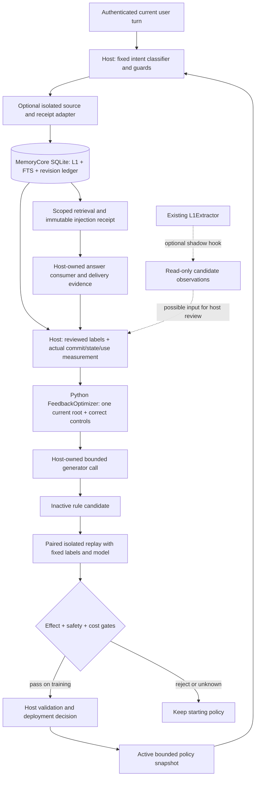

# Feedback-driven memory policy self-optimization

This optional extension lets a host improve its memory **decision policy** from
reviewed mistakes. For example, a user replaces a lasting project setting, but
the classifier treats it as a temporary answer request. A verified failed
commit and stale stored state can trigger one general rule hypothesis. The host
then replays the baseline and candidate in separate stores before adopting it.
The base model, source/target guards, retrieval and answerer remain fixed.

The intended benefit is fewer missed durable updates and fewer temporary or
third-party statements written as lasting memory. This is bounded prompt-rule
adaptation, not weight training or an autonomous framework. The extension is
default-off and has no model-provider or external evolution-framework dependency.

## Architecture



The diagram separates runtime evidence, policy learning and serving activation.
Neither a classifier's confidence nor a generated rule authorizes a write. The
host authenticates the user and labels, verifies the underlying evidence, owns
provider calls and controls deployment. Hashes check consistency, not truth.

## Components and integration points

| Component | Role | Default / change to existing behavior |
|---|---|---|
| `tencentdb_agent_memory.feedback` | Immutable rule snapshots; one-shot preparation, proposal parsing, paired adoption, cancellation and rollback | Off; no network, database, files or background loop |
| `MemoryCore/src/core/feedback/` | Source-bound ADD and receipt/version-bound UPDATE/retire in an isolated SQLite store; atomic L1/FTS/ledger changes | Explicit construction only; no Gateway registration |
| `extractL1Memories` option `candidateObserver` | Bounded frozen candidate/source snapshot with abort signal and metadata-only diagnostics | Off; shadow observations never replace dedup/writer decisions |
| `examples/feedback-selfopt/` | Source/target intent compiler, bounded host, stdio bridge and six-turn demonstrations | `--fixture` required; fresh stores, local consumer, zero model calls |

Only the existing extractor receives a small opt-in hook. All feedback-specific
storage and policy logic is in new modules. The bridge requires explicit isolated
paths and complete physical tenant scope; it refuses unmarked existing stores.
The SQLite adapter is coupled to the current SQLite schema and checks it before
operating. MongoDB/TCVDB atomic feedback writes are outside this implementation.

## Why these choices

**Separate intent, commit, state and use.** A model can say it remembered a change
while the actual write was rejected. Conversely, a diagnostic source-span
difference can preserve the correct fact. Feedback therefore uses observed
commit/state/use with reviewed source meanings, retaining unknowns explicitly.

**One error allows exploration; adoption remains strict.** Requiring several
independent errors can leave a strong base model with no candidate to explore.
A single verified current error therefore admits one small, inactive hypothesis.
Downstream propagation does not create new independent support. Correct write
and NOOP controls accompany the error. Complete paired data, at least 5 pp
weighted state improvement, no actual-behavior/risk regression, and token/latency
limits are still required for training adoption. These thresholds are bounded
engineering choices, not statistically calibrated guarantees.

**Preserve authority and atomicity.** Sources are captured before mutation;
targets must come from immutable delivered receipts and match current versions
and all scope dimensions. L1, FTS, old-vector invalidation and the event ledger
share a synchronous SQLite transaction. Stale versions or incomplete evidence
reject the operation. Retirement removes the active view but keeps audit history;
it is not physical erasure of historical data.

**Make disabling and failure observable.** Off mode delegates to the existing
caller path. Shadow observer failures preserve baseline writer decisions.
Optimizer failures retain the starting policy. An uncertain isolated write stops
the run instead of being retried; diagnostics retain whether a commit was
applied, not applied or unknown. Policy rollback never replays or reverses user
memory mutations. Provider deadlines and send accounting remain the host's job.

## Reproduce the engineering behavior

Start with a clean checkout of this PR and an activated Python virtual
environment. Use Node 22.16+ and Python 3.11+ for the complete example. From the
repository root:

The Python installation needs `venv`/`ensurepip` support (some minimal Linux
installations omit it). Dependency installation uses the package registries;
the examples and tests themselves make no provider calls.

```sh
python -m pip install ./sdk/memory-core/python
cd MemoryCore
npm install --ignore-scripts
npm run test:feedback
npm run typecheck:feedback
npm run test:candidate-observer
npm run typecheck:candidate-observer
npm pack --dry-run
cd ..
python -B examples/feedback-selfopt/demo.py
python -B examples/feedback-selfopt/optimize.py --fixture --core ./MemoryCore --output ./feedback-optimizer-run
cd sdk/memory-core/python
python -B -m unittest discover -s tests -p 'test_feedback*.py' -v
cd ../../../examples/feedback-selfopt
python -B -m unittest -v test_example test_optimize
```

No provider credentials, cloud account, private research directory, historic
experiment artifacts or compiled model are needed. The first demo invocation
does nothing. The optimizer fixture runs 12 actual SQLite turns with a planted
baseline fault and a scripted patch: 4/6 versus 6/6 correct states, one current
root at turn 3, and a final policy version of 0. Local timing may reject adoption
through the unchanged 1.5x p95 gate; that rejection is valid and remains visible.
It is a connection/failure-handling test, not evidence of model improvement.

Use a new output directory on each run. `test_example` preserves its evidence;
for subsequent runs set `E5_F3_TEST_OUTPUT` to a new path. Generated trajectories
contain full sources and history; they are not public telemetry. The example
README describes platform dependencies, output limits and exact expected fields.
CI runs the real connection on Linux and SDK boundary checks on Python 3.9/3.13.

### Recorded clean-environment check

The runtime source at commit `e56f93b` was exported with `git archive` into a new
Linux directory, with no research files, prior `node_modules`, installed SDK or
previous run outputs. On Node 22.23.2 and Python 3.11.16, dependencies were freshly
installed (npm 11.6.0 for installation), and the wheel was built and installed
into a new virtual environment. The package manifest and shared source hashes
remained unchanged after installation.

| Check | Result |
|---|---:|
| SQLite transaction, source, receipt, capacity and stream tests | 73 passed |
| Shadow observer unit/extractor integration tests | 34 passed |
| Public SDK lifecycle and adoption boundaries | 12 passed |
| Actual SQLite source/SDK integration and failure tests | 8 passed |
| Both TypeScript source typechecks; installed-wheel mypy consumer | Passed |
| Full npm build/pack | Passed; 1,580,284-byte archive, below 2 MiB guard |
| Documented default-off and paired fixture commands | Passed; zero model calls |

The same component suites also passed on Windows with Node 24.14.0 and Python
3.13.9. A clean build initially exposed a pre-existing aggregate build command
that invoked the absent `scripts/seed-v2/tsconfig.json`; a separate prerequisite
commit removes that unavailable task from `build:scripts`. The feedback imports
use upstream's current `store/sqlite/memory-store.ts` path, and `.gitattributes`
keeps the example's hashed source files in LF form on Windows.

The public SDK and adapter contracts, including all capacity and timeout limits:

- [SDK lifecycle and feedback schema](../../sdk/memory-core/python/docs/feedback.md)
- [SQLite evidence and atomic write adapter](../../MemoryCore/src/core/feedback/README.md)
- [Shadow observer](../../MemoryCore/src/core/record/README.candidate-observer.md)
- [Runnable source example](../../examples/feedback-selfopt/README.md)

## Measured usefulness and its limits

A separate controlled real-model pilot compared an unchanged, previously
automatically generated rule against empty rules with the same MiniMax-M3 model.
It observed 11 improved, 0 regressed and 110 unchanged **known paired** primary
turns; 23 of the planned 144 pairs remained unknown. Only two originating
failures account for the improvements. The complete project-setting scenario
improved from 68/72 to 72/72. Matched token usage increased about 3%.

These observations motivate the extension; they do not establish a generally
effective, calibrated or production-ready learner. The short pilot generated no
new rule. The long pilot tested transfer of a historical rule, and its incomplete
coverage did not pass the complete-plan adoption gate. Candidate-side formatting,
diagnostic and availability regressions are documented alongside the gain in the
[pilot report](../experiments/feedback-selfopt-pilot.md), with
[machine-readable aggregate counts](../experiments/feedback-selfopt-pilot.json).

This PR reproduces the engineering mechanism and exposes the contracts needed
for a host to run its own controlled study. The private historical raw traces
and labels are not distributed; the aggregate pilot is therefore not a publicly
rerunnable benchmark. Do not use the deterministic fixture or the historical
pilot to claim independent statistical confidence, TencentCloud production
benefit or improvement over the unmodified upstream extractor.
