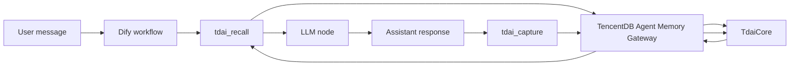

# Dify Plugin Installation and Workflow Guide

This guide shows how to package, install, configure, and verify the TencentDB
Agent Memory Dify tool plugin.

The Dify adapter is intentionally thin: it does not reimplement the memory
engine. It forwards Dify tool calls to the TencentDB Agent Memory Gateway,
which owns recall, capture, search, and session-level memory processing.

The Python `TdaiGatewayClient` inside the plugin is only a Dify-runtime
transport shim for the existing Gateway API contract. It is not presented here
as a new shared cross-platform adapter layer. Shared Gateway client structure
should come from the Gateway Client Adapter Kit rather than this Dify plugin.

For read-after-write validation, treat `tdai_conversation_search` as the
immediate `L0 read path`. `tdai_recall` is the structured recall path. This
guide's quickstart flushes the session with `tdai_session_end` and verifies
that the recall tool call itself succeeds through the Dify adapter.

Whether `tdai_recall.context` is non-empty depends on the deployed Gateway
build plus the existing memory consolidation pipeline. This guide therefore
keeps the Dify smoke test focused on adapter reachability and immediate L0
read-after-write validation.

## Scope

This guide covers:

- Packaging the Dify tool plugin into a `.difypkg` file.
- Installing the package into a Dify workspace.
- Configuring a Gateway endpoint reachable from the Dify plugin runtime.
- Wiring recall and capture tools into a Dify workflow.
- Verifying basic memory write and read behavior.

## Data Flow



## Prerequisites

Prepare:

1. A running Dify instance with plugin support enabled.
2. The Dify plugin CLI.
3. Python 3.12 for the plugin runtime.
4. A running TencentDB Agent Memory Gateway.
5. A Gateway URL reachable from the Dify plugin runtime.

Gateway URL examples:

```text
# Dify runs in Docker and Gateway runs on the host:
http://host.docker.internal:8420

# Gateway is exposed on the LAN:
http://192.168.x.x:8420

# Gateway is exposed through HTTPS:
https://memory-gateway.example.com
```

Do not assume that `127.0.0.1` inside the Dify plugin runtime points to the
host machine. In Docker deployments, it usually points to the container itself.

## Package the Plugin

From the repository root:

```bash
dify plugin package ./dify-plugin-tdai-memory
```

Expected output:

```text
plugin packaged successfully
```

If packaging fails, check:

- `manifest.yaml` syntax.
- Provider YAML path.
- Tool YAML paths.
- Python source paths.
- Icon path. Dify plugin YAML should reference `icon.svg`; the file lives
  under `_assets/icon.svg` in the plugin package layout.
- Files excluded by `.difyignore`.

## Install in Dify

Open Dify and use:

```text
Workspace -> Plugins -> Install Plugin -> Local Package
```

Upload the generated `.difypkg`. After installation, the plugin should appear
as:

```text
TencentDB Agent Memory
```

For local unsigned packages, Dify plugin daemon may require local development
configuration:

```text
FORCE_VERIFYING_SIGNATURE=false
```

Keep signature verification enabled for production plugin distribution unless
the package is signed and trusted by the target environment.

## Configure Provider Credentials

Configure the installed provider:

| Field | Example | Notes |
| --- | --- | --- |
| Gateway URL | `http://host.docker.internal:8420` | Endpoint reachable from the Dify plugin runtime. |
| Gateway API Key | optional | Must match `TDAI_GATEWAY_API_KEY` when Gateway auth is enabled. |
| Timeout Seconds | `10` | Request timeout for plugin-to-Gateway calls. |

Do not expose real API keys in screenshots, logs, or committed configuration.

## Tool Mapping

| Tool | Gateway endpoint | Typical workflow position |
| --- | --- | --- |
| `tdai_health` | `GET /health` | Setup validation |
| `tdai_recall` | `POST /recall` | Before the LLM node |
| `tdai_capture` | `POST /capture` | After the LLM node |
| `tdai_memory_search` | `POST /search/memories` | Debug/admin workflow |
| `tdai_conversation_search` | `POST /search/conversations` | Debug/admin workflow |
| `tdai_session_end` | `POST /session/end` | End of workflow/session |

Use Dify `conversation_id` as `session_key`. A workflow run id changes on every
execution, but `conversation_id` stays stable across turns in the same
conversation.

## Minimal Workflow

Recommended node order:

```text
Start -> tdai_recall -> LLM -> tdai_capture -> End
```

Start inputs:

```text
user_id: string
conversation_id: string
query: string
```

Recall tool input:

```json
{
  "user_id": "{{start.user_id}}",
  "session_key": "{{start.conversation_id}}",
  "query": "{{start.query}}",
  "max_chars": 2000
}
```

LLM prompt example:

```text
Relevant memory:
{{tdai_recall.context}}

User question:
{{start.query}}
```

Capture tool input:

```json
{
  "user_id": "{{start.user_id}}",
  "session_key": "{{start.conversation_id}}",
  "user_content": "{{start.query}}",
  "assistant_content": "{{llm.text}}"
}
```

Optional session flush:

```json
{
  "user_id": "{{start.user_id}}",
  "session_key": "{{start.conversation_id}}"
}
```

## Verification Scenario

Two-turn check:

1. Capture memory:

   ```text
   user_id = demo-user
   conversation_id = demo-conversation
   query = My preferred coding language is Go, and I usually work on Kubernetes projects.
   ```

   Expected:

   ```text
   tdai_capture returns ok=true.
   Gateway stores the raw conversation turn.
   ```

2. Recall or search memory:

   ```text
   user_id = demo-user
   conversation_id = demo-conversation
   query = What programming language do I usually prefer?
   ```

   Expected:

   ```text
   tdai_session_end flushes the session buffer.
   tdai_conversation_search is the immediate L0 read path and returns the captured token immediately.
   tdai_recall returns ok=true, proving the structured recall path is callable from Dify.
   ```

## Local Validation Log

Environment:

```text
Dify: langgenius/dify-api:1.15.0
Dify plugin daemon: langgenius/dify-plugin-daemon:0.6.3-local
Gateway URL used by Dify plugin runtime: http://host.docker.internal:8420
Gateway health from Dify API container: status=ok, vectorStore=true, embeddingService=false
```

Quickstart e2e:

```text
[1/6] Starting or reusing TencentDB Agent Memory Gateway at http://127.0.0.1:8432
Gateway already healthy
[2/6] Starting mock Dify plugin server at http://127.0.0.1:18420
[3/6] Capturing a completed Dify turn through tdai_capture
{"l0_recorded": 2, "ok": true, "scheduler_notified": true}
[4/6] Validating immediate L0 read-back through tdai_conversation_search
{"ok": true, "results": "Found 2 matching message(s) ... TDAI_DIFY_E2E_TOKEN_20260705002308 ...", "total": 2}
[5/6] Flushing the session through tdai_session_end
{"flushed": true, "ok": true}
[6/6] Validating the Gateway recall path through tdai_recall
{"context": "", "memory_count": 0, "ok": true}
Quickstart e2e succeeded: Gateway -> mock Dify server -> capture -> conversation_search (L0 read-back) -> session_end flush -> recall call
```

Dify package/install:

```text
$ dify plugin package ./dify-plugin-tdai-memory
2026/07/04 16:54:02 INFO plugin packaged successfully output_path=/tmp/tdai_memory_0.0.1.difypkg
package size: 19227 bytes

upload unique_identifier:
tencentdb-agent-memory/tdai_memory:0.0.1@83c5476576a25586fc2223f0cd9cadf7331cfc3b52719b983039528a9ebab872

install task:
status=success
message=installed
plugin_id=tencentdb-agent-memory/tdai_memory
```

Dify plugin invocation through `PluginToolManager`:

```text
provider=tencentdb-agent-memory/tdai_memory/tdai_memory
tools=tdai_health, tdai_recall, tdai_capture, tdai_memory_search, tdai_conversation_search, tdai_session_end

tdai_health:
{"ok": true, "status": "ok", "stores": {"embeddingService": false, "vectorStore": true}, "version": "0.1.0"}

tdai_capture:
{"l0_recorded": 2, "ok": true, "scheduler_notified": true}

tdai_conversation_search:
{"ok": true, "total": 2, "results": "Found 2 matching message(s) ... TDAI_DIFY_E2E_TOKEN_20260704_SKYBLUE ..."}

tdai_recall:
{"context": "", "memory_count": 0, "ok": true}
```

The invocation path above is:

```text
Dify API -> plugin_daemon -> tdai_memory Python plugin -> TencentDB Agent Memory Gateway
```

## Troubleshooting

### Plugin cannot connect to Gateway

Check the Gateway URL from inside the Dify plugin runtime. For Docker-based
Dify, prefer:

```text
http://host.docker.internal:8420
```

### Provider credentials fail to save

Check:

- Gateway URL format.
- Timeout value.
- Gateway reachability.
- Whether Gateway auth is enabled and the API key is correct.

### Recall returns empty memory

Check:

- Whether `tdai_capture` ran first.
- Whether `tdai_session_end` flushed the session before validating structured recall.
- Whether `session_key` is stable.
- Whether the Gateway uses the expected data directory.
- Whether the deployed Gateway build returns the expected recall transport
  fields for your client path.
- Whether the Gateway has working L1 extraction configured.

Use `tdai_conversation_search` for immediate L0 read-after-write validation.
This is the adapter's documented immediate `L0 read path`.

### Capture succeeds but later recall/search misses data

Avoid using a transient workflow run id as `session_key`. Prefer Dify
`conversation_id`.

## Security Notes

Private or local Gateway URLs are allowed because self-hosted memory
infrastructure is expected.

Do not send Bearer credentials over non-local plain HTTP. Use HTTPS for remote
Gateway deployments.
