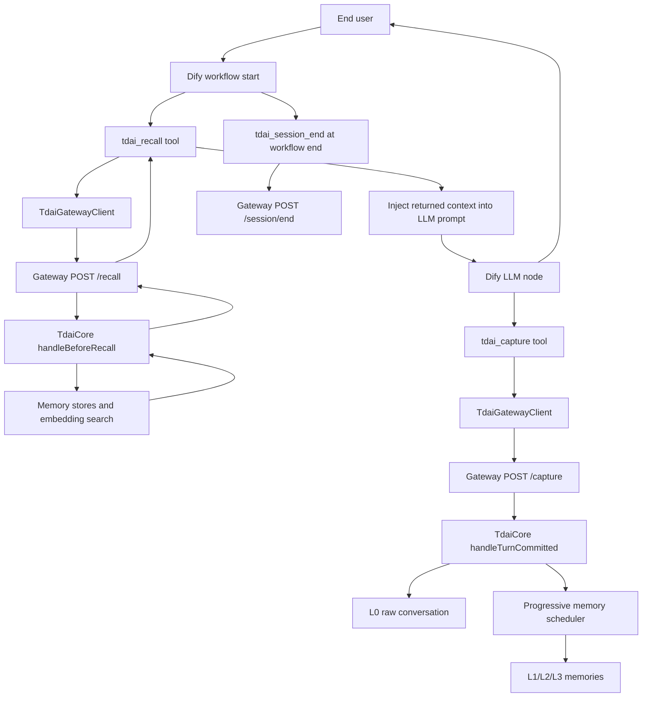

# Dify Workflow Diagram

This diagram covers the recommended Dify workflow for TencentDB Agent Memory.
The adapter keeps Dify-specific wiring at the edge and reuses the existing
Gateway and `TdaiCore` pipeline.

Recommended identifiers:

| Dify value | TDAI parameter | Reason |
| --- | --- | --- |
| `conversation_id` | `session_key` | Stable across turns in the same Dify conversation. |
| End-user id | `user_id` | Optional metadata; current Gateway/Core behavior still relies primarily on `session_key`. |
| Current user message | `query` for recall | Drives memory retrieval before generation. |
| User plus assistant turn | `capture` body | Records completed conversation turns after generation. |
