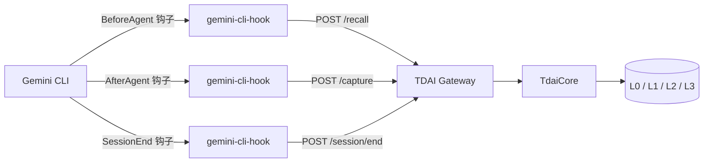

# Gemini CLI 适配器

通过 Gemini CLI 官方 hooks 机制，可以将 TencentDB Agent Memory 接入 Gemini CLI。适配器会在每轮对话前召回相关记忆，在助手回复后捕获本轮内容，并在会话结束时刷新待处理的流水线数据。

## 架构



Hook 脚本是短生命周期进程，且采用 fail-open：Gateway 不可用时，Gemini CLI 仍可正常使用，错误只会输出到 stderr。

## 前置条件

1. Node.js 22+ 和 npm。
2. 已安装并可正常使用 Gemini CLI。
3. 本地已启动 TDAI Gateway。在本仓库运行：

```bash
node --import tsx src/gateway/server.ts
```

Gateway 默认地址为 `http://127.0.0.1:8420`。

## 作为 Gemini CLI 扩展安装

```bash
npm install
npm run build:gemini-cli-hook
gemini extensions link ./gemini-cli-extension
```

重启 Gemini CLI。安装过程中会提示输入 Gateway 地址和可选的 API Key。扩展会注册三个 hooks：

| 事件 | 行为 |
| --- | --- |
| BeforeAgent | 召回记忆并注入 `additionalContext` |
| AfterAgent | 捕获用户输入和助手回复 |
| SessionEnd | 通过 Gateway 刷新会话数据 |

## 手动配置 settings.json 的方式

如果不想使用扩展，可以在 `~/.gemini/settings.json` 中添加 hooks：

```json
{
  "hooks": {
    "BeforeAgent": [
      {
        "hooks": [
          {
            "name": "memory-recall",
            "type": "command",
            "command": "node /absolute/path/to/bin/gemini-cli-hook.mjs",
            "timeout": 10000
          }
        ]
      }
    ],
    "AfterAgent": [
      {
        "hooks": [
          {
            "name": "memory-capture",
            "type": "command",
            "command": "node /absolute/path/to/bin/gemini-cli-hook.mjs",
            "timeout": 10000
          }
        ]
      }
    ],
    "SessionEnd": [
      {
        "hooks": [
          {
            "name": "memory-flush",
            "type": "command",
            "command": "node /absolute/path/to/bin/gemini-cli-hook.mjs",
            "timeout": 10000
          }
        ]
      }
    ]
  }
}
```

## 配置项

| 变量 | 默认值 | 说明 |
| --- | --- | --- |
| `MEMORY_TENCENTDB_GATEWAY_URL` / `TDAI_GATEWAY_URL` | 无 | Gateway 完整地址 |
| `MEMORY_TENCENTDB_GATEWAY_HOST` / `TDAI_GATEWAY_HOST` | `127.0.0.1` | Gateway 主机 |
| `MEMORY_TENCENTDB_GATEWAY_PORT` / `TDAI_GATEWAY_PORT` | `8420` | Gateway 端口 |
| `MEMORY_TENCENTDB_GATEWAY_API_KEY` / `TDAI_GATEWAY_API_KEY` | 无 | 开启鉴权时的 Bearer token |
| `MEMORY_TENCENTDB_GATEWAY_TIMEOUT_MS` / `TDAI_GATEWAY_TIMEOUT_MS` | `5000` | Hook 请求超时时间 |

Gemini CLI 会清理传给扩展进程的环境变量。如果通过扩展使用，敏感值需要放在扩展的 `settings` 数组中，才能被显式注入。

## 验证

先启动 Gateway，再向 hook 输入一个假的 BeforeAgent 事件：

```bash
echo '{"hook_event_name":"BeforeAgent","session_id":"demo","prompt":"hello"}' | node bin/gemini-cli-hook.mjs
```

没有记忆时，stdout 应输出类似 `{}` 的 JSON hook 结果。

## 源码位置

- 适配器客户端：`src/adapters/gemini-cli/gateway-client.ts`
- Hook 映射：`src/adapters/gemini-cli/hook-handler.ts`
- 入口脚本：`scripts/gemini-cli/hook.ts`
- 扩展清单：`gemini-cli-extension/`
