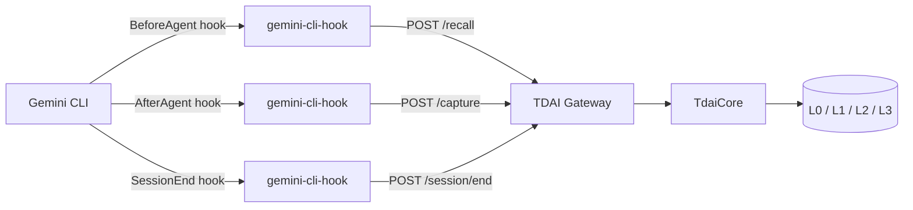

# Gemini CLI Adapter

TencentDB Agent Memory can be attached to [Gemini CLI](https://geminicli.com/)
through the official hooks system. The adapter recalls relevant memory before
each turn, captures the completed turn after the agent responds, and flushes
buffered pipeline work when the session ends.

## Architecture



Hook scripts are short-lived processes and fail open: if the Gateway is
unavailable, Gemini CLI continues normally and the hook logs to stderr.

## Prerequisites

1. Node.js 22+ and npm.
2. Gemini CLI installed and working.
3. A TDAI Gateway running locally. Start it from this repo:

```bash
node --import tsx src/gateway/server.ts
```

The Gateway defaults to `http://127.0.0.1:8420`.

## Install as a Gemini CLI extension

```bash
npm install
npm run build:gemini-cli-hook
gemini extensions link ./gemini-cli-extension
```

Restart Gemini CLI. During installation, Gemini CLI prompts for the Gateway
URL and optional API key. The extension registers three hooks:

| Event | Behavior |
| --- | --- |
| BeforeAgent | Recall memories and inject `additionalContext` |
| AfterAgent | Capture user prompt and assistant response |
| SessionEnd | Flush the session through the Gateway |

## Manual settings.json alternative

If you prefer not to use the extension, add the hooks to `~/.gemini/settings.json`:

```json
{
  "hooks": {
    "BeforeAgent": [
      {
        "hooks": [
          {
            "name": "memory-recall",
            "type": "command",
            "command": "node /absolute/path/to/bin/gemini-cli-hook.mjs",
            "timeout": 10000
          }
        ]
      }
    ],
    "AfterAgent": [
      {
        "hooks": [
          {
            "name": "memory-capture",
            "type": "command",
            "command": "node /absolute/path/to/bin/gemini-cli-hook.mjs",
            "timeout": 10000
          }
        ]
      }
    ],
    "SessionEnd": [
      {
        "hooks": [
          {
            "name": "memory-flush",
            "type": "command",
            "command": "node /absolute/path/to/bin/gemini-cli-hook.mjs",
            "timeout": 10000
          }
        ]
      }
    ]
  }
}
```

## Configuration

| Variable | Default | Description |
| --- | --- | --- |
| `MEMORY_TENCENTDB_GATEWAY_URL` / `TDAI_GATEWAY_URL` | none | Full Gateway base URL |
| `MEMORY_TENCENTDB_GATEWAY_HOST` / `TDAI_GATEWAY_HOST` | `127.0.0.1` | Gateway host |
| `MEMORY_TENCENTDB_GATEWAY_PORT` / `TDAI_GATEWAY_PORT` | `8420` | Gateway port |
| `MEMORY_TENCENTDB_GATEWAY_API_KEY` / `TDAI_GATEWAY_API_KEY` | none | Bearer token when auth is enabled |
| `MEMORY_TENCENTDB_GATEWAY_TIMEOUT_MS` / `TDAI_GATEWAY_TIMEOUT_MS` | `5000` | Hook request timeout |

Gemini CLI sanitizes environment variables passed to extension processes. When
using the extension, declare sensitive values through the extension `settings`
array so they are explicitly injected.

## Verify

Start the Gateway, then feed a fake BeforeAgent event to the hook:

```bash
echo '{"hook_event_name":"BeforeAgent","session_id":"demo","prompt":"hello"}' | node bin/gemini-cli-hook.mjs
```

Expected stdout is a JSON hook output such as `{}` when no memory exists yet.

## Source

- Adapter client: `src/adapters/gemini-cli/gateway-client.ts`
- Hook mapping: `src/adapters/gemini-cli/hook-handler.ts`
- Entrypoint: `scripts/gemini-cli/hook.ts`
- Extension manifest: `gemini-cli-extension/`
