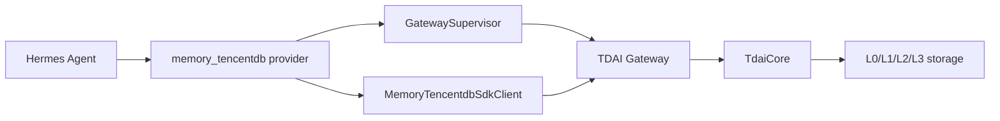

# Hermes Adapter Setup

This guide is the Hermes-specific path for the platform-adapter work in issue
#235. Hermes uses the existing Python `memory_tencentdb` provider and the Node
TDAI Gateway sidecar.

## Data Flow



## Enable the Provider

The provider directory must be named `memory_tencentdb`.

```bash
rm -rf ~/.hermes/hermes-agent/plugins/memory/memory_tencentdb
ln -sf ~/.memory-tencentdb/tdai-memory-openclaw-plugin/hermes-plugin/memory/memory_tencentdb \
       ~/.hermes/hermes-agent/plugins/memory/memory_tencentdb
```

Then enable it in `~/.hermes/config.yaml`:

```yaml
memory:
  provider: memory_tencentdb
```

## Configure the Gateway

For a developer checkout, the explicit command is the most predictable option:

```bash
export MEMORY_TENCENTDB_GATEWAY_CMD="sh -c 'cd ~/.memory-tencentdb/tdai-memory-openclaw-plugin && exec npx tsx src/gateway/server.ts'"
export MEMORY_TENCENTDB_GATEWAY_HOST="127.0.0.1"
export MEMORY_TENCENTDB_GATEWAY_PORT="8420"
```

The provider also supports zero-config auto-discovery when the checkout lives
under one of the documented default locations.

## Configure LLM Credentials

Hermes-facing config can use the provider names:

```bash
export MEMORY_TENCENTDB_LLM_API_KEY="sk-your-api-key"
export MEMORY_TENCENTDB_LLM_BASE_URL="https://api.openai.com/v1"
export MEMORY_TENCENTDB_LLM_MODEL="gpt-4o"
```

When the Hermes provider starts the Gateway, `GatewaySupervisor` bridges these
variables into the Gateway names:

```bash
TDAI_LLM_API_KEY
TDAI_LLM_BASE_URL
TDAI_LLM_MODEL
```

If both names are set, the explicit `TDAI_LLM_*` value wins.

For a Gateway started by the provider, the supervisor also mirrors its resolved
host and port into `TDAI_GATEWAY_HOST` and `TDAI_GATEWAY_PORT`. The Node Gateway
therefore listens on the same endpoint that the Hermes client probes, including
when `MEMORY_TENCENTDB_GATEWAY_HOST` or
`MEMORY_TENCENTDB_GATEWAY_PORT` uses a non-default value.

### DeepSeek Example

Claude Code may be configured with DeepSeek's Anthropic-compatible endpoint:

```bash
ANTHROPIC_BASE_URL="https://api.deepseek.com/anthropic"
ANTHROPIC_MODEL="deepseek-v4-pro[1M]"
```

The TDAI Gateway uses OpenAI-compatible chat completions, so configure Hermes
memory with the DeepSeek `/v1` endpoint and a Gateway-supported model name:

```bash
export MEMORY_TENCENTDB_LLM_API_KEY="$ANTHROPIC_AUTH_TOKEN"
export MEMORY_TENCENTDB_LLM_BASE_URL="https://api.deepseek.com/v1"
export MEMORY_TENCENTDB_LLM_MODEL="deepseek-v4-pro"
export TDAI_LLM_DISABLE_THINKING="deepseek"
```

When using `TDAI_LLM_*` directly, use the same values:

```bash
export TDAI_LLM_API_KEY="$ANTHROPIC_AUTH_TOKEN"
export TDAI_LLM_BASE_URL="https://api.deepseek.com/v1"
export TDAI_LLM_MODEL="deepseek-v4-pro"
export TDAI_LLM_DISABLE_THINKING="deepseek"
```

## Lifecycle Mapping

| Hermes call | Gateway endpoint | Result |
| --- | --- | --- |
| `prefetch(query)` | `POST /recall` | Combines dynamic L1 and stable persona/scene context for prompt injection |
| `sync_turn(user, assistant)` | `POST /capture` | Records the turn and notifies the pipeline |
| `handle_tool_call(memory_tencentdb_memory_search)` | `POST /search/memories` | Searches L1 structured memories |
| `handle_tool_call(memory_tencentdb_conversation_search)` | `POST /search/conversations` | Searches L0 conversation history |
| `shutdown()` / session end | `POST /session/end` | Flushes pending session work |

## Smoke Test

Start the Gateway manually:

```bash
cd ~/.memory-tencentdb/tdai-memory-openclaw-plugin
TDAI_LLM_API_KEY="sk-your-api-key" \
TDAI_LLM_BASE_URL="https://api.deepseek.com/v1" \
TDAI_LLM_MODEL="deepseek-v4-pro" \
TDAI_LLM_DISABLE_THINKING="deepseek" \
npx tsx src/gateway/server.ts
```

Verify health:

```bash
curl http://127.0.0.1:8420/health
```

Then launch Hermes with the provider enabled. A successful first conversation
should call `prefetch()` before the model turn and `sync_turn()` after the
assistant response.
