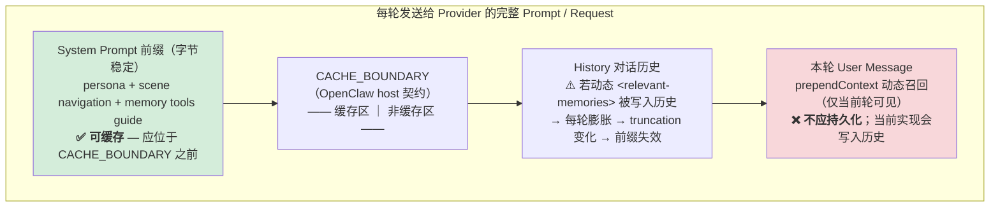

# Issue 120 Cache-Safe Recall: Measurement Report

## Background

Issue #120 reports prompt cache hit-rate regression for OpenAI-compatible providers
(DeepSeek, MiMo) after enabling memory recall. The recall path produces two kinds of context:

| block | field | stability | desired behavior |
| --- | --- | --- | --- |
| stable memory context | `appendSystemContext` | mostly stable | reusable, cacheable system-prefix material |
| dynamic L1 recall | `prependContext` | per-query | current-turn-only, never persisted |

This change makes the split explicit and observable (stable/dynamic context parts plus
cache-debug telemetry), and keeps injected dynamic recall out of persisted history.

## Memory-Injected Context Structure (basic-stage artifact)

How recall context is placed in the prompt, and what each segment means for prefix caching:

- Stable block (`appendSystemContext`): byte-stable, hash-observable (single SHA-256 across Gateway smoke turns) — cacheable prefix material.
- Dynamic block (`prependContext`): per-query L1 recall — must stay current-turn-only.
- The v5 provider matrix (below) isolates exactly these two effects.

## Provider Measurement (DeepSeek)

Real `deepseek-chat` (api.deepseek.com), warm turns (turn > 1),
`warmHitRate = cacheRead / (miss + cacheRead)`, miss = `prompt_cache_miss_tokens`.

### pi host (`--provider deepseek`, prompt via file, stable block via `--append-system-prompt`)

| variant | warm input miss | warm cache read | warm hit rate |
| --- | ---: | ---: | ---: |
| `current-dynamic-persist` | 5137 | 14336 | 0.7362 |
| `clean-history-only` | 4389 | 12288 | 0.7368 |
| `stable-prefix-clean-history` | 4408 | 19200 | 0.8133 |

### direct API (constructed multi-turn inputs)

| variant | warm input miss | warm cache read | warm hit rate |
| --- | ---: | ---: | ---: |
| `current-dynamic-persist` | 6166 | 16640 | 0.7296 |
| `clean-history-only` | 5001 | 13952 | 0.7361 |
| `stable-prefix-clean-history` | 5032 | 22528 | 0.8174 |

## Interpretation

1. **Dynamic recall persisted in history costs real cache misses**: current → clean reduces the
   warm miss surface by ~15% (pi 5137 → 4389; direct 6166 → 5001), i.e. ~180 tokens/turn on pi.
   Keeping dynamic `<relevant-memories>` out of persisted history is backed by data.
2. **A stable memory prefix at the front of the system prompt is reused by the provider cache**:
   `stable-prefix-clean-history` beats `clean-history-only` on both tracks (pi 0.8133 vs 0.7368;
   direct 0.8174 vs 0.7361) with no additional miss — the stable block rides on the cache.
3. Stable context is byte-stable across turns (single stable SHA-256 in Gateway smoke) and now
   separately observable via `context_parts` / `cache_debug`.

## Long-History Pressure Validation (supporting)

The matrix above uses 5–6 turns. Two earlier pi runs on real DeepSeek (complete prompts) cover the
long-session regime described by issue #120 (history bloat after many turns):

**12-turn pressure** (deepseek-v4-flash, warm turns 2–12):

| variant | warm input miss | warm cache read | warm hit rate |
| --- | ---: | ---: | ---: |
| `current-prepend-persist-pressure` | 44551 | 270080 | 0.8584 |
| `stable-prefix-clean-history-pressure` | 42662 | 276608 | 0.8664 |

- stable-prefix + clean-history beats current-prepend-persist by `+0.0080` hit rate and `−1889` warm
  miss tokens under 12-turn history pressure. Two-way only — the three-way v5 matrix separates the
  clean-history and stable-prefix effects; this run confirms the combined direction at long history.

**6-turn smoke** (deepseek-chat, warm turns 2–6):

| variant | warm input miss | warm cache read | warm hit rate |
| --- | ---: | ---: | ---: |
| `baseline-clean` | 448 | 13056 | 0.9668 |
| `current-prepend-persist` | 670 | 12928 | 0.9507 |
| `stable-prefix-clean-history` | 424 | 10880 | 0.9625 |

- `current-prepend-persist` (dynamic recall persisted) is the worst arm (`+222` warm miss vs baseline),
  independently supporting the dynamic-recall non-persistence direction.
- stable-prefix-clean-history ≈ baseline hit rate (0.9625 vs 0.9668): stable input adds no miss.

## Scope of This PR

- Stable/dynamic recall split exposed as `contextParts` (core) and `context_parts` (Gateway `/recall`),
  backward-compatible with `appendSystemContext` / `prependContext`.
- `before_message_write` strip of `<relevant-memories>` moved into a tested shared utility
  (`src/utils/recall-context.ts`) with string + content-parts handling.
- Cache-debug telemetry (hashes, sizes, placement, persist policy) gated behind
  `TDAI_CACHE_DEBUG` / `TDAI_EXPERIMENT_CACHE_DEBUG`.

Not in scope: OpenClaw `CACHE_BOUNDARY` host placement (pi `--append-system-prompt` approximates
a true system-prefix slot; OpenClaw does not expose the insertion point) and MiMo verification
(no API key available for this measurement).

## Validation

| command | result |
| --- | --- |
| `npm test` | 7 files / 73 tests passed |
| `npm run build` | passed |
| `git diff --check` | clean |
