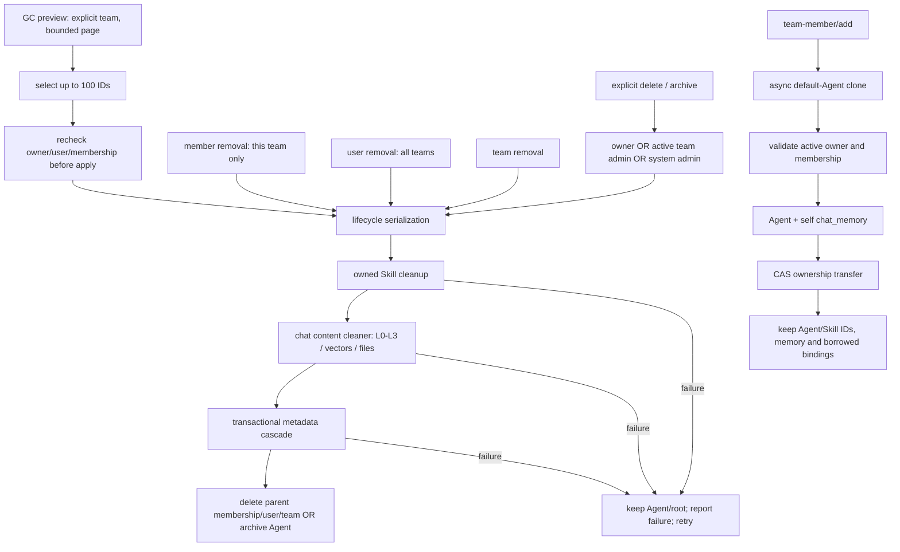

# Issue #1321: recoverable Agent lifecycle

Target branch: `feat/server_team`. Scope: MemoryCore metadata lifecycle and MemoryPanel Agent controls.

## Problem and ownership boundaries

Removing a membership used to delete only `meta_team_members`; deleting a user
removed credentials before resolving owned Agents. Agent delete/archive were
owner-only, so the remaining root had no usable owner. Panel advertised team-admin
management but rejected it at the control route. Team deletion bypassed the Agent
cascade, leaving task links, asset bindings and content behind.



## Implementation decisions

- Authorization completes for the whole batch before destructive work. Agent
  lifecycle reuses `assertCallerIsAgentOwnerOrTeamAdmin`, including authenticated
  system admins outside the team. Ordinary editing stays owner-only.
- Member/user/team service deletion repeatedly drains **page zero, 100 per batch**.
  This avoids both fixed limits and offset skipping as rows disappear. A partial
  store result aborts parent removal instead of being silently ignored.
- External cleanup precedes removal of Agent metadata. Skills are cleaned by an
  injected internal capability, not by stealing an owner's user key. It verifies
  team/Agent scope, handles active and archived Skill heads, awaits metadata
  cleanup and detects no-progress loops. Borrowed Skills are not deleted.
- Skill metadata is removed before the Skill root. If metadata fails, the Skill
  remains discoverable by its owner-Agent. If Skill deletion fails, retry still
  discovers the Skill through SkillCore (not metadata bindings).
- Agent retirement opts into strict Skill resource cleanup: all version directories
  are removed before deleting Skill version roots. A resource error propagates and
  preserves the Skill root for retry; ordinary Skill deletion keeps its existing API.
- The existing per-instance chat-memory cleaner is reused for **hard deletion as
  well as archive**. This preserves instance routing and does not require an LLM.
- SQLite uses nested savepoints. Agent/team metadata cascades and ownership
  transfer are atomic. MongoDB passes one session through each complete metadata
  operation. Transfer explicitly requires transactions; standalone non-transactional
  MongoDB development mode is not represented as atomic.
- A reentrant, instance-local lifecycle queue serializes member removal, user/team
  deletion, Agent creation, transfer and GC. A queued default-Agent clone rechecks
  the target user's active membership after removal, rather than recreating an orphan.
- Panel delegates cleanup and authorization to the kernel once. All allowed roles
  use the same archive semantics; admins do not bypass Skill/content cleanup.
- Agent delete buttons use an Agent-specific policy. Generic `canManageAsset`
  permissions for tasks/skills are not broadened. Edit controls remain owner-only.
- Agent get/list now enforce private/team visibility in the kernel. The visibility
  predicate is applied in each adapter **before pagination and total counting**.

## Role matrix

| Action | Agent owner | Active team admin | Non-team system admin | Other member / other-team admin |
|---|---|---|---|---|
| Delete / archive | yes | yes | yes | no |
| Transfer | yes | yes | yes | no |
| GC for a team | no, unless admin | yes | yes | no |
| Ordinary edit | yes | only when owner | only when owner | no |
| Read private Agent | yes | yes | yes | no |
| Read team-visible Agent | yes | yes | yes | active members of that team only |

The frontend does not grant authority; the authenticated kernel checks remain decisive.

## Ownership transfer

`POST /v3/meta/agent/transfer` (Panel proxy: `/api/v1/meta/agent/transfer`):

```json
{
  "agent_id": "AGENT_ID",
  "new_owner_user_id": "ACTIVE_TEAM_MEMBER_ID",
  "expected_owner_user_id": "CURRENT_OWNER_ID"
}
```

The recipient must exist, be active and belong to the same team. A stale expected
owner returns **409 ownership_conflict**. Authorization and validation happen before
writing. The store changes the Agent, its self-memory asset and **owned** Skill
metadata in one transaction. Skill identity (`owner_agent_id`) is unchanged; Skill
`user_id` is a historical author/audit field, not current ownership. Borrowed assets,
shared bindings and content are preserved. Explicit ACL grants are not rewritten.
Generic `agent/update` does not provide an ownership bypass.

## Existing-orphan repair / GC

Preview (default is read-only):

```json
{"team_id":"TEAM_ID","limit":100,"offset":0}
```

Call `POST /v3/meta/agent/gc` (same Panel metadata proxy prefix). Response includes
`candidates`, their reasons (`team_missing`, `owner_missing`, `owner_inactive`,
`membership_missing`), and `next_offset`. Missing team roots can be inspected by
system admins using the historical team ID.

Apply is explicit, limited to 100 IDs, and re-evaluates each candidate:

```json
{"team_id":"TEAM_ID","dry_run":false,"agent_ids":["REVIEWED_AGENT_ID"]}
```

An empty/missing selection is rejected. All selected IDs are checked for team
scope before any deletion. A restored membership or transferred healthy owner is
skipped. The result separates `deleted_ids`, `skipped_ids`, and per-ID `failed`.
Repeat previews from offset zero after applying a batch; do not continue a stale
offset through a shrinking dataset. No automatic scheduler or destructive startup
sweep is installed. Review inactive-owner candidates before selecting them: account
suspension can be intentional, and transfer may be preferable to deletion.

## Failure, concurrency and recovery boundaries

1. **External storage and metadata are not one distributed transaction.** Earlier
   Skills/content may already be removed when a later operation fails. Keeping
   root metadata enables retry, not undo of removed content. No claim of restoring
   deleted user data is made.
2. The lifecycle queue is **per MetadataService instance**, not a cross-pod lock.
   Direct store/migration writes and independent ingestion workers do not participate.
   Multi-writer production operation needs a durable retirement fence/outbox or a
   maintenance window that drains producers before destructive GC. CAS protects
   concurrent ownership updates; it does not fence all distributed ingestion.
3. Pure metadata-store APIs do not have Skill/file/vector clients. Application
   removal must go through MetadataService; raw migration store access only offers
   metadata integrity. Store `deleteUsers`/`removeTeamMember` remain low-level APIs.
4. Cleaner absence is supported for standalone metadata tests/migrations. The
   gateway installs the real cleaners. A disabled standalone SkillCore is an
   explicit no-op, not a swallowed arbitrary upstream error.
5. Ownership transfer requires MongoDB replica-set transactions. Non-transactional
   deletion keeps roots until child work finishes but has weaker atomicity.
6. This change is additive at the API level; rebuild/deploy **kernel and Panel
   together**. A new Panel with an old kernel would not have kernel-owned cleanup.
7. No general transfer of unrelated user-owned tasks/wiki/code-graph assets is
   claimed. Team ownership itself is a separate lifecycle domain.

## Reproduction and test commands

Node >= 22.16. Install each package's declared dependencies. Tests use in-memory
SQLite or a temporary MongoDB replica set, never an existing deployment database.

```sh
cd MemoryCore
npm test -- src/metadata/__tests__
TEST_METADATA_MONGODB=1 npm test -- src/metadata/__tests__
TEST_LIFECYCLE_BACKEND=mongodb npm test -- src/metadata/__tests__/agent-lifecycle.test.ts
cd ../MemoryPanel
npm test -- tests/lifecycle
npm run typecheck
cd web
npm run build
```

Mongo tests use `mongodb-memory-server` with MongoDB 7.0.14; the first opt-in run
needs a binary download. The 205-Agent regression actually crosses the 100-item
batch size. Tests also cover role matrices, cross-team isolation, all-user-key
removal, protected team owner/last system admin, content/Skill errors, retry,
transfer conflict and stale/healthy GC candidates. Real SkillCore + SQLite + local files verify version/resource deletion and retry.
SQLite triggers inject failures
at the root delete/asset update to verify transactional rollback. HTTP tests use
real user-key authentication on a disposable loopback server.

## Comparison with earlier proposals

Compared with #1323 / #1398 / #1442: this implementation adds actual transfer and
bounded GC endpoints, Skill/content cleanup for all roles, transactional metadata
cascades, explicit failure propagation, real cross-page tests, private-list filtering,
and a single kernel-owned Panel lifecycle route. Existing unrelated errors are
reported against a baseline rather than relabeled as passing.

This document describes implemented behavior and explicit limits, not a promise
of distributed exactly-once deletion. See the accompanying verification record
for observed commands, outputs and exit statuses.
