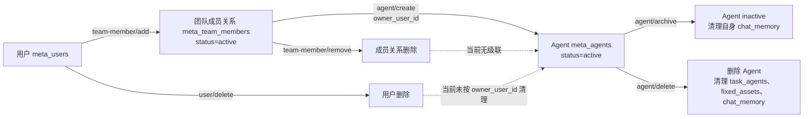
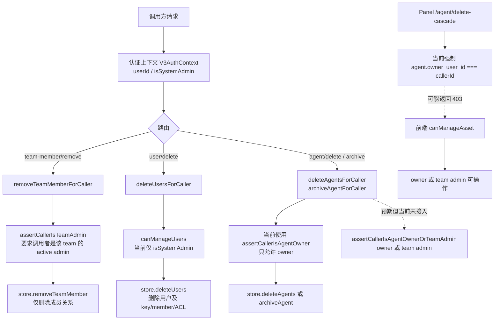

# Issue #1321 基础阶段分析：成员、用户与 Agent 生命周期

Issue：[#1321](https://github.com/TencentCloud/TencentDB-Agent-Memory/issues/1321)

本文只完成基础阶段验收要求：定位成员移除、用户删除、Agent 删除/归档权限这三条缺陷链，绘制生命周期与权限校验链路，并说明孤儿 Agent 的产生路径。本阶段不修改运行逻辑。

## 1. 当前生命周期

Agent 通过 `owner_user_id` 记录用户归属，通过 `team_id` 记录团队归属；成员关系单独存储在 `meta_team_members`。因此，成员关系被删除并不会自动改变 Agent 表中的 owner 字段。

### 生命周期中的三个断点

| 缺陷链 | 当前入口 | 当前行为 | 断点 |
| --- | --- | --- | --- |
| 成员移除 | `POST /v3/team-member/remove` | `removeTeamMemberForCaller()` 校验管理员后调用 `removeTeamMember()` | 只删除 `meta_team_members`，没有处理 `(team_id, owner_user_id)` 对应的 Agent |
| 用户删除 | `POST /v3/user/delete` | `deleteUsersForCaller()` 校验 system admin 后调用 store 的 `deleteUsers()` | SQLite / MongoDB 都清理 user key、成员关系和用户 ACL，但没有按 `owner_user_id` 删除或转移 Agent |
| Agent 删除/归档权限 | `POST /v3/agent/delete`、`POST /v3/agent/archive` 以及 Panel `/api/v1/agent/delete-cascade` | 内核和 Panel 当前都按 Agent owner 判断 | 已存在的 `assertCallerIsAgentOwnerOrTeamAdmin()` 没有用于这两个 caller-scoped 操作；Panel 的 owner-only 检查与前端 team-admin 判断不一致 |

## 2. 成员 / 用户 / Agent 权限校验链路

### 代码定位

- 用户删除入口：`MemoryCore/src/metadata/router/v3-meta-router.ts` 的 `/v3/user/delete`，服务层为 `metadata-service.ts` 的 `deleteUsersForCaller()`。
- 成员移除入口：`v3-meta-router.ts` 的 `/v3/team-member/remove`，服务层为 `removeTeamMemberForCaller()`。
- Agent 删除与归档入口：`v3-meta-router.ts` 的 `/v3/agent/delete`、`/v3/agent/archive`，服务层为 `deleteAgentsForCaller()`、`archiveAgentForCaller()`。
- 已有但未复用的权限 helper：`metadata-service.ts` 的 `assertCallerIsAgentOwnerOrTeamAdmin()`。
- SQLite 级联实现：`MemoryCore/src/metadata/store/sqlite-adapter.ts` 的 `deleteUsers()`、`deleteTeams()`、`deleteAgents()`。
- MongoDB 级联实现：`MemoryCore/src/metadata/store/mongodb-adapter.ts` 的对应三个方法。
- Panel 删除入口：`MemoryPanel/src/panel/http/routes/agent-lifecycle.ts` 的 `/agent/delete-cascade`。
- 前端权限判断：`MemoryPanel/web/src/services/backendStore.ts` 的 `canManageAsset()`。

## 3. 孤儿 Agent 的产生路径

### 路径 A：成员被移出团队

1. 用户 `usr-A` 是团队 `team-T` 的 active member，并拥有 Agent `agent-X`。
2. 管理员调用 `/v3/team-member/remove`，目标是 `usr-A`。
3. `removeTeamMemberForCaller()` 最终只删除 `meta_team_members(team-T, usr-A)`。
4. `meta_agents(agent-X)` 仍保留 `owner_user_id=usr-A`、`team_id=team-T`。
5. `usr-A` 已不是团队成员，但 Agent 仍指向该用户；若没有额外清理或 owner transfer，该 Agent 成为孤儿。

### 路径 B：用户被删除

1. 用户 `usr-A` 在 `team-T` 下拥有一个或多个 Agent。
2. system admin 调用 `/v3/user/delete` 删除 `usr-A`。
3. `deleteUsersForCaller()` 调用 adapter 的 `deleteUsers()`。
4. SQLite 和 MongoDB 会删除用户、user key、team membership、用户 ACL。
5. 两个 adapter 当前都没有删除 `owner_user_id=usr-A` 的 Agent，因此 Agent 留在 `meta_agents` 中，形成悬空 owner 引用。

### 路径 C：权限链不一致导致无法完成清理

1. 团队管理员在前端通过 `canManageAsset()` 判断为可管理 Agent。
2. Panel `/agent/delete-cascade` 却要求 caller 必须等于 `agent.owner_user_id`。
3. team admin 点击删除时收到 `403 NOT_YOUR_AGENT`，无法进入清理流程。
4. 内核的 `deleteAgentsForCaller()` / `archiveAgentForCaller()` 也只调用 owner-only helper，现有 team-admin helper 没有生效。
5. 团队管理员无法代删失联 Agent，孤儿 Agent 因而继续残留。

## 4. 基础阶段结论

当前问题不是 Agent 创建时缺少 owner，而是三条生命周期链没有共享同一套清理和授权规则：

1. 成员关系删除没有触发 Agent 生命周期处理；
2. 用户删除没有按 owner 级联处理 Agent；
3. Agent 删除/归档的内核、Panel、前端权限判断不一致。

这三条链共同解释了“成员被移出团队或用户被删除后，Agent 仍存在且无法被正常删除”的现象。进阶阶段应在此分析基础上决定采用 Agent 级联删除还是 owner transfer，并统一 owner、team admin、system admin 的授权路径。
