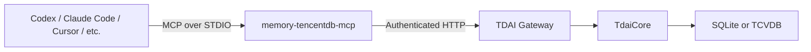

# TDAI Memory MCP Adapter

The `memory-tencentdb-mcp` command exposes the TDAI Gateway as a STDIO
Model Context Protocol server. It provides 5 tools for memory recall,
capture, and search to any MCP-compliant client.

## Architecture



The MCP server is intentionally a thin transport adapter:

| Concern | MCP adapter | Gateway |
|---------|------------|---------|
| Protocol | MCP STDIO (JSON-RPC 2.0) | HTTP REST |
| Memory logic | None (pass-through) | TdaiCore / storage / pipeline |
| Security | Input validation, tool schemas | Auth, API keys |

## Tools

| Tool | Purpose | Mutates memory |
|------|---------|:---:|
| `tdai_recall` | Return L1 memories + persona context for prompt injection | No |
| `tdai_memory_search` | Search structured L1 memory | No |
| `tdai_conversation_search` | Search raw L0 conversation history | No |
| `tdai_capture` | Persist a completed user/assistant turn | Yes |
| `tdai_session_end` | Flush pending work for a session | Yes |

## Usage

### Prerequisites

1. Start the TDAI Gateway (default: `http://127.0.0.1:8420`)
2. Install the package: `npm install @tencentdb-agent-memory/memory-tencentdb`
3. Verify the CLI: `memory-tencentdb-mcp --help`

### Direct invocation

```bash
memory-tencentdb-mcp
```

With environment overrides:

```bash
TDAI_GATEWAY_URL=http://127.0.0.1:8420 \
TDAI_GATEWAY_API_KEY=your-key \
memory-tencentdb-mcp
```

### Codex configuration

Add to `~/.codex/config.toml` or `.codex/config.toml`:

```toml
[mcp_servers.tencentdb_memory]
command = "memory-tencentdb-mcp"
env = { TDAI_GATEWAY_URL = "http://127.0.0.1:8420", TDAI_GATEWAY_API_KEY = "replace-me" }
startup_timeout_sec = 10
tool_timeout_sec = 30
```

### Claude Code configuration

Add to `.claude/settings.json`:

```json
{
  "mcpServers": {
    "memory-tdai": {
      "command": "npx",
      "args": ["--package", "@tencentdb-agent-memory/memory-tencentdb", "memory-tencentdb-mcp"]
    }
  }
}
```

## Protocol

The server implements MCP protocol versions:
- `2025-11-25` (latest published)
- `2025-06-18`
- `2025-03-26`
- `2024-11-05`

It enforces:
- JSON-RPC 2.0 compliance
- Initialization handshake before tool access
- Closed tool schemas (extra arguments rejected)
- Integer or string request IDs
- Proper error codes (ParseError, InvalidRequest, etc.)

## Environment Variables

| Variable | Default | Description |
|----------|---------|-------------|
| `TDAI_GATEWAY_URL` | `http://127.0.0.1:8420` | Gateway base URL |
| `TDAI_GATEWAY_API_KEY` | — | Gateway API key (required for non-localhost) |
| `TDAI_GATEWAY_TIMEOUT_MS` | `10000` | Request timeout in milliseconds |
