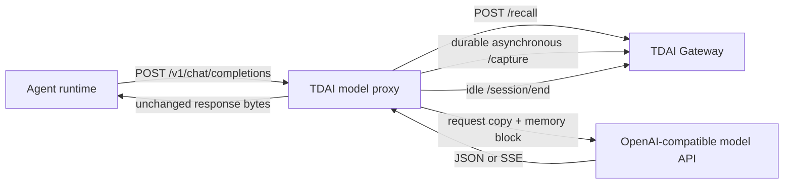

# Model Protocol Memory Proxy

The model proxy is a hook-free adapter for Agent runtimes that can configure an
OpenAI-compatible model base URL. It recalls memory before each logical user
turn, injects that memory only into the upstream request copy, and captures the
completed assistant answer asynchronously.

This is deliberately a protocol adapter, not another platform SDK:

- it does not require an Agent plugin lifecycle;
- it does not require the model to call an MCP tool;
- it does not parse a platform's private session files;
- it leaves storage, ranking, extraction, and session flushing in the existing
  TDAI Gateway and `TdaiCore`.

## Architecture



## Start

Start the existing TDAI Gateway first, then configure the upstream model origin
and run the proxy:

```bash
export TDAI_MODEL_UPSTREAM_URL="https://api.openai.com"
export TDAI_GATEWAY_URL="http://127.0.0.1:8420"
export TDAI_PROXY_SESSION_SECRET="replace-with-a-long-random-secret"

memory-tencentdb-model-proxy
```

The proxy listens on `127.0.0.1:8421` by default. Point the Agent's model base
URL to:

```text
http://127.0.0.1:8421/v1
```

The model API key remains the request's normal `Authorization` header and is
forwarded to the configured upstream. `TDAI_GATEWAY_API_KEY` is used only for
the memory Gateway and is never sent upstream.

The upstream setting is an origin or path prefix. For example, an incoming
`/v1/chat/completions` request and an upstream value of
`https://models.example.com/openai` resolve to
`https://models.example.com/openai/v1/chat/completions`.

## Configuration

| Variable | Default | Purpose |
| --- | --- | --- |
| `TDAI_MODEL_UPSTREAM_URL` | required | Fixed upstream model origin/path prefix |
| `TDAI_GATEWAY_URL` | `http://127.0.0.1:8420` | TDAI Gateway base URL |
| `TDAI_GATEWAY_API_KEY` | empty | Memory Gateway Bearer token |
| `TDAI_PROXY_HOST` | `127.0.0.1` | Proxy listen host |
| `TDAI_PROXY_PORT` | `8421` | Proxy listen port |
| `TDAI_PROXY_SESSION_SECRET` | random per process | HMAC secret for transcript lineage |
| `TDAI_PROXY_STATE_DIR` | `.tdai-model-proxy` | Durable capture-outbox directory |
| `TDAI_PROXY_RECALL_TIMEOUT_MS` | `300` | Recall latency budget; timeout fails open |
| `TDAI_PROXY_WRITE_TIMEOUT_MS` | `10000` | Background capture/flush timeout |
| `TDAI_PROXY_SESSION_IDLE_MS` | `1800000` | Idle delay before `/session/end` |
| `TDAI_PROXY_MAX_MEMORY_CHARS` | `12000` | Maximum injected recall characters |

Use a stable `TDAI_PROXY_SESSION_SECRET` if deterministic hashes are important
across configuration reloads. The current lineage index is in-memory, so a
process restart starts new inferred session keys even with a stable secret.
Hosts that already have a stable ID can avoid inference by sending:

```text
X-TDAI-Session-Key: project-a:conversation-42
```

Optional headers consumed by the proxy and never forwarded upstream:

| Header | Meaning |
| --- | --- |
| `X-TDAI-Session-Key` | Explicit stable conversation identity |
| `X-TDAI-Client-Id` | Namespace for lineage inference |
| `X-TDAI-User-Id` | Forward-compatible Gateway user identity |
| `X-TDAI-Skip-Memory: 1` | Bypass recall and capture for internal LLM work |

Do not route TDAI's own L1/L2/L3 extraction model calls back through this
proxy. Configure the standalone runner with the real upstream URL, or set
`X-TDAI-Skip-Memory: 1`, to prevent recursive memory capture.

## Conversation identity

Chat Completions is stateless and usually has no conversation ID. The proxy
therefore calculates a cumulative HMAC chain over canonical message roles,
text, tool-call IDs, and tool-call arguments. It stores only hashes:

```text
H0 = HMAC(secret, client_namespace || "root")
Hn = HMAC(secret, client_namespace || Hn-1 || canonical(message_n))
```

An extended chain continues the existing TDAI session. A different child after
an observed prefix creates a new session for that conversation branch.
Explicit `X-TDAI-Session-Key` always takes precedence.

Two completely identical first-turn transcripts from the same client are
indistinguishable at the HTTP protocol layer. Hosts that need strict separation
must provide the explicit header.

## Recall and capture semantics

- Recall is cached by logical user-turn hash, so multi-step tool loops recall
  only once.
- The memory block is appended to the last user content in the upstream copy.
  It stays near the prompt tail and does not mutate the Agent's stored history.
- Multimodal content keeps all original parts; recall is added as a text part.
- SSE is forwarded incrementally while response deltas are observed.
- `finish_reason=tool_calls` and `function_call` are lineage events but are not
  captured as completed turns.
- A terminal text answer is written to a SQLite outbox after the response.
  Duplicate completion IDs collapse to one row, and failed Gateway writes retry
  with exponential backoff.
- Gateway recall failure is fail-open: the original model request still runs.

## Security and current limits

- The upstream URL is fixed at startup, accepts only HTTP(S), and rejects
  embedded credentials.
- Hop-by-hop headers and all `X-TDAI-*` control headers are removed upstream.
- The proxy never logs request content or credentials.
- Bind to loopback unless a separate authenticated ingress protects the proxy.
- `user_id` exists in the Gateway request schema but is not currently a storage
  isolation boundary inside `TdaiCore`; run one Gateway data directory per
  trust domain.
- The first implementation supports Chat Completions. Responses API support is
  intentionally a separate, reviewable follow-up.
