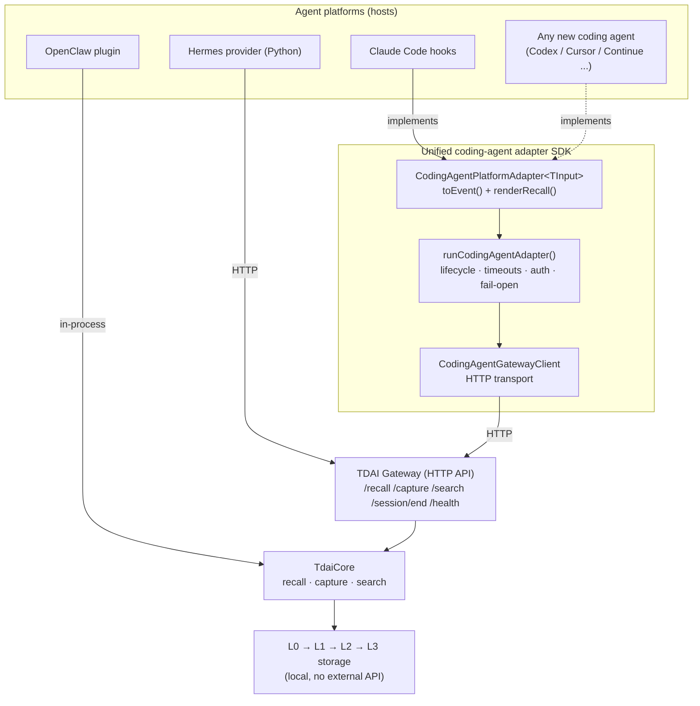
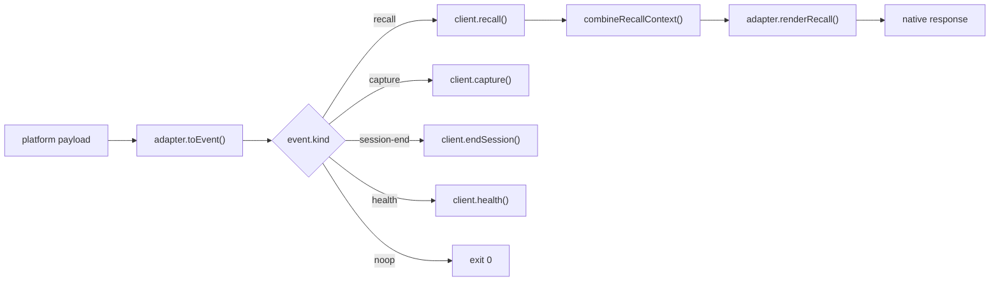
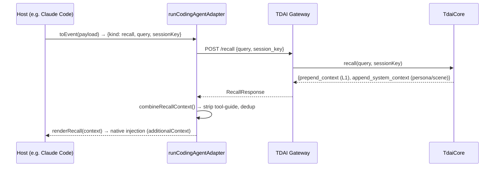
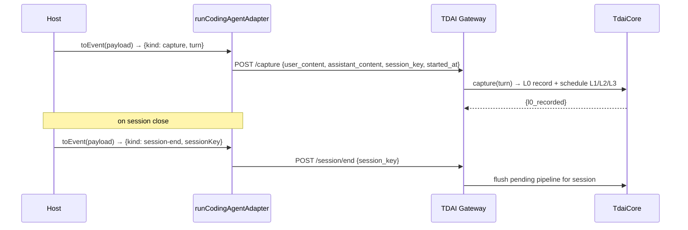

# Platform Adapter Architecture

This document answers the **基础 (foundational)** acceptance goal of issue #235:
draw the architecture that connects the core memory engine (`TdaiCore`) to each
platform adapter, and annotate the data flow. It also describes the **拓展
(challenge)** goal: a unified adapter SDK where a new platform is integrated by
implementing a single interface.

## 1. Layered architecture



- **OpenClaw** embeds `TdaiCore` in-process (no HTTP hop).
- **Hermes** and every **coding-agent** host reach the core through the
  Gateway sidecar over HTTP, so the core never has to know the host.
- **Claude Code** is the reference implementation of the SDK interface. A new
  platform only implements the same interface (dotted arrow) and reuses the
  entire SDK runner + transport unchanged.

## 2. Unified adapter interface (拓展 goal)

A new platform is integrated by implementing one interface — no new transport,
timeout, auth, or error-handling code:

```ts
export interface CodingAgentPlatformAdapter<TInput> {
  readonly platform: string;
  // Map a platform-native payload into a neutral lifecycle event.
  toEvent(input: TInput): CodingAgentEvent | Promise<CodingAgentEvent>;
  // Render recalled memory back into the platform's native response shape.
  renderRecall(context: string, input: TInput): unknown;
}
```

`runCodingAgentAdapter(adapter, input, options)` then drives the lifecycle:
it resolves the event, calls the Gateway, flattens recall context, renders the
platform response, and **always fails open** (exit code 0, error to stderr) so
memory being unavailable never blocks the host agent.



## 3. Recall data flow (before the model call)



## 4. Capture + session flush data flow (after the turn)



## 5. Capability boundary (`TdaiCore`)

Every adapter maps onto the same core capabilities, nothing more:

| Capability | Gateway route | Purpose |
| --- | --- | --- |
| recall | `POST /recall` | Fetch dynamic L1 + stable persona/scene context for a turn |
| capture | `POST /capture` | Record an L0 turn and schedule L1→L3 extraction |
| search memories | `POST /search/memories` | Query distilled L1+ memories |
| search conversations | `POST /search/conversations` | Query raw L0 turns |
| session flush | `POST /session/end` | Flush the pipeline for a session |
| health | `GET /health` | Liveness / store readiness |

See [`platform-adapter-comparison.md`](./platform-adapter-comparison.md) for how
OpenClaw, Hermes, Claude Code, and Dify differ across these routes, and
[`coding-agent-adapter-quickstart.md`](./coding-agent-adapter-quickstart.md) for
the minimal code to onboard a new platform.
