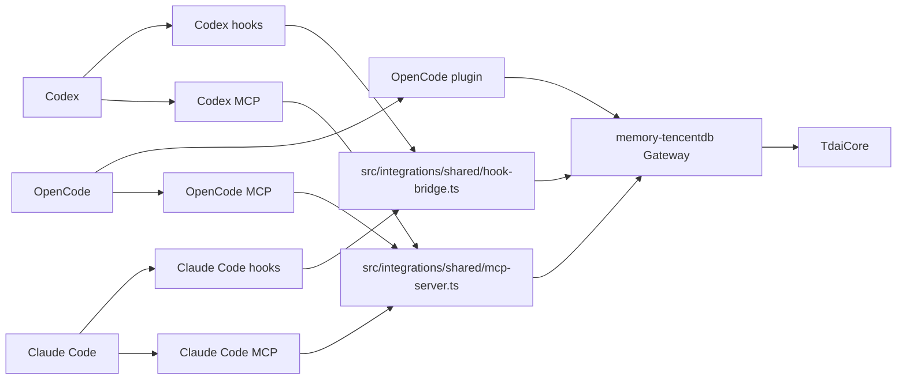

# 平台适配对比：Codex、Claude Code 和 OpenCode / Platform Adapter Comparison: Codex, Claude Code, and OpenCode

## 为什么选择这条路线 / Why This Route

本实现遵循 issue #235 中“先适配两个或以上平台，并对比平台差异”的路线。
This implementation follows the issue #235 route of adapting two or more platforms first and documenting their differences.

它暂不引入新的公共 Adapter SDK，而是先提供三个真实平台适配。
It does not introduce a new public Adapter SDK yet. Instead, it adds three concrete platform adapters first.

- Codex
- Claude Code
- OpenCode

三个适配都复用现有 Gateway 和 `TdaiCore` 能力边界。
All three adapters reuse the existing Gateway and `TdaiCore` capability boundary.

## 核心能力边界 / Core Capability Boundary

| 能力 / Capability | Core/Gateway 操作 / Operation | 目的 / Purpose |
| --- | --- | --- |
| prompt 前 recall / Recall before prompt | `POST /recall` | 在模型看到用户请求前注入相关记忆 / Inject relevant memory before the model sees the user request |
| turn 后 capture / Capture after turn | `POST /capture` | 将 user/assistant 对话写入 L0 并触发提取流程 / Persist dialogue into L0 and trigger extraction |
| 搜索结构化记忆 / Search structured memories | `POST /search/memories` | agent-callable L1 memory search |
| 搜索原始对话 / Search raw conversations | `POST /search/conversations` | agent-callable L0 conversation search |
| session 结束 / End session | `POST /session/end` | flush 一个 conversation 的 buffered work / Flush buffered work for one conversation |

## 架构 / Architecture

共享 TypeScript 实现。
Shared TypeScript implementation.

- `src/integrations/shared/gateway-client.ts`
- `src/integrations/shared/hook-bridge.ts`
- `src/integrations/shared/mcp-server.ts`

可执行 wrapper。
Runnable wrappers.

- `bin/memory-tencentdb-gateway.mjs`
- `bin/memory-tencentdb-hook.mjs`
- `bin/memory-tencentdb-mcp.mjs`

平台文件。
Platform-specific files.

- `integrations/codex/config.toml.example`
- `integrations/codex/hooks/hooks.json`
- `integrations/codex/.codex-plugin/plugin.json`
- `integrations/claude-code/.mcp.json`
- `integrations/claude-code/.claude/settings.json`
- `integrations/opencode/opencode.json.example`
- `integrations/opencode/plugin.js`

## Codex 适配器 / Codex Adapter

Codex 适配使用 MCP config、`UserPromptSubmit` hook 和 `Stop` hook。
The Codex adapter uses MCP config, `UserPromptSubmit` hook, and `Stop` hook.

- MCP 暴露显式 memory search tools。
  MCP exposes explicit memory search tools.
- `UserPromptSubmit` 做 recall，并缓存 prompt。
  `UserPromptSubmit` performs recall and caches the prompt.
- `Stop` 将 cached prompt 与 `last_assistant_message` 配对后调用 `/capture`。
  `Stop` pairs the cached prompt with `last_assistant_message` and calls `/capture`.
- Codex plugin metadata 可用于打包配置。
  Codex plugin metadata can package the configuration.

优势。
Strengths.

- Codex 有官方 MCP 支持。
  Codex has official MCP support.
- hooks 可以在不修改 memory core 的情况下桥接生命周期。
  Hooks bridge lifecycle events without changing the memory core.

限制。
Limitations.

- capture 依赖 `UserPromptSubmit` 与 `Stop` 都在同一 turn 运行。
  Capture depends on both `UserPromptSubmit` and `Stop` running for the same turn.
- 如果没有 assistant final message，adapter 会 flush session，而不是写入不完整 turn。
  If there is no final assistant message, the adapter flushes the session instead of recording an incomplete turn.

## Claude Code 适配器 / Claude Code Adapter

Claude Code 适配使用 `.mcp.json` 和 `.claude/settings.json`。
The Claude Code adapter uses `.mcp.json` and `.claude/settings.json`.

- `.mcp.json` 注册 memory MCP server。
  `.mcp.json` registers the memory MCP server.
- `.claude/settings.json` 注册 hook commands。
  `.claude/settings.json` registers hook commands.
- 共享 MCP 和 hook bridge 与 Codex 相同。
  The shared MCP and hook bridges are the same as Codex.

优势。
Strengths.

- 配置形态符合 Claude Code project-local settings。
  The configuration shape matches Claude Code project-local settings.
- MCP tool registration 直接且稳定。
  MCP tool registration is straightforward and stable.

限制。
Limitations.

- capture 同样依赖 prompt 和 assistant output 都可见。
  Capture also depends on both prompt and assistant output being available.
- 如果项目已有 hooks，需要合并 settings。
  If a project already has hooks, settings must be merged carefully.

## OpenCode 适配器 / OpenCode Adapter

OpenCode 适配使用 `opencode.json` MCP 配置和 OpenCode plugin。
The OpenCode adapter uses `opencode.json` MCP configuration plus an OpenCode plugin.

- `opencode.json.example` 注册 memory MCP server。
  `opencode.json.example` registers the memory MCP server.
- `plugin.js` 在 `chat.message` 中调用 `/recall` 并注入 synthetic memory text part。
  `plugin.js` calls `/recall` from `chat.message` and injects a synthetic memory text part.
- `message.updated`、`message.part.updated` 和 `session.idle` 用于还原 assistant 输出并调用 `/capture` 或 `/session/end`。
  `message.updated`, `message.part.updated`, and `session.idle` reconstruct assistant output and call `/capture` or `/session/end`.
- 示例配置固定 `deepseek/deepseek-v4-flash`，用于 issue #235 的 OpenCode proof lane。
  The example pins `deepseek/deepseek-v4-flash` for the issue #235 OpenCode proof lane.

优势。
Strengths.

- OpenCode 同时支持 MCP tools 和 plugin hooks，适合验证同一条 `Gateway + MCP + lifecycle` 路线。
  OpenCode supports both MCP tools and plugin hooks, making it a good fit for the same `Gateway + MCP + lifecycle` route.
- plugin 运行在 OpenCode 进程内，不需要平台私有补丁。
  The plugin runs inside OpenCode and does not require private platform patches.

限制。
Limitations.

- OpenCode 的 plugin 事件名与 Codex / Claude Code 不同，需要单独的事件映射层。
  OpenCode plugin event names differ from Codex / Claude Code, so it needs a separate event mapping layer.
- capture 依赖 OpenCode 暴露 completed assistant message 或 text part update。
  Capture depends on OpenCode exposing a completed assistant message or text part updates.

## Codex、Claude Code 与 OpenCode 差异 / Codex vs Claude Code vs OpenCode Differences

| 维度 / Dimension | Codex | Claude Code | OpenCode |
| --- | --- | --- | --- |
| MCP config | `config.toml` / `codex mcp add` | `.mcp.json` | `opencode.json` |
| Hook/plugin config | `hooks.json` 或 plugin-bundled hooks / `hooks.json` or plugin-bundled hooks | `.claude/settings.json` | `.opencode/plugins/memory-tencentdb.js` |
| Packaging | optional Codex plugin | project settings directory | OpenCode plugin file or package |
| Stable path | MCP search tools | MCP search tools | MCP search tools |
| 自动 recall / Automatic recall | `UserPromptSubmit.prompt` | `UserPromptSubmit.prompt` | `chat.message` text parts |
| 自动 capture / Automatic capture | cached prompt + `Stop.last_assistant_message` | cached prompt + `Stop.last_assistant_message` | cached prompt + assistant `message.part.updated` / completed message |
| Session key source | session/thread/conversation field, else cwd | session id, else cwd | workspace root + OpenCode session id |

共同结论：MCP 是稳定的显式搜索路径，hooks/plugins 在 payload 足够完整时提供自动 recall/capture。
Common lesson: MCP is the stable explicit search path, while hooks/plugins provide automatic recall/capture when payloads are complete enough.

## 与现有平台对比 / Comparison With Existing Platforms

| 平台 / Platform | 接入方式 / Integration style | 记忆行为 / Memory behavior | 说明 / Notes |
| --- | --- | --- | --- |
| OpenClaw | native plugin hooks/tools | full automatic recall and capture | 最完整，因为 OpenClaw 直接暴露生命周期 / strongest because OpenClaw exposes lifecycle directly |
| Hermes | Python Provider + Gateway | Provider lifecycle recall/capture | 适合 non-Node host 的 sidecar 模式 / sidecar pattern for non-Node hosts |
| Codex | MCP + command hooks | stable search, best-effort automatic recall/capture | 官方扩展面，不依赖私有 API / official extension surfaces, no private APIs |
| Claude Code | MCP + command hooks | stable search, best-effort automatic recall/capture | 与 Codex 类似但配置文件不同 / similar to Codex with different config files |
| OpenCode | MCP + plugin hooks | stable search, best-effort automatic recall/capture | 证明同一策略可扩展到第三个 agent 平台 / proves the same strategy can extend to a third agent platform |

## 为什么暂不做 SDK / Why No SDK Yet

现在直接抽 public SDK 会过早冻结抽象。
Extracting a public SDK now would freeze abstractions too early.

当前路线保留更低层、更可验证的边界。
The current route keeps lower-level, more verifiable boundaries.

- shared Gateway contract
- shared MCP bridge
- shared hook bridge
- platform-specific config and plugin examples
- package bins for runnable adapters

当 OpenClaw、Hermes、Codex、Claude Code 和 OpenCode 的行为都被验证后，再从已证明的共同模式里提取 SDK。
After OpenClaw, Hermes, Codex, Claude Code, and OpenCode behavior is proven, an SDK can be extracted from validated common patterns.

## 后续规划 / Future Plan

### Phase 1: 验证三个 adapter / Validate Three Adapters

- 运行 Codex MCP+hooks 并验证 search tools 和 hook capture。
  Run Codex MCP+hooks and verify search tools plus hook capture.
- 运行 Claude Code MCP+hooks 并验证 search tools 和 hook capture。
  Run Claude Code MCP+hooks and verify search tools plus hook capture.
- 运行 OpenCode MCP+plugin 并验证 search tools 和 plugin capture。
  Run OpenCode MCP+plugin and verify search tools plus plugin capture.
- 保存真实 hook payload examples。
  Capture real hook payload examples.

### Phase 2: 改进自动行为 / Improve Automatic Behavior

- 细化各平台 session key 提取。
  Refine session key extraction per platform.
- 改进 `UserPromptSubmit` recall context 格式。
  Improve `UserPromptSubmit` recall context formatting.
- 增加 missing Gateway、auth failure、empty hook payload 的 troubleshooting docs。
  Add troubleshooting docs for missing Gateway, auth failure, and empty hook payloads.

### Phase 3: 重新考虑 SDK / Reconsider SDK Extraction

未来 SDK 应基于以下已验证需求。
A future SDK should be based on these validated requirements.

- stable session identity
- pre-prompt recall event
- post-turn capture event
- tool registration format
- shutdown/session flush semantics

## 验收清单 / Acceptance Checklist

- Codex adapter 文档说明 MCP 和 hook setup。
  Codex adapter documents MCP and hook setup.
- Claude Code adapter 文档说明 MCP 和 hook setup。
  Claude Code adapter documents MCP and hook setup.
- OpenCode adapter 文档说明 MCP 和 plugin setup。
  OpenCode adapter documents MCP and plugin setup.
- 三者复用现有 Gateway。
  All three adapters reuse the existing Gateway.
- package 暴露 runnable gateway、MCP 和 hook bins。
  Package exposes runnable gateway, MCP, and hook bins.
- hook bridge 可以将 cached prompt 与 `last_assistant_message` 配对 capture。
  Hook bridge can pair cached prompt with `last_assistant_message` for capture.
- OpenCode plugin 可以将 `chat.message` 与 completed assistant message 配对 capture。
  OpenCode plugin can pair `chat.message` with completed assistant messages for capture.
- 不引入新的 public SDK export。
  No new public SDK export is introduced.
- 平台差异和限制已文档化。
  Platform differences and limitations are documented.
