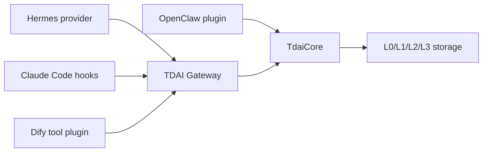

# Platform Adapter Comparison

This document compares the platform adapter shapes relevant to issue #235.
All paths reuse the same `TdaiCore` capability boundary: recall, capture,
memory search, conversation search, and session flush.

## Summary

| Platform | Adapter shape | Runtime boundary | Recall timing | Capture timing | Status |
| --- | --- | --- | --- | --- | --- |
| OpenClaw | In-process plugin | `index.ts` calls `TdaiCore` directly | `before_prompt_build` | `agent_end` / committed turn | Existing |
| Hermes | Python provider + Node Gateway | HTTP sidecar | `prefetch(query)` -> `/recall` | `sync_turn()` -> `/capture` | Existing, documented |
| Claude Code | Hook adapter + Node Gateway | Hook command over stdio, then HTTP | `UserPromptSubmit` -> `/recall` | `Stop` -> `/capture`; `SessionEnd` -> `/session/end` | Added as lightweight adapter |
| Dify | Tool plugin + Node Gateway | Dify tool runtime, then HTTP | `tdai_recall` tool | `tdai_capture` tool | Covered by upstream PR #394 |

## Core Data Flow

## Adapter Differences

| Dimension | OpenClaw | Hermes | Claude Code | Dify |
| --- | --- | --- | --- | --- |
| Host integration | Plugin SDK hooks | `MemoryProvider` implementation | Claude Code hook commands | Dify tool plugin |
| Transport | In-process TypeScript | HTTP Gateway | Hook stdin/stdout + HTTP Gateway | Tool invocation + HTTP Gateway |
| Session key | OpenClaw session/runtime state | Hermes session id | Stable Claude `session_id` | Workflow/session variables |
| Prompt injection | Direct `prependContext` mutation | `prefetch()` return string | `hookSpecificOutput.additionalContext` | Tool result consumed by workflow |
| Turn capture | Direct committed-turn object | Background `sync_turn()` thread | Latest transcript user/assistant turn | Tool call payload |
| Gateway auth | Not applicable in-process | Optional Bearer token | Optional Bearer token | Optional Bearer token |
| Best fit | Native OpenClaw users | Hermes users who want memory provider semantics | Claude Code users who can configure hooks | Dify workflows and tool nodes |

## Claude Code Notes

The Claude Code adapter intentionally stays thin:

- `UserPromptSubmit` calls recall and returns dynamic L1 plus stable
  persona/scene context as `additionalContext`.
- `Stop` pairs the latest human prompt from the transcript with Claude Code's
  authoritative `last_assistant_message`, then captures it through the Gateway.
- `SessionEnd` flushes the session without capturing the final turn twice.

This keeps platform-specific behavior in `src/adapters/claude-code/` while
reusing the generic `CodingAgentGatewayClient` HTTP wrapper.

## Dify Notes

Dify is a good target platform for this issue, but a full implementation is
already covered by PR #394. For this branch, Dify is treated as a comparison
point rather than reimplemented from scratch.
