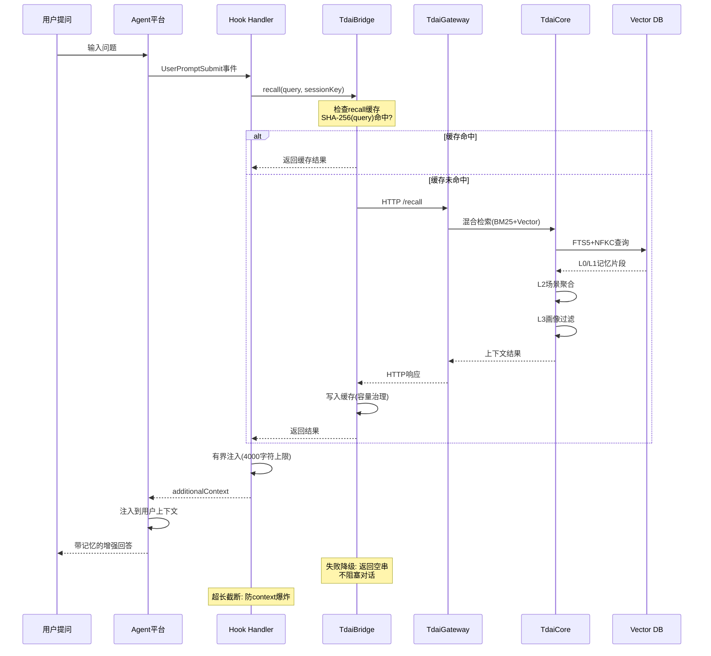

# Platform Adapters Comparison

本文档对比 TencentDB Agent Memory 在6个Agent平台上的适配方案，分析不同接入模式、技术选型和实现特点。

## 平台对比总览

| 平台 | 状态 | 接入模式 | 改core hostType? | HTTP Client | L0读写可靠性 | Reliability特性 | MCP支持 | 实现位置 |
|------|------|----------|-----------------|-------------|--------------|-----------------|---------|----------|
| **OpenClaw** | ✅ Main | In-process host-adapter | ❌ 否 (native) | — | ✅ 直接调用TdaiCore | Plugin lifecycle管理 | ❌ 无 | `openclaw-plugin/` |
| **Hermes** | ✅ Main | HTTP sidecar | ❌ 否 (HTTP路径) | 自带`memory_tencentdb` provider | ✅ HTTP + 重试队列 | Supervisor/circuit-breaker | ❌ 无 | `hermes-plugin/memory/memory_tencentdb/` |
| **Codex** | 🔄 PR #516 | HTTP hooks | ❌ 否 (HTTP路径) | 自写client | ✅ HTTP + 降级 | 持久化重试队列 | ❌ 无 | PR独立实现 |
| **Claude Code** | 🔄 PR #517 | Tool-based hooks | ❌ 否 (HTTP路径) | 自写`gateway-client.ts` | ✅ HTTP + 有界注入 | 持久化队列/超时预算 | ✅ 有(自建) | `src/adapters/claude-code/` |
| **Dify** | 🔄 PR #394 | HTTP tool-plugin | ❌ 否 (HTTP路径) | Python `tools/client.py` | ✅ HTTP + 异常捕获 | Python try/except降级 | ❌ 无 | `dify-plugin-tdai-memory/` |
| **Trae** | 🔄 本PR | HTTP hooks + MCP | ❌ 否 (HTTP路径) | 复用#316`GatewayMemoryClient` | ✅ HTTP + TdaiBridge | retry/recall缓存/降级/消毒 | ✅ 有(复用#372) | `src/adapters/trae/` |

### 维度说明

**接入模式分类:**
- **In-process host-adapter**: OpenClaw插件直接调用TdaiCore，无HTTP中间层
- **HTTP sidecar**: Hermes通过独立Gateway进程，HTTP通信
- **HTTP hooks**: 生命周期hook触发HTTP调用 (Codex/Trae)
- **Tool-based hooks**: 通过工具调用触发hook (Claude Code)
- **HTTP tool-plugin**: 平台工具插件发起HTTP请求 (Dify)
- **MCP**: Model Context Protocol标准接口 (Trae/Claude Code)

**改core hostType**: 所有方案均避免修改`core/hostType`联合类型，走HTTP路径保持core稳定性。

**HTTP Client来源**: 
- Hermes自带provider (维护中)
- #316 `GatewayMemoryClient` (轻量baseline)
- 各PR自写client (碎片化问题)
- Trae复用#316 (整合方向)

**Reliability特性**:
- **OpenClaw**: 直接调用，依赖插件生命周期管理
- **Hermes**: Supervisor模式 + circuit-breaker
- **Codex/Claude Code**: 持久化重试队列 (文件系统)
- **Trae**: 分类retry + recall缓存 + 输入消毒 + 优雅降级 (取#339内核)

## 组件架构图

```mermaid
graph TB
    subgraph "Agent Platforms"
        OC["OpenClaw<br/>In-process Plugin"]
        HM["Hermes<br/>HTTP Sidecar"]
        CX["Codex<br/>HTTP Hooks"]
        CC["Claude Code<br/>Tool Hooks"]
        DY["Dify<br/>Tool Plugin"]
        TR["Trae<br/>Hooks + MCP<br/>(本PR)"]
    end

    subgraph "Adaptation Layer"
        TD["TdaiBridge<br/>(薄整合层)"]
        GW["TdaiGateway<br/>HTTP Server"]
    end

    subgraph "Core Engine"
        TC["TdaiCore<br/>记忆引擎"]
        VDB[(("Vector DB<br/>FTS5+NFKC"))]
    end

    OC -->|直接调用| TC
    HM -->|HTTP Provider| GW
    CX -->|自写Client| GW
    CC -->|自写gateway-client| GW
    DY -->|Python client.py| GW
    TR -->|复用#316<br/>GatewayMemoryClient| TD
    TD -->|retry/缓存/降级| GW
    GW --> TC
    TC --> VDB

    style TR fill:#90EE90,stroke:#228B22,stroke-width:3px
    style TD fill:#FFD700,stroke:#FF8C00,stroke-width:2px
    style TC fill:#87CEEB,stroke:#4682B4
```

**架构说明:**
- OpenClaw走进程内路径，无需HTTP层
- Hermes/Codex/Claude Code/Dify通过各自HTTP client接入Gateway
- Trae通过`TdaiBridge`薄整合层，复用#316 `GatewayMemoryClient`
- 所有HTTP路径最终汇聚到`TdaiGateway` → `TdaiCore`

## Recall READ路径



**READ路径关键点:**
- **缓存优化**: 同会话同查询命中缓存，直接修复#120 prompt-cache问题
- **分类retry**: 仅对瞬态错误重试(503/429/timeout)，Auth错误立即降级
- **有界注入**: 4000字符上限，防上下文爆炸
- **优雅降级**: 任何异常返回空串，不阻塞对话

## L0→L3 WRITE路径

```mermaid
graph TB
    subgraph "Capture阶段"
        HK["Hook Handler<br/>(Stop/SessionEnd事件)"]
        CP["TdaiBridge.capture()"]
    end

    subgraph "L0原始对话层"
        L0["L0 Conversation<br/>原始对话记录"]
        RAW["refs/*.md<br/>工具调用结果"]
    end

    subgraph "L1原子事实层"
        L1["L1 Atom<br/>结构化事实"]
        V1[(("向量索引<br/>FTS5+BK-Tree"))]
    end

    subgraph "L2场景层"
        L2["L2 Scenario<br/>场景块"]
        IDX["场景索引<br/>时间/任务聚类"]
    end

    subgraph "L3画像层"
        L3["L3 Persona<br/>用户画像"]
        PRF["偏好/风格/目标<br/>长期沉淀"]
    end

    HK --> CP
    CP -->|输入消毒<br/>长度clamp| L0
    L0 --> RAW
    
    L0 -->|每N轮触发| L1
    L1 --> V1
    L1 -->|向量去重| L1
    L1 -->|语义关联| L2
    
    L2 -->|场景聚类| IDX
    L2 -->|每50条触发| L3
    
    L3 --> PRF
    
    L3 -.->|召回时过滤| L2
    L2 -.->|下钻证据| L1
    L1 -.->|溯源原文| L0
    L0 -.->|完整恢复| RAW

    style CP fill:#FFD700,stroke:#FF8C00
    style L0 fill:#E6F3FF,stroke:#4682B4
    style L1 fill:#FFF0E6,stroke:#FF8C00
    style L2 fill:#E6FFE6,stroke:#228B22
    style L3 fill:#FFE6F0,stroke:#DC143C
```

**WRITE路径层次:**
- **L0 Conversation**: 原始对话完整保留，`refs/*.md`卸载工具调用结果
- **L1 Atom**: 结构化原子事实，向量去重，支持语义检索
- **L2 Scenario**: 场景块聚合，任务级别归纳
- **L3 Persona**: 用户画像，长期偏好/表达风格/目标沉淀

**可追溯链路**: Persona → Scenario → Atom → Conversation → refs/*.md，每一步都可下钻恢复原始证据。

## 技术选型对比

### HTTP Client碎片化现状

| PR | Client实现 | 代码量 | 特点 |
|----|-----------|--------|------|
| #316 | `GatewayMemoryClient` | ~300行 | 轻量baseline，被maintainer认可 |
| #372 | `TdaiGatewayClient` | ~400行 | MCP桥专用 |
| #517 | `src/adapters/claude-code/gateway-client.ts` | ~350行 | Claude Code专用 |
| #394 | `tools/client.py` | ~200行 | Python实现 |
| **本PR (Trae)** | **复用#316** | **0行新增** | **整合方向** |

**整合机会**: Trae主动复用#316 `GatewayMemoryClient`，避免第5份自写client，为未来统一SDK奠基。

### Reliability特性来源

| 特性 | 来源 | 应用平台 |
|------|------|----------|
| 分类retry (瞬态重试/Auth跳过) | #339 ABC内核 | Trae |
| Recall会话缓存 (SHA-256 key) | #339 修复#120 | Trae |
| 输入消毒 (query截断/limit clamp) | #339 防御 | Trae |
| 优雅降级 (异常返回空值) | #339 | Trae |
| 持久化重试队列 | #517 Claude Code | Claude Code |
| Supervisor/circuit-breaker | Hermes | Hermes |
| 有界additionalContext注入 | #517 | Trae/Claude Code |

**Trae整合策略**: 取#339高杠杆内核 (retry/缓存/降级/消毒)，避开G2-G4重型防御门。

## MCP支持对比

| 平台 | MCP实现 | Schema模式 | 工具数量 | 特点 |
|------|---------|-----------|---------|------|
| **Claude Code** | 自建MCP v1.3 | Open schema | 5个 | 工具定义灵活 |
| **Trae** | 复用#372模式 | Closed schema | 5个 | 纯JSON-RPC + 强校验 |
| **OpenClaw** | ❌ 无 | — | — | 进程内调用 |
| **Hermes** | ❌ 无 | — | — | HTTP provider |
| **Codex** | ❌ 无 | — | — | HTTP hooks |
| **Dify** | ❌ 无 | — | — | HTTP plugin |

**Trae MCP特点**:
- 纯JSON-RPC手写 (不依赖@modelcontextprotocol/sdk，供应链安全)
- Closed schema (`additionalProperties: false`) 强校验
- G0输入校验 + G1 HMAC签名 (参照#372)
- 5个工具: `tdai_recall`/`tdai_capture`/`tdai_memory_search`/`tdai_conversation_search`/`tdai_session_end`

## 各平台实现状态

### ✅ 已合并 (Main分支)
- **OpenClaw**: `openclaw-plugin/` - 进程内插件，零配置启动
- **Hermes**: `hermes-plugin/memory/memory_tencentdb/` - HTTP sidecar，Docker/原生双路径

### 🔄 进行中 (PR)
- **Codex** (#516): 独立HTTP client + hooks实现
- **Claude Code** (#517): 自建MCP + gateway-client + 持久化队列
- **Dify** (#394): Python HTTP client + 工具插件
- **Trae** (本PR): 复用#316 client + TdaiBridge + MCP (参照#372)

### 🎯 差异化优势 (Trae)

相对其他平台的独特优势:
1. **整合碎片化Client**: 主动复用#316，避免第5份自写实现
2. **薄统一适配层**: `TdaiBridge`为未来跨平台SDK奠基
3. **完整Reliability**: retry/缓存/降级/消毒四位一体
4. **腾讯云底座**: FTS5+NFKC召回质量 + 中国合规
5. **空白市场**: Trae平台完全未被Mem0/Letta/Zep占用

## 参考PR链接

- #316: HTTP baseline (`GatewayMemoryClient`)
- #372: MCP桥 (`TdaiMcpServer`)
- #516: Codex适配器
- #517: Claude Code适配器 
- #394: Dify适配器
- #339: 大统一SDK (ABC内核来源)

---

**最后更新**: 2026-07-21 (Trae Adapter PR)