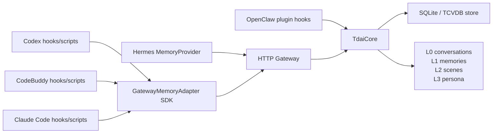

# Platform Adapters

TencentDB Agent Memory keeps the memory engine host-neutral. Platform adapters
translate each agent runtime into the same Gateway operations:

- `recall`: fetch memory context before an LLM turn
- `capture`: persist the completed user/assistant turn
- `searchMemories`: query L1 structured memories
- `searchConversations`: query L0 raw conversations
- `endSession`: flush pending pipeline work for one session



## Implemented Platforms

| Platform | Entry point | Transport | Lifecycle mapping |
| --- | --- | --- | --- |
| OpenClaw | `index.ts`, `src/adapters/openclaw/` | In-process plugin hooks | `before_prompt_build` -> recall, `agent_end` -> capture, `gateway_stop` -> shutdown |
| Hermes | `hermes-plugin/memory/memory_tencentdb/` | HTTP Gateway sidecar | `prefetch` -> `/recall`, `sync_turn` -> `/capture`, `shutdown` -> `/session/end` |
| Codex | `src/adapters/codex/` | SDK over HTTP Gateway | Local hooks or wrappers call recall/capture/search around Codex turns |
| CodeBuddy | `src/adapters/codebuddy/` | SDK over HTTP Gateway | CodeBuddy hooks or wrappers call the same SDK operations |
| Claude Code | `src/adapters/claude-code/` | SDK over HTTP Gateway | Claude Code hooks or wrappers call the same SDK operations |

## Core Boundary

`TdaiCore` owns memory storage, retrieval, extraction, and lifecycle decisions.
Adapters translate host events into core operations; they do not duplicate memory
logic.

| Core capability | Core method or Gateway route | Adapter responsibility |
| --- | --- | --- |
| Recall memory before a turn | `handleBeforeRecall()` / `POST /recall` | Provide query text and stable session key; place returned context in the host prompt |
| Capture a completed turn | `handleTurnCommitted()` / `POST /capture` | Send clean user and assistant content after success |
| Search structured memories | `searchMemories()` / `POST /search/memories` | Expose optional user-facing lookup tools |
| Search raw conversations | `searchConversations()` / `POST /search/conversations` | Expose debugging or audit lookup tools |
| Flush session work | `flushSession()` / `POST /session/end` | Call when the host session finishes |

## Unified Adapter SDK

`GatewayMemoryAdapter` is the shared SDK for platforms that live outside the
OpenClaw process. A new platform can either instantiate it directly or implement
one `MemoryPlatformAdapterDefinition` interface and pass it to
`createPlatformMemoryAdapter()`.

```ts
import { GatewayMemoryAdapter } from "@tencentdb-agent-memory/memory-tencentdb/adapters";

const memory = new GatewayMemoryAdapter({
  platform: "my-agent",
  sessionKey: process.env.MY_AGENT_SESSION_ID ?? process.cwd(),
  userId: process.env.USER,
  sessionEndTimeoutMs: 180_000,
});

const recall = await memory.recall({ query: "How does this repo prefer tests?" });

await memory.capture({
  userContent: "How does this repo prefer tests?",
  assistantContent: "Use Vitest and keep tests close to the adapter code.",
});
```

The SDK prefixes session keys with the platform name, so `workspace:/repo`
becomes `codex:workspace:/repo`, `codebuddy:workspace:/repo`, or
`claude-code:workspace:/repo`. This keeps memories separated by runtime while
allowing all platforms to share the same Gateway.

`recall()` returns `context`, which combines dynamic L1 memories with stable
persona/scene context. The raw Gateway response also exposes
`prepend_context` for the per-turn L1 memory block and `append_context` for the
stable persona/scene block. `endSession()` may wait for a real LLM-backed L1
flush, so the SDK gives that operation a longer timeout by default and lets
callers override it with `sessionEndTimeoutMs`.

For a reusable platform package, implement one interface:

```ts
import {
  createPlatformMemoryAdapter,
  type MemoryPlatformAdapterDefinition,
} from "@tencentdb-agent-memory/memory-tencentdb/adapters";

const MyAgentMemoryPlatformAdapter: MemoryPlatformAdapterDefinition = {
  platform: "my-agent",
  fromEnv(env) {
    return {
      baseUrl: env.MY_AGENT_GATEWAY_URL,
      apiKey: env.MY_AGENT_API_KEY,
      sessionKey: env.MY_AGENT_SESSION_ID ?? env.MY_AGENT_WORKSPACE,
      userId: env.MY_AGENT_USER_ID,
    };
  },
};

const memory = createPlatformMemoryAdapter(MyAgentMemoryPlatformAdapter, process.env);
```

## Provider Registry

The SDK also supports a provider registry: callers choose a provider name and
pass a small config object. Built-in providers register themselves when their
modules are imported.

```ts
import { createMemoryAdapter } from "@tencentdb-agent-memory/memory-tencentdb/adapters";

const memory = createMemoryAdapter({
  provider: "codebuddy",
  config: {
    baseUrl: "http://127.0.0.1:8420",
    apiKey: process.env.MEMORY_TENCENTDB_GATEWAY_API_KEY,
    sessionKey: process.cwd(),
    userId: process.env.USER,
    sessionEndTimeoutMs: 180_000,
  },
});
```

Third-party platforms can register one definition and then use the same
`provider + config` shape:

```ts
import {
  createMemoryAdapter,
  registerMemoryPlatformAdapter,
  type MemoryPlatformAdapterDefinition,
} from "@tencentdb-agent-memory/memory-tencentdb/adapters";

const MyAgentProvider: MemoryPlatformAdapterDefinition = {
  platform: "my-agent",
  fromEnv(env) {
    return {
      baseUrl: env.MY_AGENT_GATEWAY_URL,
      apiKey: env.MY_AGENT_API_KEY,
      sessionKey: env.MY_AGENT_SESSION_ID ?? env.MY_AGENT_WORKSPACE,
      userId: env.MY_AGENT_USER_ID,
    };
  },
  fromConfig(config) {
    return {
      baseUrl: config.baseUrl as string | undefined,
      apiKey: config.apiKey as string | undefined,
      sessionKey: config.sessionKey as string | undefined,
      userId: config.userId as string | undefined,
    };
  },
};

registerMemoryPlatformAdapter(MyAgentProvider);

const memory = createMemoryAdapter({
  provider: "my-agent",
  config: { sessionKey: "workspace:/repo" },
});
```

## Platform Differences

| Concern | Codex | CodeBuddy | Claude Code |
| --- | --- | --- | --- |
| Adapter class | `CodexMemoryGatewayClient` | `CodeBuddyMemoryAdapter` | `ClaudeCodeMemoryAdapter` |
| Default Gateway URL env | `MEMORY_TENCENTDB_GATEWAY_URL` | `CODEBUDDY_MEMORY_GATEWAY_URL` then common env | `CLAUDE_CODE_MEMORY_GATEWAY_URL` then common env |
| Default API key env | `MEMORY_TENCENTDB_GATEWAY_API_KEY` then `TDAI_GATEWAY_API_KEY` | `CODEBUDDY_MEMORY_API_KEY` then common env | `CLAUDE_CODE_MEMORY_API_KEY` then common env |
| Session identity env | `CODEX_SESSION_ID` or `CODEX_WORKSPACE` | `CODEBUDDY_SESSION_ID` or `CODEBUDDY_WORKSPACE` | `CLAUDE_CODE_SESSION_ID` or `CLAUDE_CODE_WORKSPACE` |
| User identity env | `CODEX_USER_ID` | `CODEBUDDY_USER_ID` | `CLAUDE_CODE_USER_ID` |
| Best integration point | Wrapper around Codex turns | CodeBuddy hook or command wrapper | Claude Code hook or command wrapper |

## Adapter Checklist

Use this checklist when adding another platform:

1. Add a small wrapper class that extends `GatewayMemoryAdapter`.
2. Or, for the minimal SDK path, implement one `MemoryPlatformAdapterDefinition`.
3. Define platform-specific env names for Gateway URL, API key, session, and user.
4. Use `createGatewayAdapterOptions()` or `createPlatformMemoryAdapter()` so defaults and caller overrides behave consistently.
5. Register reusable providers with `registerMemoryPlatformAdapter()` so callers can use `createMemoryAdapter({ provider, config })`.
6. Call `recall()` before model execution and inject returned context after the user's original prompt when possible.
7. Call `capture()` after a successful turn with clean user and assistant text.
8. Call `endSession()` when the host session ends.
9. Add tests for env mapping, provider config mapping, session key prefixing, Gateway endpoint mapping, and error propagation.
