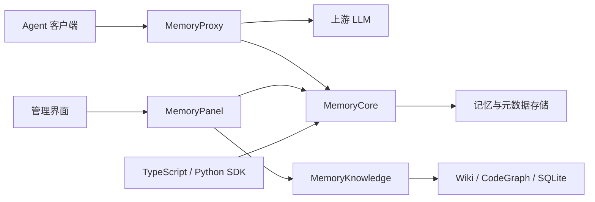

# 项目边界与测试职责

本文按源码划分职责和验证范围。单测与组件集成结果证明选定调用链的行为，不代表外部服务可用性、完整部署鉴权链路或模型生成质量。

## 1. 功能边界

箭头表示主要依赖调用，省略回调、遥测和插件嵌入方式。

| 模块 | 负责 | 依赖交界 | 源码入口 |
| --- | --- | --- | --- |
| MemoryCore | L0 对话、L1 原子记忆、L2 场景、L3 长期认知，Skill 与资产元数据/权限 | 存储适配器、后台任务、抽取模型 | `MemoryCore/src/core/tdai-core.ts`、`src/gateway/server.ts` |
| MemoryProxy | Agent 协议接入、会话绑定、上下文注入、上游请求转发和对话回写 | Core、上游模型、会话状态存储 | `MemoryProxy/src/handler.ts`、`src/injection/pipeline.ts` |
| MemoryPanel | 用户/团队/Agent/资产管理，身份上下文和跨服务操作编排 | 通过 HTTP ports/adapters 调用 Core、Knowledge | `MemoryPanel/src/panel/panel-deps.ts:45`、`src/panel/http/app.ts:20` |
| MemoryKnowledge | 文档 Wiki、代码索引 CodeGraph、知识查询工具和构建任务 | Git/文件源、SQLite、LLM、代码索引引擎 | `MemoryKnowledge/src/module.ts:79`、`src/server.ts:40` |
| SDK | 构造请求、保持隔离上下文、校验参数、统一服务端错误 | Core HTTP API；最终权限和存储仍由服务端落实 | `sdk/memory-core/typescript/src/v3/client.ts`、`sdk/memory-core/python/tencentdb_agent_memory/v3/client.py` |

源码模块、独立进程和容器不是同一层级：组合部署可把 Panel 与 Knowledge 放入同一容器，源码职责仍然分开。参见 `deploy/panel-knowledge-combined/start-combined.sh`。

## 2. 数据与权限边界

- **实例、团队、用户、Agent、会话各有作用。** Proxy 组装记忆身份需要 team/user/agent/session 完整；不完整时身份 helper 返回 `null`。见 `MemoryProxy/src/tdai/identity.ts:20`。
- **L0/L1 和 L2/L3 的聚合范围不同。** v3 对话写入必须绑定 session；读接口可在 team/agent/user 范围跨 session 查询。L2/L3 profile 以 team+agent 聚合，不应默认理解成逐用户、逐会话隔离。见 SDK v3 客户端和 `MemoryCore/src/core/profile/profile-scope.ts:34`。
- **资产可见性和绑定是两种规则。** `checkPermission` 校验 owner、成员状态、可见性、角色、ACL；`canBindAsset` 决定资产能否配给 Agent。private 对非 owner 拒绝；restricted 的普通成员需显式 ACL；跨团队绑定拒绝。见 `MemoryCore/src/metadata/service/permission-checker.ts:43`、`:155`。
- **Panel 的请求头检查不等于最终授权。** Panel 从实例注册表选出服务器端连接凭证，并传递用户 key/会话身份；实际资产操作仍需要 Core 的权限判断。见 `MemoryPanel/src/panel/http/middleware/validate-panel-headers.ts:34`、`src/panel/kernel/adapters/fetch-meta-kernel-adapter.ts`。
- **删除必须明确指定目标。** SDK 的批量对话删除不会自动使用构造时的 session；消息 ID 上限 5000、会话 ID 上限 100，去重和兼容参数合并后的最终集合也必须遵守上限。

## 3. 外部服务与信任交界

单测使用输入和依赖替身，组件集成增加真实本地HTTP、SQLite和文件系统；完整覆盖矩阵见 TESTING.md。下列行为仍有清晰的验证边界：

| 交界 | 本地单测/组件集成已验证的部分 | 仍需专项集成/部署确认的部分 |
| --- | --- | --- |
| 客户端 → HTTP 服务 | 请求参数、身份字段、错误封装 | TLS、凭证真实性、路由级授权、限流 |
| Panel ↔ Core/Knowledge | 出站凭证选择、错误传播、绑定预检、进度状态的 run_id 代际 | 服务间认证、网络访问控制、部分失败后的实际数据一致性 |
| 租户标识 → 存储 | 标识格式、上下文传递和纯权限判定 | 标识的可信来源、实际查询是否带全隔离条件 |
| Worker → 存储/任务队列 | 本地并发上限、FIFO、失败恢复、租约到期；选定SQLite事务/重开与中断恢复 | Redis 原子性、跨进程竞争、其他数据库后端与进程重启全链路 |
| LLM 输出 → Wiki 文件 | 协议容错、路径穿越拒绝、目录边界比较 | 模型质量、实际文件系统权限及符号链接处理 |
| LLM 请求 → Proxy | 会话选择和分页 | 流式分块、断连、上游协议差异、端到端回写 |

`isInsideRoot` 使用 `path.resolve` 做词法路径比较，未执行 `realpath`；因此路径单测不覆盖符号链接逃逸。见 `MemoryKnowledge/src/engines/wiki/ingest-v2/safe-path.ts:17`。

Panel ingest 进度是有 TTL 的进程内状态，BuildQueue 是单进程、同资产串行队列。它们不能替代跨实例的分布式一致性保证。见 `MemoryPanel/src/panel/state/ingest-progress-store.ts:22`、`MemoryKnowledge/src/store/build-queue.ts:11`。

## 4. 本次测试锁定的回归

1. restricted 资产不能因为服务层第一次用空 ACL 试算而忽略后续显式授权。
2. 已过期的本地抽取租约不能通过续约复活。
3. 串行队列遇到同步抛错后要继续处理后续任务；暂停队列清空后要唤醒 idle 等待者。
4. 旧 ingest run 的迟到终态不能清除新 run 的进度。
5. 两种 SDK 的批量删除在合并 legacy `session_id` 后仍须检查数量；TypeScript legacy 参数也需要非空校验与规范化。
6. TypeScript SDK 收到非对象 JSON 信封时应抛出 SDK 错误，保留状态与请求追踪信息。
7. 嵌套 L2 文件应参与本地快照及同步；拉取后回写不能误删远端，MD5异常时应保留已有本地副本。
8. Wiki 连续替换构建或上传推进版本后，旧构建的成功/失败都不应发布为当前代际结果。
9. TypeScript SDK 收到响应头后读取响应体超时，应保留取消错误，避免误报为非JSON响应。

运行方式和测试范围见 [TESTING.md](../TESTING.md)。浏览器UI、真实LLM、生产数据库后端、分布式锁和完整部署E2E不在这批本地测试结果的证明范围内。
