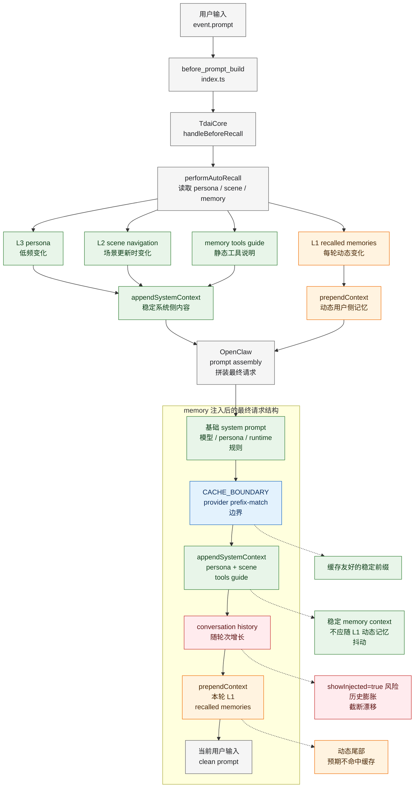

# Memory 注入后的上下文结构与缓存优化分析

本文先展示 memory 注入后的上下文结构图，再分析开启 showInjected 引发的对话膨胀趋势，并对比两套优化实现方案。

## 源码依据

- `index.ts` 注册 `before_prompt_build` hook，缓存原始用户输入，调用 `core.handleBeforeRecall()`，并把 recall 结果返回给 OpenClaw。
- `src/core/tdai-core.ts` 将 `handleBeforeRecall()` 委托给 `performAutoRecall()`。
- `src/core/hooks/auto-recall.ts` 将 recall 结果拆成两类：
  - `appendSystemContext`：L3 persona、L2 scene navigation、memory tools guide，属于相对稳定内容。
  - `prependContext`：L1 relevant memories，随每轮用户输入变化，属于动态内容。
- `index.ts` 注册 `before_message_write`，在写入历史前清理 `<relevant-memories>`，避免召回片段污染持久化对话。

## Mermaid 图

## 各段内容对缓存的影响

| 段落 | 来源 | 稳定性 | 缓存影响 |
| --- | --- | --- | --- |
| 基础 `system prompt` | OpenClaw runtime | 高 | 最适合放在 provider prefix-cache 区域。 |
| `appendSystemContext`: L3 persona | `persona.md` | 较高 | 应作为稳定系统侧内容，避免被 L1 动态召回带着变化。 |
| `appendSystemContext`: L2 scene navigation | scene index | 中等 | 场景更新时变化，但多轮内通常稳定，适合参与缓存。 |
| `appendSystemContext`: memory tools guide | 常量 `MEMORY_TOOLS_GUIDE` | 高 | 静态内容，适合参与缓存。 |
| `prependContext`: L1 recalled memories | 当前用户输入召回结果 | 低 | 每轮变化，应该留在动态区。 |
| conversation history | OpenClaw 会话历史 | 持续增长 | 如果 `showInjected=true`，动态记忆会进入可见历史，造成历史膨胀。 |
| 当前用户输入 | `event.prompt` | 低 | 动态内容，不应作为缓存前缀优化目标。 |

## `showInjected` 导致的对话膨胀趋势

`showInjected` 影响的是“注入内容是否进入可见/持久历史”，不是“本轮模型是否能看到注入内容”。当 `showInjected=true` 时，每轮注入的 L1 recalled memories 可能作为用户消息的一部分进入后续历史。随着轮次增加，历史里会积累多份动态记忆片段：

- 单轮注入 500-1700 tokens 时，短期看成本不高。
- 多轮后，历史中重复出现不同 recall 片段，动态尾部变长。
- 历史变长后更容易触发 truncation。
- truncation 截断点每轮可能不同，导致 provider 看到的 prefix 发生漂移。
- prefix 漂移会降低 OpenAI-compatible provider 的 prompt cache 命中率。

本 PR 新增的本地估算器使用同一组长度输入比较两种形态：

- `legacy`：假设 `showInjected=true`，动态记忆进入可见历史，历史膨胀随轮次增长。
- `optimized`：`showInjected=false`，动态记忆只参与本轮请求，不进入后续可见历史。

运行时会在 recall 日志和 `agent_turn` metric 中输出 `promptCacheImpact`，包括估算的 `legacyEstimatedHitRate`、`optimizedEstimatedHitRate` 和 `estimatedHitRateDelta`。其中 `turns` 由 `before_prompt_build` 的 `event.messages` 中历史 user message 数量估算，当前轮按 `+1` 计入；没有历史消息时回退为 1。

## `showInjected` 策略调优常见的三种细分手段

| 手段 | 是否本 PR 落地 | 说明 |
| --- | --- | --- |
| 自动降级 | 已落地 | 只要存在 `prependContext`，返回 `showInjected=false`，原因标记为 `memory_auto_degrade`。 |
| 记忆长度截断 | 已有能力 | `applyRecallBudget()` 已按 `maxCharsPerMemory` / `maxTotalRecallChars` 控制单条和总召回长度。该能力降低单轮注入体积，是 `showInjected` 调优的配套手段。 |
| 长会话分级展示 | 暂不新增代码 | 在“有记忆即 `showInjected=false`”策略下，长会话阈值逻辑冗余。建议保留为后续可选策略：如果未来允许短会话展示 injected 内容，再按 message count / turn count 自动关闭。 |

## 两种优化方案对比

| 方案 | 做法 | 改动范围 | 指标预期 | 风险 |
| --- | --- | --- | --- | --- |
| 方案 A：缓存分区 + `showInjected` 策略调优 | 稳定内容留在 `appendSystemContext`，动态 L1 留在 `prependContext`，有记忆时强制 `showInjected=false`。 | 小，集中在 recall hook、类型和 metric。 | 降低可见历史膨胀，提升稳定前缀复用率。 | 低，宿主不支持 `showInjected` 时仍保持兼容。 |
| 方案 B：session 级静态去重 + `showInjected` 策略调优 | 对 persona / scene / tools guide 等稳定系统片段做 session 级 hash 去重，重复片段不再每轮完整发出。 | 中到大，需要 session 状态、hash、版本和失效机制。 | 长会话收益更高，可进一步减少重复稳定 token。 | 中，需要处理 persona / scene 更新、恢复和 replay。 |

## 本 PR 选择方案 A 的原因

方案 A 是更适合本次合入的最低风险方案：

- 不改变 memory 检索算法。
- 不引入新的持久化状态。
- 与现有 `appendSystemContext` / `prependContext` 分区一致。
- 能直接缓解 `showInjected=true` 导致的历史膨胀。
- 新增 `promptCacheImpact` 指标后，可以在真实流量里观察优化前后的估算命中率变化。

方案 B 适合作为后续增强，详见 `docs/session-system-prompt-dedup.md`。
