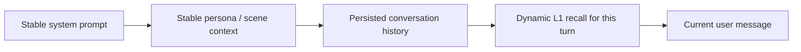
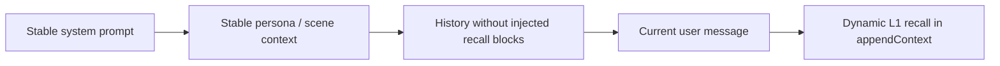

# Prompt-cache mitigation and verification

This note records the acceptance evidence for issue #120 without treating the
original provider-rate correlation as proof of causation. The reporter later
isolated a separate OpenClaw webchat regression, so provider A/B runs must hold
the OpenClaw version and channel constant.

## Context layout

`auto-recall` produces two classes of context:

- stable persona and scene context in `appendSystemContext`;
- per-turn L1 recall in `prependContext`.

The OpenClaw adapter added by #375 can move only the dynamic L1 block to
`appendContext`. It deliberately leaves the core result unchanged for other
hosts.

### Legacy prepend mode



The cache-sensitive prefix ends as soon as a dynamic segment differs. With
`recall.showInjected=true`, every dynamic recall block is also persisted in
`H`, so later requests replay stale blocks and reach the differing portion
earlier.

### Cache-friendly OpenClaw mode



Configure:

```json
{
  "recall": {
    "injectionMode": "append",
    "showInjected": false
  }
}
```

This preserves the longest stable prefix available to an OpenClaw host that
supports `appendContext`. It is an opt-in placement change; `prepend` remains
the backward-compatible default. The `before_message_write` hook removes
`<relevant-memories>` before persistence when `showInjected` is false.

## History-growth analysis

Let `R` be the average serialized recall size per turn and `N` the number of
turns. Preserving injected recall adds approximately `N * R` characters to the
stored transcript. Because request `k` re-sends the previous injected blocks,
the additional characters sent over the whole session grow approximately as
`R * N * (N - 1) / 2`.

The deterministic regression fixture uses 100 turns and roughly 1,000 dynamic
recall characters per turn. It verifies that:

- all 100 recall blocks are removed before persistence when `showInjected` is
  false;
- at least 100,000 injected characters are removed;
- the cleaned transcript is less than 5% of the `showInjected=true` transcript;
- original user text and non-text multipart content remain unchanged;
- `showInjected=true` remains an explicit diagnostic opt-in.

Run it with:

```bash
COREPACK_ENABLE_AUTO_PIN=0 pnpm vitest run \
  src/adapters/openclaw/recall-injection.test.ts \
  src/adapters/openclaw/recall-injection.multiturn.test.ts
```

This is a persisted-history proxy, not a provider cache-hit percentage.

## Provider verification protocol

Use a separate A/B session for each provider and repeat the same scripted turn
sequence in both configurations:

1. baseline: `injectionMode=prepend`, `showInjected=true`;
2. mitigation: `injectionMode=append`, `showInjected=false`.

Keep provider account, model, OpenClaw build, channel, tools, system prompt,
recall corpus, and turn sequence identical. Do not compare one channel (for
example webchat) with another (for example Feishu). Warm each configuration
with the same first request, then record per-request input, cache-hit, and
cache-miss tokens. Report medians and aggregate token-weighted hit rate over at
least 30 measured turns; retain raw response usage fields for audit.

| Provider | Official response fields | Token-weighted hit rate |
| --- | --- | --- |
| DeepSeek OpenAI API | `usage.prompt_cache_hit_tokens`, `usage.prompt_cache_miss_tokens` | `sum(hit) / (sum(hit) + sum(miss))` |
| Xiaomi MiMo OpenAI API | `usage.prompt_tokens_details.cached_tokens`, `usage.prompt_tokens` | `sum(cached) / sum(prompt)` |

DeepSeek documents automatic prefix caching and exposes explicit hit/miss token
counts. MiMo exposes cached prompt tokens in its OpenAI-compatible response;
its matching policy should be treated as provider-controlled and verified by
the A/B data rather than assumed.

Official references:

- DeepSeek context caching: <https://api-docs.deepseek.com/guides/kv_cache>
- Xiaomi MiMo OpenAI-compatible chat API:
  <https://mimo.mi.com/docs/en-US/api/chat/openai-api>

## Interpretation

An improvement is attributable to this mitigation only when the stable-prefix
A/B changes while the host/channel control stays fixed. Publish the raw token
counts and confidence interval alongside the percentage. If usage fields are
missing or null, mark that request unavailable instead of treating it as a
zero-token cache hit.

The runtime mitigation and deterministic growth test are complete. Live
DeepSeek/MiMo percentages remain environment evidence and require credentials;
they must not be fabricated in repository tests.
