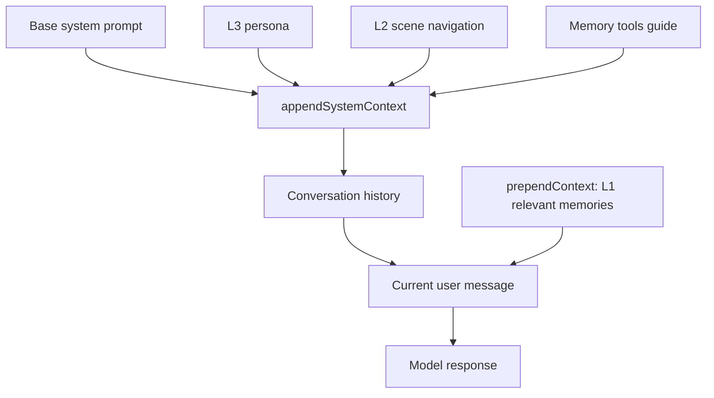

# Prompt Cache Impact of Auto-Recall Injection

Issue #120 focuses on how dynamic recall context changes the prompt shape seen by
OpenAI-compatible providers that use prefix matching for prompt caching.

## Context Shape



`appendSystemContext` is mostly stable within a session, so providers can reuse
the cached prefix when persona, scene navigation, and tool guidance do not
change. `prependContext` is intentionally dynamic: it depends on the latest user
query and therefore should not be persisted into future conversation history.

## Why `showInjected` Hurts Prefix Matching

If injected recall text is written to history, every later turn inherits the
previous turn's dynamic `<relevant-memories>` block. The old block is stable
after it is persisted, so it can still be part of a cacheable prefix when the
next request starts with the same tokens:

```text
turn 1 history: <relevant-memories>A</relevant-memories> + user message
turn 2 history: <relevant-memories>A</relevant-memories> + user message
                <relevant-memories>B</relevant-memories> + user message
turn 3 history: <relevant-memories>A</relevant-memories> + user message
                <relevant-memories>B</relevant-memories> + user message
                <relevant-memories>C</relevant-memories> + user message
```

The direct cost is prompt growth: each turn adds another recall block to future
history. The cache risk is indirect but important: larger history reaches context
budget pressure earlier, making host-side truncation, summarization, or tool
result compaction more likely. Once those mechanisms remove or rewrite different
amounts of earlier content across turns, the continuous prefix seen by
prefix-matching providers can drift and cache reuse drops.

## Current Mitigation

The OpenClaw hook keeps L1 recall in `prependContext` for the current turn, then
strips `<relevant-memories>` before the user message is persisted. This keeps the
model-visible current turn behavior while preventing dynamic recall artifacts
from accumulating in future prompts.

The helper in `src/utils/recall-injection.ts` makes this behavior testable and
also exposes `analyzeRecallInjectionImpact()` for local diagnostics. Platforms
can feed a sequence of user turns and prepended recall blocks into that function
to estimate:

- extra characters that would be persisted with injected recall visible;
- how many adjacent turns have a changed injected prefix;
- the clean history size after recall cleanup.

Run the deterministic replay diagnostic with:

```bash
npm run diagnose:recall-cache
```

The replay compares two histories over the same turns:

- `cleanHist`: previous `<relevant-memories>` blocks are stripped before
  persistence, matching the current OpenClaw hook behavior;
- `injectedHist`: previous `<relevant-memories>` blocks remain visible in future
  history, matching a `showInjected=true` style transcript.

`lcpClean` and `lcpInjected` report the longest common prefix with the previous
full prompt. They are diagnostic fields, not a claim that cleanup always makes
the next raw prefix longer. Persisted injected blocks can be cacheable once they
are part of history. The regression risk this diagnostic highlights is the
additional history growth and the resulting pressure on truncation/compaction
paths, where prefix drift is usually introduced.

## Optimization Options

1. Keep the current default: strip injected L1 recall before history persistence.
2. If visibility is required, make it an explicit opt-in and document the cache
   cost clearly.
3. Keep stable content in `appendSystemContext`, and keep dynamic recall limited
   to the current user message.
4. Use `maxTotalRecallChars` and `maxCharsPerMemory` to reduce worst-case prompt
   growth in long sessions.
