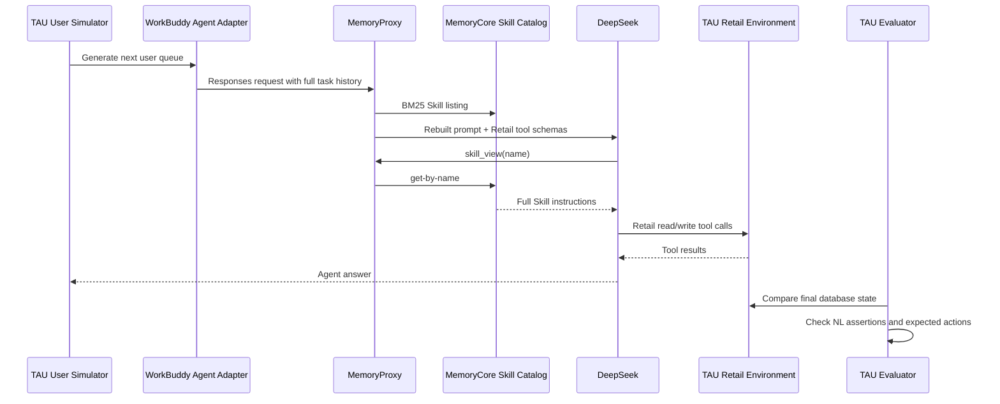

# Dynamic Skill Queue Injection: 100-Task Benchmark

This report compares the baseline and three queue-aware Skill injection strategies. See [Dynamic Skill Queue Injection](./skill-queue-dynamic-injection.md) for the design, configuration, and operational behavior.

## Evaluation Setup

### Workload

- Dataset: TAU Retail official tasks `0-99`.
- Catalog: 34 active, fine-grained retail Skills allocated through MemoryCore.
- Agent endpoint: WorkBuddy Responses through MemoryProxy.
- Business environment: a new isolated Retail environment for every task.
- User: TAU `user_simulator`, turn-by-turn interaction.
- Agent tools: official Retail tool schemas plus `skill_view`.
- Skill content: loaded from MemoryCore through the real Proxy Skill bridge.
- Temperature: 0.
- Seed: 300.
- Maximum steps: 80.
- Maximum agent output: 8000 tokens per request.

The Agent receives the Retail tool schemas because those are its executable capabilities. It does not receive all Skill contents. MemoryProxy retrieves Skill summaries; the model calls `skill_view` for relevant instructions, then calls the Retail tools.

### Execution Chain

### Metrics

- **Official success**: TAU aggregate reward equals 1.
- **DB match**: final Retail database matches the expected state.
- **NL assertion**: required facts are present in the final conversation.
- **Action coverage**: expected tool actions matched by the trace.
- **KV cache hit rate**: `cached input tokens / input tokens` reported by the upstream provider.
- **Cost**: cached input at `$0.007/M`, uncached input at `$0.22/M`, output at `$0.66/M`.

## Results

| Metric | `session_init` | `every_queue` | `latest_only` | `adaptive_queue` |
|---|---:|---:|---:|---:|
| Completed tasks | 100/100 | 100/100 | 100/100 | 100/100 |
| Official success | 89/100 | 86/100 | **91/100** | 85/100 |
| DB final-state match | **91/100** | 89/100 | **91/100** | 86/100 |
| NL assertions met | 46/48 | 43/48 | **47/48** | 46/48 |
| Expected actions matched | **477/514** | 464/514 | 468/514 | 466/514 |
| Action coverage | **92.80%** | 90.27% | 91.05% | 90.66% |
| Input tokens | 18,097,995 | 21,658,589 | 21,258,340 | 20,683,432 |
| Cached input tokens | 15,894,528 | 19,238,912 | 18,002,944 | **19,448,192** |
| Uncached input tokens | 2,203,467 | 2,419,677 | 3,255,396 | **1,235,240** |
| KV cache hit rate | 87.82% | 88.83% | 84.68% | **94.03%** |
| Output tokens | 550,310 | **498,253** | 583,042 | 602,349 |
| Proxy requests | 1,269 | 1,341 | 1,429 | 1,311 |
| `skill_view` calls | 325 | 622 | 731 | 482 |
| Retail tool calls | 787 | 778 | 784 | 789 |
| Mean TTFB | 1,351.4 ms | 1,358.3 ms | 1,253.4 ms | **302.7 ms** |
| TTFB P50 | 1,275 ms | 1,305 ms | 1,202 ms | **265 ms** |
| TTFB P95 | 1,725 ms | 1,766 ms | 1,519 ms | **545 ms** |
| Proxy cumulative time | 7,043.62 s | 6,409.73 s | 7,189.10 s | **4,921.97 s** |
| Task cumulative time | 8,005.30 s | 7,393.49 s | 8,142.90 s | **5,558.98 s** |
| Estimated cost | $0.95923 | $0.99585 | $1.22702 | **$0.80544** |
| Estimated cost/task | $0.00959 | $0.00996 | $0.01227 | **$0.00805** |

## Result Interpretation

- `latest_only` achieved the highest official success rate, `91/100`, and the highest measured cost, `$1.22702`.
- `adaptive_queue` achieved the highest KV-cache hit rate, `94.03%`, and the lowest measured cost, `$0.80544`.
- `every_queue` retained immutable full listings and measured an `88.83%` KV-cache hit rate, with `86/100` official success.
- `session_init` remained competitive at `89/100` while performing Skill selection only at session initialization.

## Failed Task IDs

| Strategy | Failed tasks |
|---|---|
| `session_init` | 5, 12, 29, 38, 41, 49, 60, 67, 68, 80, 91 |
| `every_queue` | 8, 13, 16, 18, 38, 41, 49, 59, 60, 67, 68, 71, 81, 90 |
| `latest_only` | 5, 21, 22, 38, 39, 41, 76, 90, 98 |
| `adaptive_queue` | 7, 16, 18, 19, 22, 29, 38, 39, 49, 59, 64, 72, 76, 79, 98 |
