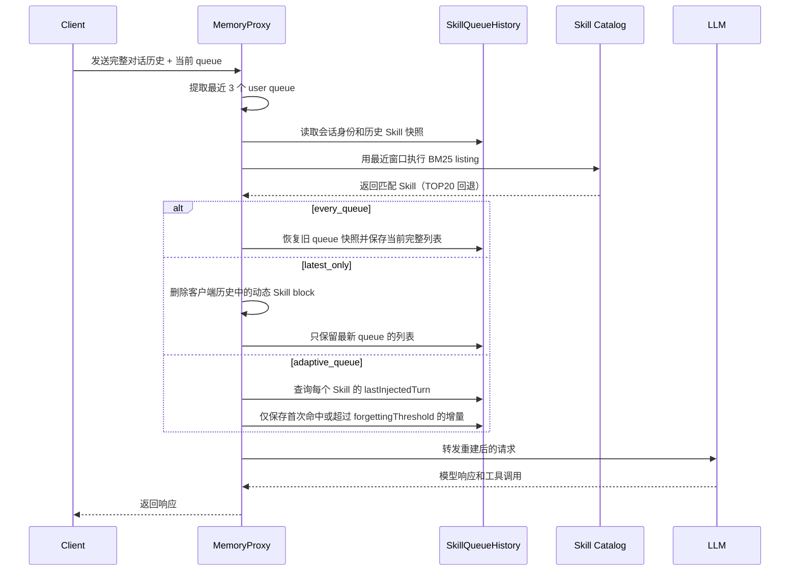

# Dynamic Skill Queue Injection

## 背景

`session_init` 只在会话初始化时把 Skill 列表注入 system prompt。会话开始后，Proxy 不会根据新的 user queue 重新检索 Skill，因此对话主题变化时模型看不到新的 Skill。

三个 queue 策略共用最近 3 个 user queue 作为 BM25 检索窗口：

| 策略 | Skill 注入位置 | 历史处理 |
|---|---|---|
| `every_queue` | 每个 user queue 后追加当前列表 | 已注入的历史快照永久保留 |
| `latest_only` | 只在最新 user queue 后追加当前列表 | 每轮移除历史动态 Skill，再注入最新列表 |
| `adaptive_queue` | 只追加尚未注入或达到遗忘阈值的 Skill | 已注入历史永久保留，只追加增量 |

## 请求链路



## 实现要点

- Proxy 以 `spaceId + userId + agentSource + sessionId` 隔离 Skill 队列历史。
- queue key 使用规范化 user 文本的 SHA-256 和重复次数，避免相同文本 queue 互相覆盖。
- `every_queue` 使用不可变快照恢复客户端没有保存的历史 Skill。
- `latest_only` 每轮重建请求中的动态 Skill block。
- `adaptive_queue` 在 `SkillQueueHistory` 中维护每个 Skill 的 `lastInjectedTurn`；默认 `forgettingThreshold=3`。
- 同一 session 使用锁串行更新，工具循环复用当前 queue 的快照，不重复执行 BM25。
- Skill block 使用固定 `tdai:skill-queue` 标记，发送到上游前由 Proxy 统一处理。

## TAU Retail 100 题实验

实验条件：同一官方 retail 数据集 `0-99`、真实 Skill Catalog、真实 `skill_view`、阿里云兼容端点 `deepseek-v4-flash-0731`。`adaptive_queue` 的历史结果来自此前独立端点实验。

| 指标 | `session_init` | `every_queue` | `latest_only` | `adaptive_queue` |
|---|---:|---:|---:|---:|
| 官方成功 | 89/100 | 86/100 | 90/100 | 85/100 |
| DB 终态匹配 | 91/100 | 89/100 | 90/100 | 86/100 |
| NL assertion | 96/100 | 93/100 | 96/100 | 96/100 |
| 动作覆盖 | 477/514 | 464/514 | 462/508 | 466/514 |
| 输入 token | 18,097,995 | 21,658,589 | 21,121,903 | 20,683,432 |
| 缓存命中 token | 15,894,528 | 19,238,912 | 17,888,256 | 19,448,192 |
| KV cache 命中率 | 87.82% | 88.83% | 84.69% | 94.03% |
| 输出 token | 550,310 | 498,253 | 578,649 | 602,349 |
| Proxy 请求数 | 1,269 | 1,341 | 1,422 | 1,311 |
| 非高峰估算成本 | $0.95923 | $0.99585 | $1.21853 | $0.80544 |

动态策略的实现测试：`MemoryProxy` 全部 8 个测试文件通过，共 33 个测试。

## 配置

```yaml
injection:
  skillQueueStrategy: every_queue # session_init / every_queue / latest_only / adaptive_queue
  forgettingThreshold: 3
```
