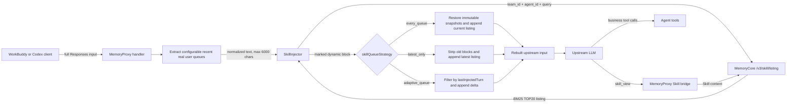
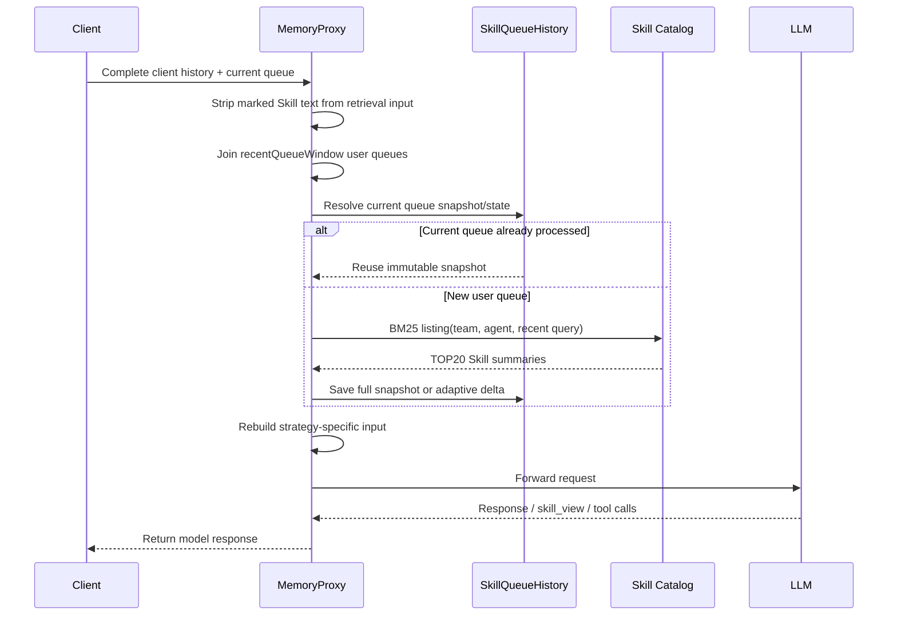

# Dynamic Skill Queue Injection

## Summary

The existing `session_init` strategy selects Skill once when a session starts and places the listing in the system prompt. A long-running task cannot see newly created Skills or adapt its Skill set when the conversation moves to another business flow.

This change adds three queue-aware strategies while keeping `session_init` as the default:

| Strategy | Retrieval | Injection | Historical Skill blocks |
|---|---|---|---|
| `every_queue` | Configurable recent user queues (default 3) | Full current listing on each new queue | Restored byte-for-byte |
| `latest_only` | Configurable recent user queues (default 3) | Full current listing on the latest queue | Removed from older queues |
| `adaptive_queue` | Configurable recent user queues (default 3) | Only new or forgotten Skills | Restored byte-for-byte |

All three strategies are implemented in MemoryProxy, require no client protocol change, and work for both WorkBuddy and Codex Responses requests.

## Problem

### Baseline behavior

With `session_init`, the request seen by the upstream model has this shape:

```text
system + Skill0 + queue1 + queue2 + ... + queueN
```

`Skill0` is created during session initialization from agent/task context and cached as a stable system block. After initialization:

- user queues do not trigger a new Skill listing query;
- a Skill created during the task does not appear in that task;
- a conversation that changes from one business flow to another keeps the initial Skill set.

### Proxy ownership of dynamic history

The client stores its own conversation and sends the full history again on the next request. A Skill block appended by MemoryProxy exists only in the forwarded upstream request; the client does not receive or persist that modified request.

Therefore queue-aware injection cannot depend on the client replaying prior Skill blocks. MemoryProxy must rebuild the upstream request on every turn:

```text
client history             Proxy-owned state              upstream history
queue1, queue2, queue3  +  queue1->Skill1 snapshots  ->  queue1+Skill1,
                         queue2->Skill2 snapshots      ->  queue2+Skill2,
                                                     ->  queue3+Skill3
```

## Design

### End-to-end request flow



### Per-request sequence



## Retrieval Window

`extractRecentUserQueues()` processes the real Responses `input[]` rather than the synthetic pipeline message:

1. walk backward through `role=user` messages;
2. collect at most `recentQueueWindow` user queues (default 3);
3. remove `tdai:skill-queue` marked text;
4. restore chronological order;
5. join the text and cap it at 6000 characters.

The resulting text is passed as `skillListingQuery`. MemoryCore scopes the request with `team_id + agent_id` and runs FTS BM25. If a non-empty query returns zero matches, the injector retries without a query and obtains the scoped TOP20 listing.

Only real user queues count toward the window and adaptive turn distance. Assistant messages, function calls, and tool results do not count.

## Dynamic Block Contract

Dynamic listings are emitted at `user.after` and wrapped in stable markers:

```html
<!-- tdai:skill-queue:start -->
<available_skills>
...
</available_skills>
<!-- tdai:skill-queue:end -->
```

The handlers separate stable injection output from marked dynamic output. Stable system assets continue through the existing injection path; marked Skill output is written into the real Responses user message according to the selected strategy.

This step is required because the common injection pipeline runs on synthetic messages, while the upstream WorkBuddy/Codex request is built from the real `input[]` array.

## Strategies

### `every_queue`

Upstream history:

```text
queue1 + Skill1 + queue2 + Skill2 + ... + queueN + SkillN
```

For every new user queue, MemoryProxy stores the complete BM25 listing as an immutable snapshot. On later requests it strips client-supplied marked blocks, loads snapshots for all user queues still present in the request, and appends each snapshot to its original queue.

A tool loop reuses the snapshot already assigned to the current queue. It does not repeat BM25 and cannot replace that queue's Skill block.

### `latest_only`

Upstream history:

```text
queue1 + queue2 + ... + queueN + SkillN
```

MemoryProxy removes all marked Skill blocks and appends the current BM25 listing only to the latest user queue. It does not store queue snapshots. Every new user queue receives a fresh listing based on the latest retrieval window.

### `adaptive_queue`

Upstream history:

```text
queue1 + Delta1 + queue2 + [no block] + queue3 + Delta3 + ...
```

The strategy tracks `lastInjectedTurn` for every Skill name:

- a Skill never injected in the session is eligible;
- a Skill becomes eligible again when `currentTurn - lastInjectedTurn >= forgettingThreshold`;
- all other matched Skills are removed from the current block;
- if no Skill is eligible, the current queue receives no block;
- prior delta blocks remain immutable and are restored to their original queues.

With `forgettingThreshold: 3`:

```text
queue 1: inject A, B
queue 2: A, B matched; inject nothing
queue 3: A, B matched; inject nothing
queue 4: A matched and distance is 3; inject A again
```

## Identity, State, and Concurrency

### Session identity

Queue state is isolated by:

```text
spaceId + userId + agentSource + sessionId
```

WorkBuddy uses the Codex session namespace already used by its session initialization path, so both the session binding and Skill history resolve the same session.

### Queue identity

A queue key is:

```text
SHA-256(normalized user text, first 24 hex chars) + occurrence number
```

Whitespace is normalized and existing dynamic markers are stripped before hashing. The occurrence number distinguishes repeated user messages with identical text.

### Stored state

`every_queue` and `adaptive_queue` store:

- immutable queue snapshots under `skill-queue-history-v1-<queue-key>`;
- adaptive state under `skill-queue-history-v1-state`;
- an in-process LRU-like map capped at 1000 sessions;
- the same values through `HookCacheRepo` for shared/persistent storage.

`putIfAbsent()` gives a queue one winning immutable snapshot when multiple Proxy nodes race. A per-session promise lock serializes updates inside one process. Hook-cache refresh preserves `skill-queue-history-v1-*` entries while clearing ordinary injection cache entries.

## KV Cache Behavior

| Strategy | Prefix behavior | 100-task cache hit rate |
|---|---|---:|
| `session_init` | Stable initial system Skill block | 87.82% |
| `every_queue` | Previously emitted queue snapshots remain at the same positions | 88.83% |
| `latest_only` | Historical Skill blocks disappear as the latest position moves | 84.68% |
| `adaptive_queue` | Historical deltas remain fixed; new text is appended only when eligible | 94.03% |

`every_queue` and `adaptive_queue` never delete or reorder a Skill block already sent for a historical queue. `latest_only` intentionally rebuilds the dynamic portion so that only the newest queue carries a listing.

## Choosing a Strategy

| Priority | Strategy | Reason |
|---|---|---|
| Backward-compatible default | `session_init` | Keeps one stable Skill listing selected at session start |
| Task success in the 100-task evaluation | `latest_only` | Highest official success, with more uncached input and the highest measured cost |
| Stable full Skill context on every queue | `every_queue` | Preserves each historical full listing at its original position |
| Input-cache efficiency and cost | `adaptive_queue` | Highest measured KV-cache hit rate and lowest measured cost by emitting only eligible deltas |

The measured trade-offs and complete results are in the [100-task benchmark](./skill-queue-dynamic-injection-benchmark.md).

## Configuration

`session_init` remains the default. Enable one queue strategy in `MemoryProxy/config.yaml`:

```yaml
injection:
  skillQueueStrategy: every_queue
  forgettingThreshold: 3
  recentQueueWindow: 3
```

| Option | Accepted values | Default | Applies to |
|---|---|---|---|
| `skillQueueStrategy` | `session_init`, `every_queue`, `latest_only`, `adaptive_queue` | `session_init` | All Skill injection |
| `forgettingThreshold` | Positive integer | `3` | `adaptive_queue` only |
| `recentQueueWindow` | Positive integer | `3` | Queue-aware strategies only |

Invalid numeric values fall back to `3`.

The global image launcher exposes all three settings through `PROXY_SKILL_QUEUE_STRATEGY`, `PROXY_SKILL_FORGETTING_THRESHOLD`, and `PROXY_SKILL_RECENT_QUEUE_WINDOW`.

## Failure Handling and Diagnostics

- Missing `team_id` or `agent_id` skips Skill listing because the catalog cannot be scoped.
- A MemoryCore listing error or an empty catalog produces no dynamic Skill block for the current queue.
- An unexpected injection or queue-state error is logged and the handler forwards the request without dynamic Skill injection.
- In-process state preserves snapshots only for the lifetime of one Proxy process. Recovery after restart and sharing across Proxy nodes require a functioning shared `HookCacheRepo` backend and stable session identity.
- A non-empty BM25 query with zero lexical hits retries once without the query and uses the scoped TOP20 listing.

Operational logs use the `[skill-injector]` prefix for listing input, hit count, and fallback behavior. Handler-level failures use `[codex] injection pipeline error` or `[workbuddy] injection pipeline error`. Request metadata records `skillListingQuery` and `skillQueueSnapshotHit` for tracing retrieval input and tool-loop snapshot reuse.

## Code Map

| Area | File | Responsibility |
|---|---|---|
| Configuration | `MemoryProxy/src/config.ts`, `MemoryProxy/src/types.ts` | Strategy, forgetting threshold, and recent queue window |
| Query window | `MemoryProxy/src/common/recent-user-queues.ts` | Configurable recent user queues, marker removal, 6000-char cap |
| Markers | `MemoryProxy/src/common/skill-queue-markers.ts` | Detect, extract, and strip dynamic blocks |
| State machine | `MemoryProxy/src/common/skill-queue-history.ts` | Queue keys, snapshots, adaptive state, locks, reconstruction |
| Retrieval | `MemoryProxy/src/injection/injectors/skill-injector.ts` | BM25 listing, TOP20 fallback, dynamic block rendering |
| WorkBuddy | `MemoryProxy/src/workbuddyHandler.ts` | Query metadata and real-input reconstruction |
| Codex | `MemoryProxy/src/codexHandler.ts` | Query metadata and real-input reconstruction |
| Storage | `MemoryProxy/src/db/*hook-cache-repo.ts` | Atomic snapshot insert and preservation during refresh |
| Skill content | `MemoryProxy/src/skill/skill-bridge.ts` | Resolve `skill_view` by session identity |

## Test Coverage

`MemoryProxy` test suite on the rebased branch:

```text
Test files: 7 passed
Tests:      26 passed
```

Coverage includes:

- recent-user-window ordering, filtering, and truncation;
- marker extraction and removal;
- `every_queue` immutable reconstruction;
- `latest_only` replacement behavior;
- `adaptive_queue` first injection, no-delta turns, and forgetting threshold;
- duplicate queue text and tool-loop snapshot reuse;
- atomic `putIfAbsent` behavior;
- preservation of Skill history during hook-cache refresh;
- dynamic SkillInjector output and query fallback;
- WorkBuddy Skill bridge session identity.
