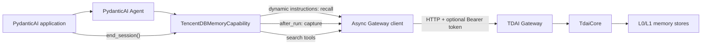

# PydanticAI Adapter Design

## Goal

Add a focused PydanticAI integration for TencentDB Agent Memory that satisfies
issue #235's architecture and single-platform adapter acceptance levels without
introducing another generic cross-platform SDK.

The adapter will use the existing TDAI HTTP Gateway as its stable boundary. A
PydanticAI 2.x `AbstractCapability` will translate agent lifecycle events into
memory recall, capture, search, and session-flush calls.

## Scope

The change will provide:

- automatic memory recall before a PydanticAI run reaches the model;
- automatic capture after a successful run;
- model-callable tools for L1 memory search and L0 conversation search;
- an explicit API for ending and flushing a conversation session;
- configurable session-key and user-ID resolution;
- optional Bearer authentication and bounded request timeouts;
- fail-open behavior when the memory Gateway is unavailable;
- an independently installable Python package, tests, CI coverage, and
  architecture/integration documentation.

The change will not:

- modify `TdaiCore` or the Gateway protocol;
- introduce a second generic TypeScript adapter SDK;
- manage or spawn the Gateway process;
- publish the Python package to PyPI;
- add another Agent platform in the same pull request.

## Architecture



The capability is the platform boundary. It owns PydanticAI-specific lifecycle
mapping and tool registration, while the client owns HTTP serialization,
authentication, timeout handling, and response validation. Neither layer
depends on OpenClaw or Hermes APIs.

## Package Layout

```text
pydantic-ai-adapter/
|-- pyproject.toml
|-- README.md
|-- src/
|   `-- tdai_pydantic_ai/
|       |-- __init__.py
|       |-- capability.py
|       `-- client.py
`-- tests/
    |-- test_capability.py
    `-- test_client.py

docs/adapters/
`-- pydantic-ai.md
```

The root English and Chinese READMEs will link to the adapter guide. The root CI
workflow will run the adapter's Python test suite in addition to the existing
Node checks.

## Public API

The package will export:

- `TencentDBMemoryCapability`: a reusable PydanticAI 2.x capability;
- `TdaiGatewayClient`: the default asynchronous Gateway client;
- `GatewayClientProtocol`: the injectable client contract used by tests and
  advanced callers;
- `TdaiGatewayError`: a typed error containing route, status, and response
  context when available.

Construction will accept a Gateway URL, optional API key, request timeout, a
session-key resolver, a user-ID resolver, and an optional injected client.
Resolvers may be static strings or callables receiving `RunContext`, so one
Agent instance can safely serve multiple conversations.

The capability will also expose:

- `end_session(session_key, user_id="")`, which calls `/session/end`;
- `health()`, which calls `/health`.

## Per-Run State Isolation

PydanticAI Agents are reusable and may run concurrently. The capability must
not store current-session values on the shared instance.

`for_run()` will resolve the session key and user ID and return a run-scoped
replacement capability. The replacement will hold only that run's resolved
identity and recall cache. PydanticAI re-extracts tools and instructions from
the replacement, so closures bind to isolated run state.

An empty session key is a configuration error and will fail before the model
request. This is intentionally different from Gateway outages: without a
stable session key, recall and capture could be assigned to the wrong
conversation.

## Data Flow

### Recall

1. The application calls `agent.run(...)` or another supported PydanticAI run
   entry point.
2. `for_run()` resolves the stable session key and user ID.
3. The dynamic instructions provider converts the original textual prompt into
   a recall query and calls `POST /recall`.
4. Returned context is added to the model instructions for the run.
5. If recall fails or the prompt has no textual content, the provider returns
   an empty instruction and the Agent continues.
6. Recall is cached on the run-scoped capability so multi-step runs do not make
   duplicate recall requests.

### Capture

1. PydanticAI completes the run successfully.
2. `after_run()` extracts textual user content from the original prompt.
3. String output is used directly; structured output is serialized as
   deterministic UTF-8 JSON where possible, then falls back to `str()`.
4. The capability calls `POST /capture` with user text, assistant text,
   session key, and user ID.
5. Capture failures are logged and do not replace or corrupt the Agent result.

Failed or cancelled Agent runs are not captured because no trustworthy final
assistant response exists.

### Search Tools

The capability registers two PydanticAI function tools:

- `tdai_memory_search(query, limit=5, type="", scene="")`;
- `tdai_conversation_search(query, limit=5)`.

Conversation search is automatically scoped to the current session. Tool
arguments are validated by PydanticAI. Gateway failures return a concise error
string to the model instead of terminating the run.

### Session End

Applications call `await memory.end_session(session_key)` when their
conversation closes. Session flushing is explicit because one PydanticAI run is
a turn, not necessarily the end of the surrounding conversation.

## HTTP Client

The default client will use Python's standard library HTTP stack behind
`asyncio.to_thread`, keeping the adapter dependency surface limited to
PydanticAI itself.

All requests will:

- encode request bodies as UTF-8 JSON;
- set `Content-Type: application/json`;
- attach `Authorization: Bearer ...` only when configured;
- use a bounded timeout;
- reject malformed JSON and non-object responses;
- convert HTTP, network, and decode failures into `TdaiGatewayError`;
- avoid logging API keys or full conversation content.

The client will implement the current Gateway routes without changing their
wire format: `/health`, `/recall`, `/capture`, `/search/memories`,
`/search/conversations`, and `/session/end`.

## Compatibility

The adapter targets Python 3.10+ and `pydantic-ai>=2.0,<3`, where capabilities
are a first-class extension mechanism. It remains an independent nested Python
package and does not become a runtime dependency of the root Node package.

The adapter uses public PydanticAI APIs only:

- `AbstractCapability`;
- `RunContext`;
- `FunctionToolset`;
- `AgentRunResult`;
- the `for_run`, `get_instructions`, `get_toolset`, and `after_run` hooks.

## Error Handling

The default policy is fail-open for operational memory failures:

- recall failure: no memory is injected;
- capture failure: the Agent result is returned unchanged;
- search failure: the tool returns a concise error result;
- session-end failure: `TdaiGatewayError` is raised to the application because
  session shutdown is an explicit management call;
- invalid or empty session resolution: `ValueError` is raised before the run.

The capability will use Python logging and will never include an API key in a
message.

## Testing

Tests will follow a red-green-refactor sequence.

Client tests will use a local in-process HTTP server and cover:

- route and JSON-body mapping;
- optional Bearer authentication;
- timeout/network and HTTP error conversion;
- malformed and non-object JSON responses.

Capability tests will use PydanticAI's test model plus an injected fake client
and cover:

- recalled context reaching the model;
- exactly one recall per multi-step run;
- successful-run capture;
- structured-output serialization;
- search tool registration and session scoping;
- explicit session flush;
- fail-open recall, capture, and search behavior;
- empty session-key rejection;
- isolation across concurrent runs.

Verification will include the adapter's Python tests, the repository's complete
Node test suite, build, package dry run, and `git diff --check`.

## Documentation

`docs/adapters/pydantic-ai.md` and the adapter README will include:

- the core/OpenClaw/Hermes/PydanticAI architecture and data-flow diagrams;
- installation and Gateway startup prerequisites;
- a minimal PydanticAI integration example;
- dynamic session-key resolution for multi-user applications;
- authenticated Gateway configuration;
- search tools and explicit session shutdown;
- failure behavior and troubleshooting;
- a comparison of OpenClaw, Hermes, and PydanticAI lifecycle mappings.

## Commit and Pull Request Shape

The implementation will remain a focused single-platform contribution. Commits
will use the repository's conventional format and include DCO sign-off. The PR
description will link issue #235, list acceptance criteria, and report exact
verification commands and results.
