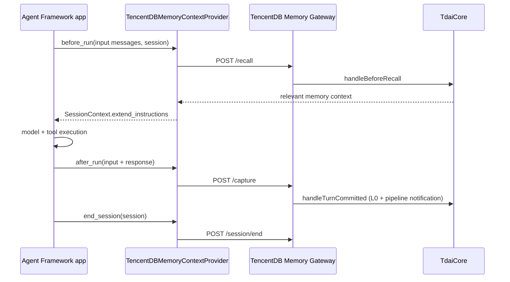

# Microsoft Agent Framework adapter

This integration exposes TencentDB Agent Memory as a native Microsoft Agent
Framework `ContextProvider`. It uses the existing standalone Gateway, so memory
storage, extraction, ranking, and the L0 → L3 pipeline remain in `TdaiCore`.

## Data flow



The provider deliberately uses framework-native lifecycle methods rather than
middleware. `before_run` injects recalled context once per run, while
`after_run` captures the completed user/assistant turn once.

## Install and use

Start the repository's Gateway, then install the adapter:

```bash
pip install ./integrations/microsoft-agent-framework
```

```python
from agent_framework import AgentSession
from agent_framework.openai import OpenAIChatClient
from tencentdb_agent_memory_agent_framework import (
    TencentDBMemoryContextProvider,
    TencentDBMemoryGatewayClient,
)

client = TencentDBMemoryGatewayClient(
    base_url="http://127.0.0.1:8420",
    api_key=None,  # match TDAI_GATEWAY_API_KEY when Gateway auth is enabled
)
memory = TencentDBMemoryContextProvider(client=client, user_id="user-42")
agent = OpenAIChatClient().as_agent(
    name="MemoryAgent",
    instructions="You are a helpful assistant.",
    context_providers=[memory],
)
session = AgentSession()

await agent.run("Remember that I prefer concise answers.", session=session)
await agent.run("How should you answer me?", session=session)
await memory.end_session(session)
```

Pass `memory.search_memories` and `memory.search_conversations` as agent tools
when active, evidence-driven retrieval is useful.

## Identity, failure, and security

- The Gateway `session_key` is `agent-framework:<session_id>` by default.
  Override `session_prefix` when applications intentionally share or isolate
  memory namespaces.
- `user_id` is provenance metadata; it is not an authorization boundary.
- Memory failures are fail-open by default. Use `strict=True` in controlled
  jobs where memory is required.
- Recalled text is bounded and explicitly labelled as untrusted context to
  reduce prompt-injection risk.
- Remote Gateway URLs are rejected unless `allow_remote=True`. When enabling
  them, use HTTPS and configure the Gateway bearer key.
- `end_session()` is explicit because Agent Framework sessions are
  application-owned and do not expose a universal close callback.

## Verification

```bash
python -m pip install -e "integrations/microsoft-agent-framework[test]"
python -m pytest integrations/microsoft-agent-framework/tests
```

Tests use real Agent Framework 1.3 context types and an in-process fake Gateway.
They verify authentication, session identity, recall injection, capture
payloads, fail-open/strict behavior, searches, and session flush.
