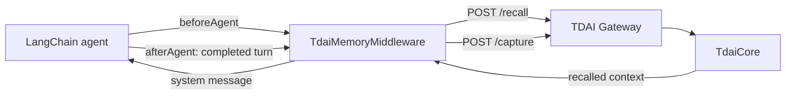

# LangChain / LangGraph Memory Middleware

This adapter connects a LangChain v1 agent (which runs on LangGraph) to the
TencentDB Agent Memory Gateway. It is a small platform follow-up built on the
shared `GatewayMemoryClient`; it does not duplicate Gateway transport logic or
add LangChain as a dependency of the core package.

## Data flow



`beforeAgent` runs once per invocation, recalls memory using the latest human
message, and appends a clearly labelled system message. `afterAgent` runs once
after the agent finishes and captures the latest completed human/AI turn.

## Usage

```ts
import { createAgent, createMiddleware } from "langchain";
import {
  GatewayMemoryClient,
  createTdaiLangChainMiddleware,
} from "@tencentdb-agent-memory/memory-tencentdb";

const client = new GatewayMemoryClient({
  baseUrl: process.env.MEMORY_TENCENTDB_GATEWAY_URL ?? "http://127.0.0.1:8420",
  apiKey: process.env.MEMORY_TENCENTDB_GATEWAY_API_KEY,
});

const memoryMiddleware = createTdaiLangChainMiddleware(createMiddleware, {
  client,
  resolveContext: (_state, runtime) => {
    const context = runtime.context as { threadId: string; userId?: string };
    return {
      sessionKey: context.threadId,
      userId: context.userId,
    };
  },
});

const agent = createAgent({
  model,
  tools,
  middleware: [memoryMiddleware],
});

await agent.invoke(
  { messages: [{ role: "user", content: "Continue my project" }] },
  { context: { threadId: "project-42", userId: "developer" } },
);
```

Use a stable LangGraph thread or conversation identifier as `sessionKey`. The
default behavior is fail-open: a Gateway outage is logged and the agent keeps
running without recalled memory. Set `failClosed: true` only when memory is a
hard requirement for the application.

Search tools and explicit session flushes remain available through the shared
`GatewayMemoryClient` / `createGatewayPlatformAdapter` API.
