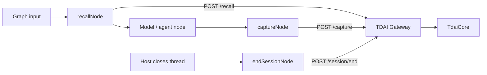

# LangGraph StateGraph Adapter

This adapter adds explicit LangGraph node functions on top of the shared
`GatewayMemoryClient` and `createGatewayPlatformAdapter` boundary. It does not
add LangGraph or LangChain as a dependency of the core package.

## Data Flow



`recallNode` reads the latest user message and writes the returned context to
the `memoryContext` state field. `captureNode` records the latest completed
user/assistant turn. `endSessionNode` flushes delayed work when the host closes
the thread.

## Usage

Add `memoryContext` to the graph state schema, then place the memory nodes
around the model node:

```ts
import { StateGraph, START, END } from "@langchain/langgraph";
import {
  GatewayMemoryClient,
  createLangGraphMemoryAdapter,
} from "@tencentdb-agent-memory/memory-tencentdb";

const client = new GatewayMemoryClient({
  baseUrl: process.env.MEMORY_TENCENTDB_GATEWAY_URL ?? "http://127.0.0.1:8420",
  apiKey: process.env.MEMORY_TENCENTDB_GATEWAY_API_KEY,
});

const memory = createLangGraphMemoryAdapter({ client });

const graph = new StateGraph(GraphState)
  .addNode("recall_memory", memory.recallNode)
  .addNode("model", async (state) => {
    const prompt = state.memoryContext
      ? `${state.memoryContext}\n\n${latestUserText(state.messages)}`
      : latestUserText(state.messages);
    return { messages: [await model.invoke(prompt)] };
  })
  .addNode("capture_memory", memory.captureNode)
  .addEdge(START, "recall_memory")
  .addEdge("recall_memory", "model")
  .addEdge("model", "capture_memory")
  .addEdge("capture_memory", END)
  .compile();

await graph.invoke(
  { messages: [{ role: "user", content: "Continue my project" }] },
  {
    configurable: {
      thread_id: "project-42",
      user_id: "developer",
    },
  },
);
```

Call `memory.endSessionNode(state, runtime)` when the host actually closes the
thread. A graph invocation ending is not necessarily the end of a long-lived
LangGraph thread.

## Identity Mapping

The default resolver accepts snake_case and camelCase names:

| LangGraph value | Gateway value |
| --- | --- |
| `runtime.configurable.thread_id` | `session_key` |
| `runtime.configurable.run_id` or `runtime.metadata.run_id` | `session_id` |
| `runtime.configurable.user_id` or `runtime.context.userId` | `user_id` |

The resolver also checks `runtime.context` and graph state. It refuses to use a
global fallback session because that could mix unrelated conversations. Supply
`resolveContext` when the host stores identity elsewhere.

## State And Message Mapping

- `messages` may contain plain `{ role, content }` objects or LangChain-style
  objects exposing `type` / `_getType()`.
- Text content blocks are normalized before crossing the HTTP boundary, so
  message methods and non-serializable runtime fields are not sent.
- `contextKey` changes the state field written by `recallNode`.
- `selectQuery` and `selectCompletedTurn` support custom graph state schemas.

## Failure Behavior

Memory nodes fail open by default: failures are logged, recall clears the
configured context field, and the graph continues. Set `failClosed: true` when
memory is mandatory.

Explicit `searchMemories()` and `searchConversations()` calls surface Gateway
errors to the caller. This lets a tool node return a platform-specific error
message instead of silently pretending that a search succeeded.
