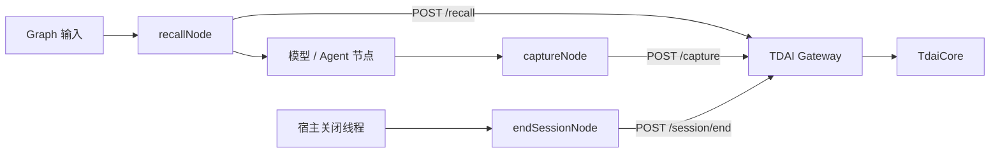

# LangGraph StateGraph 适配器

该适配器基于共享的 `GatewayMemoryClient` 与
`createGatewayPlatformAdapter`，提供可直接加入 LangGraph 的节点函数。
核心包不会因此新增 LangGraph 或 LangChain 运行时依赖。

## 数据流



`recallNode` 读取最新一条用户消息，并把召回上下文写入
`memoryContext` 状态字段。`captureNode` 记录最新一组完整的
用户/助手对话。宿主真正关闭线程时，使用 `endSessionNode` 刷新延迟任务。

## 使用方式

先在 Graph state schema 中加入 `memoryContext`，再把记忆节点放在模型节点前后：

```ts
import { StateGraph, START, END } from "@langchain/langgraph";
import {
  GatewayMemoryClient,
  createLangGraphMemoryAdapter,
} from "@tencentdb-agent-memory/memory-tencentdb";

const client = new GatewayMemoryClient({
  baseUrl: process.env.MEMORY_TENCENTDB_GATEWAY_URL ?? "http://127.0.0.1:8420",
  apiKey: process.env.MEMORY_TENCENTDB_GATEWAY_API_KEY,
});

const memory = createLangGraphMemoryAdapter({ client });

const graph = new StateGraph(GraphState)
  .addNode("recall_memory", memory.recallNode)
  .addNode("model", async (state) => {
    const prompt = state.memoryContext
      ? `${state.memoryContext}\n\n${latestUserText(state.messages)}`
      : latestUserText(state.messages);
    return { messages: [await model.invoke(prompt)] };
  })
  .addNode("capture_memory", memory.captureNode)
  .addEdge(START, "recall_memory")
  .addEdge("recall_memory", "model")
  .addEdge("model", "capture_memory")
  .addEdge("capture_memory", END)
  .compile();

await graph.invoke(
  { messages: [{ role: "user", content: "继续我的项目" }] },
  {
    configurable: {
      thread_id: "project-42",
      user_id: "developer",
    },
  },
);
```

只有宿主真正关闭长期线程时才应调用
`memory.endSessionNode(state, runtime)`。一次 Graph 调用结束并不一定表示
LangGraph thread 已结束。

## 身份映射

默认 resolver 同时支持 snake_case 与 camelCase：

| LangGraph 值 | Gateway 值 |
| --- | --- |
| `runtime.configurable.thread_id` | `session_key` |
| `runtime.configurable.run_id` 或 `runtime.metadata.run_id` | `session_id` |
| `runtime.configurable.user_id` 或 `runtime.context.userId` | `user_id` |

resolver 还会检查 `runtime.context` 和 Graph state。它不会使用全局默认
session，避免不同对话的数据被错误混合。如果宿主把身份放在其他位置，
可以传入 `resolveContext`。

## 状态与消息映射

- `messages` 可以是普通 `{ role, content }` 对象，也可以是带有
  `type` / `_getType()` 的 LangChain 风格对象。
- 文本内容块会先被规范化，消息方法和无法序列化的运行时字段不会跨越
  HTTP 边界。
- `contextKey` 可以修改 `recallNode` 写入的状态字段。
- `selectQuery` 与 `selectCompletedTurn` 可用于适配自定义 Graph state。

## 故障行为

记忆节点默认 fail-open：记录错误、清空本次召回状态，并继续运行 Graph。
当记忆是强依赖时，可以设置 `failClosed: true`。

显式调用 `searchMemories()` 和 `searchConversations()` 时，Gateway 错误会
交给调用方处理，方便工具节点返回符合平台习惯的错误信息。
