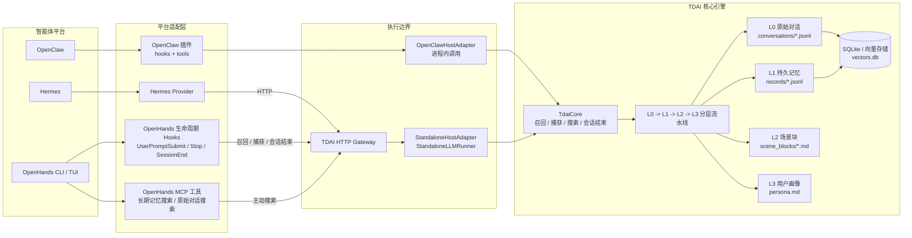

# TDAI OpenHands 适配架构与数据流

本文说明 TencentDB Agent Memory 核心引擎、已有平台适配方式及 OpenHands CLI/TUI 适配层之间的边界和数据流。

## 总体架构



OpenClaw 通过插件在进程内调用 `TdaiCore`；Hermes 与 OpenHands 使用已有 HTTP Gateway 作为进程边界。OpenHands adapter 不修改 OpenHands 源码，而是把官方 lifecycle hooks 与 MCP 工具映射到 Gateway API。

## 自动召回

```text
用户输入
  -> OpenHands UserPromptSubmit hook
  -> POST /recall + POST /search/memories
  -> TdaiCore 检索 L1/L2/L3
  -> compose_recall_context()
  -> OpenHands additionalContext
  -> 下一次 OpenHands 模型请求
```

## 自动捕获与分层提取

```text
OpenHands user/assistant/tool 原生事件
  -> OpenHands 持久化会话事件
  -> Stop / SessionEnd hook
  -> 规范化 user/assistant messages
  -> POST /capture
  -> L0 conversations + vectors.db
  -> TDAI 分层提取流水线
  -> L1 records -> L2 scene blocks -> L3 persona
  -> 退出时 POST /session/end 刷新流水线
```

`started_at` 将 OpenHands 回合的真实起始时间传给 Gateway，避免延迟捕获时把刚完成的原生消息误判为 memory runtime 启动前的历史消息。该字段为可选字段，不影响已有 Gateway 客户端。

## 模型主动搜索

```text
OpenHands 模型
  -> tdai_memory_search / tdai_conversation_search MCP 工具
  -> POST /search/memories 或 /search/conversations
  -> TDAI Gateway / TdaiCore
  -> 搜索结果返回当前智能体回合
```

自动 recall/capture 不依赖模型主动调用 MCP；MCP search 用于模型在当前任务中需要进一步检索长期记忆或原始对话时主动下钻。
