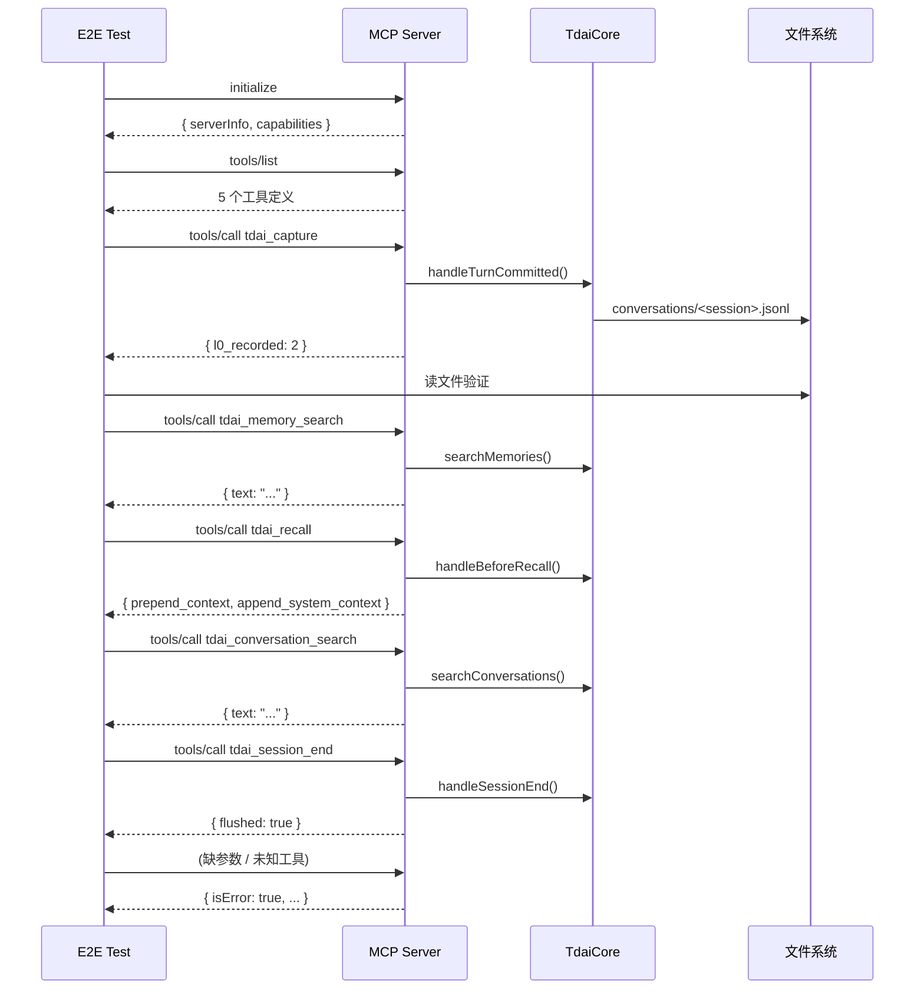

# TDAI MCP Server — E2E 测试流程

测试脚本：[tests/mcp-e2e.test.mjs](../tests/mcp-e2e.test.mjs)

## 快速开始

```bash
# 先构建（产出 dist/src/adapters/mcp/server.mjs）
cd TencentDB-Agent-Memory
pnpm build

# 跑 E2E 测试（无 LLM key 也能跑——搜索会优雅降级）
node tests/mcp-e2e.test.mjs

# 带 LLM key 完整测试（含 memory recall + L0 search 实际返回结果）
TDAI_LLM_API_KEY=sk-xxx node tests/mcp-e2e.test.mjs
```

## 测试覆盖

```
1. Initialize handshake  ──→  serverInfo.name = "tdai-memory"
2. tools/list            ──→  5 个工具、inputSchema 完整、description 合法
3. tdai_capture          ──→  写 L0 JSONL、磁盘验证内容可读
4. tdai_memory_search    ──→  搜索响应格式正确（有无 LLM key 均不挂）
5. tdai_recall           ──→  prepend_context / append_system_context 字段齐
6. tdai_conversation_search → L0 搜索可用
7. tdai_session_end      ──→  有 LLM key 时 flush 成功（无 key 时跳过）
8. Error handling x3     ──→  缺参数 → isError、未知工具 → isError
```

## 协议流



## 有 LLM key vs 无 LLM key 的差异

| 测试 | 无 LLM key | 有 LLM key |
|------|-----------|------------|
| Initialize | ✓ | ✓ |
| tools/list | ✓ | ✓ |
| tdai_capture | ✓ L0 写盘正常 | ✓ L0 + pipeline 调度 |
| tdai_memory_search | ✓ 返回"embedding 未配置"降级消息 | ✓ 返回 L1 记忆结果 + L3 persona |
| tdai_recall | ✓ memory_count=0 | ✓ memory_count > 0 |
| tdai_conversation_search | ✓ 返回降级消息 | ✓ 返回 L0 对话片段 |
| tdai_session_end | 跳过（L1 提取需 LLM，无 key 会挂起） | ✓ flushed=true |
| Error handling | ✓ | ✓ |

## 失败排查

### `Server not built`

先跑 `pnpm build`。确认 `dist/src/adapters/mcp/server.mjs` 存在。

### 某个 test 超时（>30s）

查看 stderr（测试脚本在中断时打印最后 500 字节）。常见原因：

- **LLM endpoint 不通** — `TDAI_LLM_BASE_URL` 指向了不可达地址。检查配置。
- **API key 错误** — LLM provider 返回 401，但 SDK 重试多次后才超时。
- **FTS5 不可用** — 当前 Node.js 22 的 `node:sqlite` 没有 FTS5。这导致搜索降级为纯文本，不影响其他功能。

### `conversation jsonl exists on disk` 失败

检查 `TDAI_DATA_DIR` 权限。临时目录（`$TMP/tdai-mcp-e2e-*`）需要可写。

## 环境变量参考

| 变量 | 必填 | 说明 |
|------|------|------|
| `TDAI_LLM_API_KEY` | 否 | LLM API key——有则跑完整搜索/提取，无则降级 |
| `TDAI_LLM_BASE_URL` | 否 | 默认 `https://api.openai.com/v1` |
| `TDAI_LLM_MODEL` | 否 | 默认 `gpt-4o` |
| `TDAI_DATA_DIR` | 否 | 默认临时目录，测试结束自动清 |
| `TDAI_MCP_DEBUG` | 否 | 设为 `1` 开 DEBUG 级别日志（写 stderr） |
