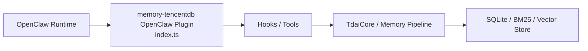
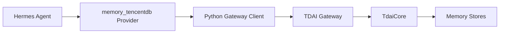
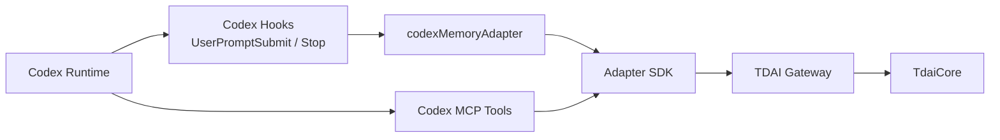
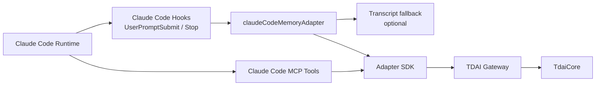

# 多平台适配方式对比说明

本文对比 OpenClaw、Hermes、Codex、Claude Code 四种接入方式，说明它们与核心引擎、Gateway、统一 Adapter SDK 的关系。

## 1. 总览对比

| 平台 | 接入位置 | 记忆读取 | 记忆写入 | 搜索工具 | 是否使用 Gateway | 是否使用 Adapter SDK | Gateway 生命周期 |
|---|---|---|---|---|---|---|---|
| OpenClaw | `index.ts` 插件入口 | OpenClaw hook | OpenClaw hook | OpenClaw tool | 不一定，原生插件可直接进入核心能力 | 否 | 由 OpenClaw 插件体系和项目部署方式决定 |
| Hermes | `hermes-plugin/memory/memory_tencentdb` Provider | `prefetch()` -> Gateway `/recall` | `sync_turn()` -> Gateway `/capture` | Provider tool call -> Gateway search | 是 | 否，使用 Python Provider + Client | Hermes Provider 可通过 supervisor 管理 Gateway |
| Codex | `codex-plugin/memory/memory_tencentdb` | `UserPromptSubmit` -> SDK -> Gateway `/recall` | `Stop` -> SDK -> Gateway `/capture` | MCP -> SDK -> Gateway search | 是 | 是 | 不自动启动，用户手动启动 Gateway |
| Claude Code | `claudecode-plugin/memory/memory_tencentdb` | `UserPromptSubmit` -> SDK -> Gateway `/recall` | `Stop` -> SDK -> Gateway `/capture` | MCP -> SDK -> Gateway search | 是 | 是 | 不自动启动，用户手动启动 Gateway |
| 新平台 | 平台自己的 hooks / tools / provider | 实现 `parseRecall()` 后由 SDK 调用 Gateway | 实现 `parseCapture()` 后由 SDK 调用 Gateway | 复用 SDK MCP 或平台工具封装 | 推荐是 | 推荐是 | 默认不自动启动 Gateway |

## 2. OpenClaw 插件方式

OpenClaw 是项目最早适配的平台之一，特点是平台原生插件能力较完整。

### 接入特点

- 入口是根目录插件入口 `index.ts`。
- 按 OpenClaw Plugin SDK 注册工具、钩子和配置。
- 平台上下文、工具调用和 hook 由 OpenClaw 插件系统调度。
- 更适合深度集成 OpenClaw 自身的上下文压缩、工具调用和记忆能力。

### 数据流特点

### 优点

- 与 OpenClaw 平台能力耦合更紧，用户安装体验简单。
- 可以充分利用 OpenClaw Plugin SDK 的工具注册和 hook 机制。
- 适合 OpenClaw 用户作为主入口使用。

### 代价

- 适配逻辑与 OpenClaw 平台模型绑定。
- 其他平台不能直接复用 OpenClaw 插件入口。

## 3. Hermes Provider 方式

Hermes 通过 Provider 接入，Provider 自身是 Python 侧实现，通过 HTTP Gateway 与核心引擎通信。

### 接入特点

- 目录是 `hermes-plugin/memory/memory_tencentdb`。
- Provider 实现 Hermes 需要的记忆生命周期方法。
- 通过 `client.py` 请求 Gateway。
- 通过 `supervisor.py` 管理 Gateway 进程和恢复逻辑。

### 数据流特点

### 优点

- 与 Hermes Provider 模型匹配。
- Python 侧可实现 watchdog、supervisor、恢复机制。
- Gateway 把 TypeScript 核心引擎与 Python 平台隔离开。

### 代价

- Provider、Client、Supervisor 是 Hermes 专属实现。
- 其他平台复用时仍要重新写平台层逻辑。
- Gateway 生命周期策略比 Codex/Claude Code 更复杂，需要测试防止进程泄漏和 stale Gateway 复用。

## 4. Codex 插件方式

Codex 插件使用统一 Adapter SDK。平台插件只负责把 Codex hook payload 转成 SDK 输入，并把 SDK 输出转回 Codex 需要的格式。

### 接入特点

- 目录是 `codex-plugin/memory/memory_tencentdb`。
- `adapter.ts` 实现 `MemoryPlatformAdapter`。
- `hooks/recall.ts` 调用 `runRecallHook(codexMemoryAdapter)`。
- `hooks/capture.ts` 调用 `runCaptureHook(codexMemoryAdapter)`。
- `mcp-server.ts` 调用 `runMemoryMcpServer()`。

### 数据流特点

### 优点

- 平台代码很薄，主要是 hook payload 解析和输出格式化。
- 记忆读写、Gateway 请求、MCP 搜索工具可复用 SDK。
- SDK 不自动启动 Gateway，行为边界清晰。

### 代价

- 用户需要先启动 Gateway。
- Codex 插件安装还需要平台自己的插件目录、MCP、hooks 配置。
- Codex hook payload 的字段变化需要更新 `adapter.ts`。

## 5. Claude Code 插件方式

Claude Code 与 Codex 类似，也使用统一 Adapter SDK，但 capture 阶段额外支持从 transcript 中恢复最近一轮 user / assistant 内容。

### 接入特点

- 目录是 `claudecode-plugin/memory/memory_tencentdb`。
- `adapter.ts` 实现 `MemoryPlatformAdapter`。
- `hooks/recall.ts` 调用 `runRecallHook(claudeCodeMemoryAdapter)`。
- `hooks/capture.ts` 调用 `runCaptureHook(claudeCodeMemoryAdapter)`。
- `mcp-server.ts` 调用 `runMemoryMcpServer()`。
- `.claude-plugin/plugin.json` 描述 Claude Code 插件结构。

### 数据流特点

### 优点

- 与 Codex 共用 SDK，平台差异集中在 `adapter.ts`。
- capture 阶段可从 prompt cache 或 transcript 恢复完整对话。
- Gateway 不可用时 hook 降级，不阻断 Claude Code 对话。

### 代价

- 用户需要先启动 Gateway。
- Claude Code 插件目录和 hook manifest 需要符合 Claude Code 规范。
- transcript 格式如果变化，需要同步更新 `adapter.ts`。

## 6. Adapter SDK 与各平台职责边界

| 职责 | OpenClaw | Hermes | Codex | Claude Code | Adapter SDK |
|---|---|---|---|---|---|
| 平台插件声明 | 是 | 是 | 是 | 是 | 否 |
| 平台 hook payload 解析 | 是 | 是 | `adapter.ts` | `adapter.ts` | 否 |
| Gateway HTTP 请求封装 | 可选 | Python client | 复用 SDK | 复用 SDK | 是 |
| MCP 搜索工具注册 | 平台工具 | Provider tool | 复用 SDK | 复用 SDK | 是 |
| prompt cache | 平台/插件逻辑 | Provider 状态 | 复用 SDK | 复用 SDK | 是 |
| Gateway 健康检查 | 平台/部署决定 | Supervisor | 复用 SDK | 复用 SDK | 是 |
| Gateway 自动启动 | 平台/部署决定 | Hermes supervisor 可管理 | 否 | 否 | 否 |
| TdaiCore 初始化 | 插件/核心路径 | Gateway | Gateway | Gateway | 否 |

## 7. 为什么 Codex 和 Claude Code 使用统一 SDK

Codex 和 Claude Code 的平台差异主要在三处：

- hook 输入字段不同。
- hook 输出格式不同。
- 插件声明、安装路径和启动方式不同。

但它们访问记忆能力的方式是一致的：

- 读取记忆：`POST /recall`
- 写入记忆：`POST /capture`
- 搜索记忆：`POST /search/memories`
- 搜索对话：`POST /search/conversations`

因此，把 Gateway 请求、错误降级、prompt cache、MCP 工具注册放进 Adapter SDK，可以避免每个平台重复实现同一套逻辑。新平台只需要把自己的事件结构映射到统一接口即可。

## 8. 推荐适配策略

新增平台时优先选择 Adapter SDK，除非平台有非常强的平台原生需求。

推荐路径：

1. 平台支持 hooks + tools / MCP：使用 Adapter SDK。
2. 平台语言不是 TypeScript，但可以访问 HTTP：参考 Hermes，写平台语言 Provider + Gateway client。
3. 平台需要深度嵌入核心引擎：参考 OpenClaw，但需要理解 TdaiCore 生命周期和平台插件能力。

默认建议：

- 新平台不要直接初始化 TdaiCore。
- 新平台不要重复实现 Gateway HTTP 请求细节。
- 新平台不要自动启动 Gateway，除非平台明确有 supervisor 生命周期模型。
- 新平台先实现 recall / capture，再补 search / session end。
