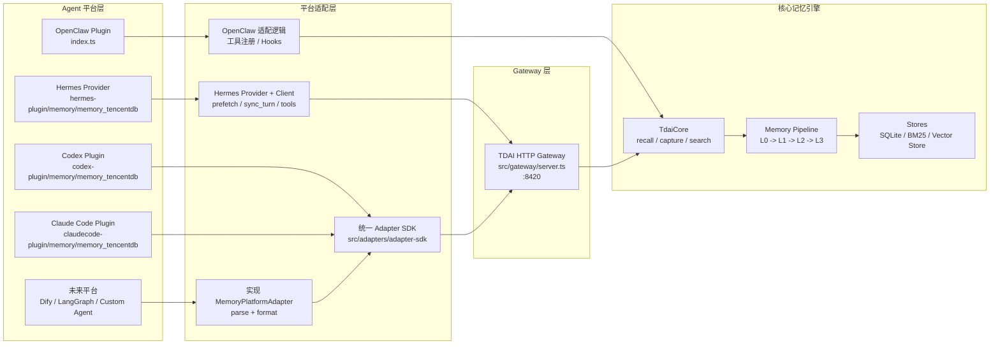
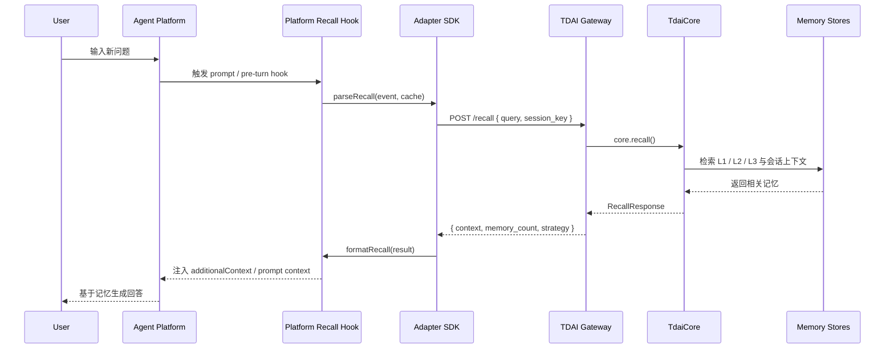
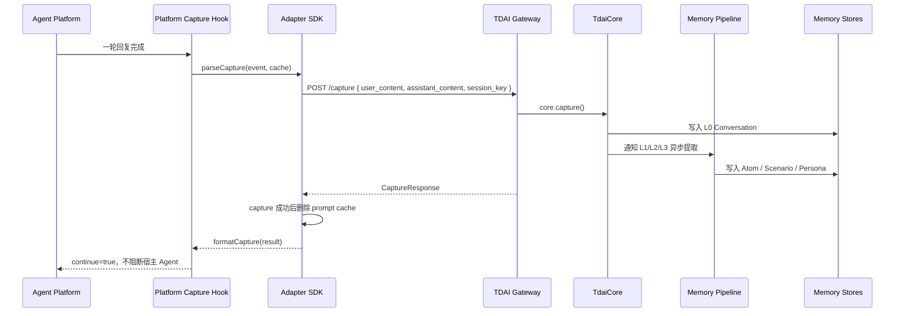
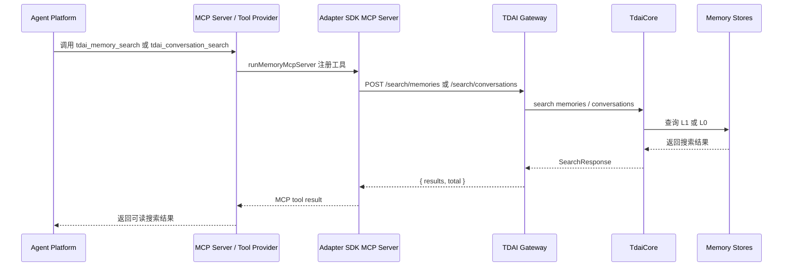

# TencentDB-Agent-Memory 多平台适配架构图

本文说明核心记忆引擎、Gateway、统一 Adapter SDK 与各 Agent 平台适配层之间的关系，并标注记忆读取、记忆写入和搜索工具的数据流。

## 1. 总体架构

说明：

- OpenClaw 是原生插件接入，入口是 `index.ts`，负责注册工具和钩子。
- Hermes 通过 `hermes-plugin/memory/memory_tencentdb` 里的 Provider 接入，经 HTTP Gateway 调用核心引擎。
- Codex 与 Claude Code 通过统一 Adapter SDK 接入，平台插件只负责解析平台事件和格式化平台输出。
- 未来平台不需要重新理解 Gateway 请求细节，只需要实现 `MemoryPlatformAdapter` 接口。

## 2. 记忆读取数据流

记忆读取发生在用户输入后、模型生成前，用于把相关历史记忆注入平台上下文。

平台差异：

- Codex：`UserPromptSubmit` hook 调用 `runRecallHook()`，输出 `additionalContext`。
- Claude Code：`UserPromptSubmit` hook 调用 `runRecallHook()`，输出 `additionalContext`。
- Hermes：Provider 的 `prefetch()` 通过 Gateway client 调用 `/recall`。
- OpenClaw：插件钩子在平台内注册，按 OpenClaw Plugin SDK 的上下文注入方式工作。

## 3. 记忆写入数据流

记忆写入发生在一轮对话完成后，用于记录 L0 原始对话并驱动后续分层提取。

关键约束：

- Adapter SDK 不自动启动 Gateway，只做健康检查和 HTTP 请求封装。
- Gateway 需要用户或部署脚本手动启动：`node --import tsx src/gateway/server.ts`。
- capture 失败时，Codex / Claude Code hook 降级为继续执行，不阻断 Agent 正常对话。

## 4. 搜索工具数据流

搜索工具用于 Agent 主动检索长期记忆或原始对话。

当前工具：

- `tdai_memory_search`：检索结构化长期记忆，主要对应 L1/L2/L3。
- `tdai_conversation_search`：检索原始对话记录，主要对应 L0 Conversation。

## 5. SDK 在架构中的职责边界

`src/adapters/adapter-sdk` 只处理跨平台通用能力：

- `GatewayClient`：封装 `/health`、`/recall`、`/capture`、`/search/memories`、`/search/conversations`。
- `ensureGateway`：检查 Gateway 是否可用，并提示手动启动。
- `runRecallHook`：读取平台 hook stdin，调用 adapter 解析事件，向 Gateway 请求 recall，输出平台格式结果。
- `runCaptureHook`：读取平台 hook stdin，调用 adapter 解析事件，向 Gateway 请求 capture，成功后清理 prompt cache。
- `runMemoryMcpServer`：注册通用 MCP 搜索工具。
- `FilePromptCache`：在 recall 与 capture hook 之间保存用户输入，便于写入完整一轮对话。

SDK 不负责：

- 启动或停止 Gateway。
- 直接初始化 TdaiCore。
- 理解具体平台的 hook payload。
- 修改平台自身配置文件格式。

这些职责由各平台插件或部署脚本完成。
